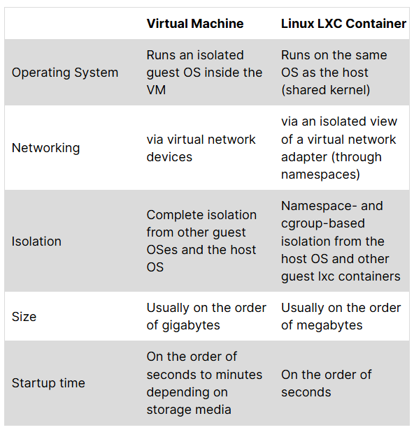

# Linux Containers

  * Vimos separación por procesos (OKWS)
    * Difícil de manejar
  * Separación de Privilegios
    * Mínimo Privilegio
    * Separación de responsabilidades

---

# chroot

  * Cambia el directorio raiz
    * Por ejemplo de / a /home/ignacio
  * No es suficiente
    * Es una aislación que se puede romper

---

# Casos de Uso

  * Segregación de privilegios más fuerte en una arquitectura de microservicios en un solo host 
  * Mejor contención del radio de explosión en caso de compromiso de seguridad
  * Utilización de recursos más efectiva en aislamiento (comparado con virtualización asistida por hardware)
  * Facilidad de despliegue de software (el propósito para el cual los contenedores fueron desarrollados originalmente)

---

# Máquinas Virtuales v/s Containers


  * **Una CPU con muchos kernels** v/s **Un kernel con muchos espacios de usuario**

  * Qué es el kernel?

---

# Máquinas Virtuales v/s Containers

  

---

# Linux Containers

  * chroot en esteroides
    * Grupo de procesos
      * Usa namespaces para vistas privadas
      * Usa cgroups para limitar el uso de recursos
      * Usa capabilities para limitar lo que puede hacer root
      * Usa seccomp-bpf para filtrar llamadas de sistema (syscalls) del kernel
  * Ligeros, rápidos y dispensables
    * Corren en milisegundos
    * Usan Mb

---

# Namespaces

  * Un namespace hace que un recurso solo pueda tener acceso a otros recursos en el mismo namespace
  * **Analogía:** Como tener habitaciones separadas en una casa
    * Cada habitación tiene sus propios recursos
    * No puedes ver lo que pasa en otras habitaciones
  * Linux tiene 7 tipos de namespaces diferentes

---

# Tipos de Namespaces

  * **PID:** separa procesos
  * **UTS:** aisla hostnames
  * **cgroup:** aisla cgroups
  * **IPC:** aisla comunicación entre procesos
  * **User:** aisla usuarios
  * **Mount:** aisla mountpoints
  * **Network:** aisla la red

---

# PID Namespace - Ejemplo

  * Cada contenedor ve sus procesos empezando desde PID 1
  * Los procesos en un contenedor **no pueden ver** procesos de otros contenedores
  
  **Host:**
  ```
  PID 1234: nginx (contenedor A)
  PID 5678: postgres (contenedor B)
  ```
  
  **Dentro del contenedor A:**
  ```
  PID 1: nginx  ← Ve solo su propio proceso
  ```

---

# Network Namespace - Ejemplo

  * Cada contenedor tiene su propia pila de red
    * Interfaces de red propias (eth0, lo)
    * Direcciones IP propias
    * Puertos propios
  * **Beneficio:** Dos contenedores pueden usar el puerto 80 sin conflicto

---

# Mount Namespace - Ejemplo

  * Cada contenedor ve su propio árbol de sistema de archivos
  * El contenedor piensa que `/` es su raíz
  * En realidad está en otro directorio en el host
  
  **Dentro del contenedor:**
<style scoped>
    pre { font-size: 24px; }
</style>

  ```
  /app
  /etc/nginx
  /var/log
  ```
  
  **En el host:**
  
  ```
  /var/lib/lxc/mi-contenedor/rootfs/app
  ```

---

# User Namespace - Ejemplo

  * Mapea usuarios del contenedor a usuarios del host
  * El usuario root (UID 0) **dentro** del contenedor puede ser UID 1000 **fuera**
  * **Seguridad:** Aunque alguien sea root en el contenedor, no tiene privilegios reales en el host

---

# IPC Namespace

  * IPC = Inter-Process Communication
  * Aísla mecanismos de comunicación entre procesos:
    * Semáforos
    * Colas de mensajes
    * Memoria compartida
  * Los procesos en diferentes contenedores no pueden comunicarse por IPC
    * Deben usar la red (sockets TCP/UDP)

---

# Control Groups - cgroups

  * Limita la cantidad de recursos que un grupo de procesos puede utilizar
  * **Problema que resuelve:** Sin límites, un contenedor podría consumir toda la RAM/CPU del host
  * 4 funciones principales:
    * **Límites:** máximos de CPU, memoria, disco, etc.
    * **Contabilidad:** monitorea el uso de recursos
    * **Priorización:** asigna más recursos a algunos contenedores
    * **Control:** detener, reiniciar, suspender procesos

---

# cgroups - Ejemplo de Límites de Memoria

<style scoped>
    pre { font-size: 22px; }
</style>

  **Sin cgroups:**
  ```
  Contenedor A: usa 8GB de RAM
  Contenedor B: usa 500MB de RAM
  Host: se queda sin memoria → crash
  ```
  
  **Con cgroups (archivo de configuración lxc):**
  ```
  lxc.cgroup.memory.limit_in_bytes = 2G
  ```
  * Contenedor A está limitado a 2GB
  * Si intenta usar más → el kernel mata procesos dentro del contenedor
  * El host sobrevive

---

# cgroups - Ejemplo de Límites de CPU

<style scoped>
    pre { font-size: 22px; }
</style>

  * Limitar contenedor a 50% de un núcleo:
  ```
  lxc.cgroup.cpu.cfs_quota_us = 50000
  lxc.cgroup.cpu.cfs_period_us = 100000
  ```
  
  * Limitar contenedor a núcleos específicos (0 y 1):
  ```
  lxc.cgroup.cpuset.cpus = 0,1
  ```
  
  * **Uso real:** Garantizar que un contenedor no monopolice la CPU

---

# cgroups - Ejemplo de Disco I/O

  * Limitar velocidad de lectura/escritura:

<style scoped>
    pre { font-size: 22px; }
</style>

  ```
  lxc.cgroup.blkio.throttle.read_bps_device = 8:0 10485760
  ```
  (Limita lectura a 10MB/s en dispositivo 8:0)
  
  * **Escenario:** Base de datos en un contenedor haciendo muchas escrituras
    * Sin límites: puede saturar el disco y afectar otros contenedores
    * Con límites: se garantiza acceso justo al I/O del disco

---

# Capabilities

* **Problema tradicional:**
  * Usuario *root* → puede hacer TODO
  * Usuario normal → puede hacer muy poco
* **Pregunta:** ¿Qué pasa si necesitamos algo intermedio?
  * Ejemplo: `ping` necesita crear sockets RAW (privilegio de root)
  * Pero no queremos dar acceso completo de root

---

# Capabilities - La Solución

* Linux divide los privilegios de root en ~40 capabilities diferentes:
  * **CAP_CHOWN:** cambiar dueño de archivos
  * **CAP_NET_ADMIN:** configurar la red
  * **CAP_NET_RAW:** crear sockets RAW (para ping, traceroute)
  * **CAP_SYS_TIME:** cambiar la hora del sistema
  * **CAP_KILL:** enviar señales a cualquier proceso
* Podemos dar **solo** la capability específica que necesitamos

---

# Capabilities - Ejemplo: ping

<style scoped>
    pre {
      width: 70%; /* Adjust this percentage or use a fixed pixel value like 700px */
      margin-left: 0px;
    }
</style>

* **Observación:** ping NO es setuid root, pero funciona para usuarios normales

```
ignacio@ubuntu:~$ ls -al /bin/ping
-rwxr-xr-x 1 root root 72776 Jan 30 15:11 /bin/ping
```

* Un usuario normal puede ejecutarlo:

```
USER   PID  %CPU %MEM VSZ   TTY   COMMAND
ignacio 3220 0.0  0.0  18464 pts/0 /bin/ping google.com
```

* **Secreto:** tiene la capability CAP_NET_RAW

```
ignacio@ubuntu:~$ getcap /bin/ping
/bin/ping = cap_net_raw+ep
```
---

# Capabilities - Sets

* Las capabilities se organizan en 3 conjuntos (sets):
  * **Effective (e):** capabilities que están activas **ahora**
  * **Permitted (p):** capabilities que el proceso puede activar
  * **Inheritable (i):** capabilities que se heredan a procesos hijos
  
* En el ejemplo anterior: `cap_net_raw+ep`
  * `+ep` = effective + permitted
  * El proceso puede usar CAP_NET_RAW inmediatamente

---

# Capabilities - ¿Qué pasa si copiamos ping?

<style scoped>
    pre {
      width: 70%; /* Adjust this percentage or use a fixed pixel value like 700px */
      margin-left: 0px;
    }
</style>

* Las capabilities **no se copian** con el archivo:

```
ignacio@ubuntu:~$ cp /bin/ping .
ignacio@ubuntu:~$ getcap ./ping 
                      ← No tiene capabilities
ignacio@ubuntu:~$ ./ping google.com
ping: socket: Operation not permitted  ← Falla!
```

---

# Capabilities - Asignando Manualmente

<style scoped>
    pre {
      width: 70%; /* Adjust this percentage or use a fixed pixel value like 700px */
      margin-left: 0px;
    }
</style>

* Podemos asignar la capability manualmente:

```
ignacio@ubuntu:~$ sudo setcap cap_net_raw=ep ./ping
ignacio@ubuntu:~$ getcap ./ping
./ping = cap_net_raw+ep
ignacio@ubuntu:~$ ./ping google.com
PING google.com (172.217.11.14) 56(84) bytes of data.
64 bytes from lax31s10-in-f14.1e100.net: icmp_seq=1 ttl=117
```

* **Ventaja:** Más seguro que setuid root

---

# Seccomp-bpf

* **Seccomp:** Secure Computing Mode
* **BPF:** Berkeley Packet Filter (originalmente para networking)
* **Función:** Filtrar qué syscalls puede hacer un proceso
* Linux tiene ~300+ syscalls, pero la mayoría de aplicaciones usan <50

---

# Seccomp-bpf - Motivación

* **Escenario de ataque:**
  1. Atacante encuentra vulnerabilidad en tu aplicación web
  2. Logra ejecutar código arbitrario dentro del contenedor
  3. Obtiene privilegios de root (por algún bug del kernel)
  4. ¿Qué puede hacer?
  
* **Sin seccomp:** Cualquier syscall (montar filesystems, cargar módulos del kernel, etc.)
* **Con seccomp:** Solo los syscalls que definimos como permitidos

---

# Seccomp-bpf - Ejemplo

* Docker usa un perfil seccomp por defecto que **bloquea ~40 syscalls peligrosas:**
  * `reboot` - reiniciar el sistema
  * `swapon/swapoff` - administrar swap
  * `mount/umount` - montar filesystems
  * `kexec_load` - cargar un nuevo kernel
  * `ptrace` - depurar otros procesos
  
* Si el atacante intenta usarlos → el kernel mata el proceso

---

# Seccomp-bpf - Aplicando un Perfil

* Ejecutar contenedor con perfil seccomp personalizado:

<style scoped>
    pre { font-size: 22px; }
</style>

```
lxc.seccomp.profile = /path/to/seccomp-profile
```

* **Perfil:** archivo que lista syscalls permitidos/bloqueados
* **Estrategia común:**
  1. Whitelist: solo permitir syscalls necesarios
  2. Blacklist: bloquear los más peligrosos 

---

# ¿Cómo funciona todo junto?

* **Namespaces:** aislan elementos del kernel
  * El contenedor no ve procesos de otros contenedores
* **Capabilities:** reducen privilegios no deseados
  * Aunque sea root en el contenedor, no tiene todas las capabilities
* **cgroups:** limitan los recursos de hardware
  * El contenedor no puede usar más de 2GB de RAM
* **seccomp-bpf:** filtran llamadas al kernel
  * El contenedor no puede hacer syscalls peligrosas

---

# Ejemplo Completo: Contenedor Web

<style scoped>
    pre {
      width: 85%;
      margin-left: 0px;
    }
</style>

```
# Archivo config de lxc
lxc.cgroup.memory.limit_in_bytes = 1G
lxc.cgroup.cpu.cfs_quota_us = 50000
lxc.cap.drop = all
lxc.cap.keep = net_bind_service
lxc.seccomp.profile = /etc/lxc/seccomp
```

* **Resultado:** Contenedor altamente aislado y limitado
* Si se compromete → daño contenido

