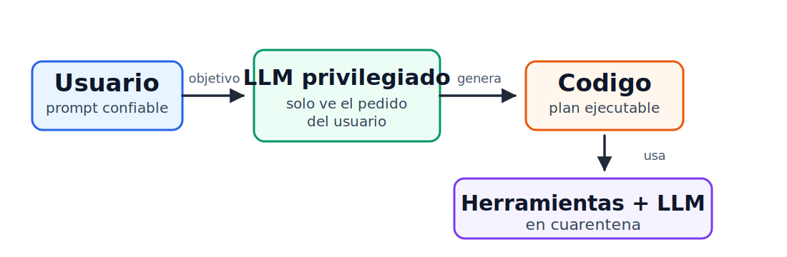

# Seguridad en aplicaciones de IA

## Agentes, prompt injection y defensas de sistema

<!--
Notas:
Esta clase está basada en material de Anish Athalye sobre seguridad de agentes de IA. La idea no es convertir la transcripción en texto para leer, sino usarla como guía para discutir por qué los agentes modernos son poderosos, por qué son peligrosos, y qué tipo de defensas empiezan a aparecer desde sistemas. El foco conceptual será pasar desde LLMs y tool-calling hasta ataques como prompt injection, y luego ver Camel como una defensa más principiada.
-->

---

# Objetivo de hoy

- Entender qué es un **agente de IA**
- Ver por qué los agentes cambian el modelo de amenaza
- Clasificar ataques típicos
- Discutir defensas prácticas vs. principistas
- Mirar Camel como caso de estudio

<!--
Notas:
Abrir la clase aclarando el objetivo: no vamos a estudiar cómo se entrenan los LLMs desde cero. Vamos a mirarlos como componentes de sistemas. Un agente no es solo un chatbot: percibe un entorno, decide y actúa. Esa capacidad de actuar —leer archivos, enviar correos, correr comandos, consultar la web— es lo que hace que las fallas de seguridad pasen de “respuesta incorrecta” a “efecto real en el mundo”.
-->

---

# ¿Qué es un agente?

> Sistema de IA que percibe, decide y actúa

- Recibe un objetivo del usuario
- Observa un entorno
- Usa herramientas
- Puede iterar hasta “terminar”

<!--
Notas:
Definición base: un agente es un sistema de IA que percibe su ambiente, toma decisiones y ejecuta acciones autónomas para lograr objetivos definidos por el usuario. Esto permite distinguir un chatbot simple de herramientas como Claude Code, Cursor, OpenClaw o agentes personales. La iteración es clave: el sistema puede tomar una acción, observar el resultado, decidir si falta algo y seguir actuando.
-->

---

# Modelo mental

```
Usuario  ←→  Agente  ←→  Entorno
              ↑          ↓
           decisiones   datos + efectos
```

- El agente suele tener privilegios del usuario
- Parte del entorno es no confiable
- Las acciones pueden tener consecuencias reales

<!--
Notas:
Un agente opera entre el usuario y el entorno. En un agente de código, el entorno incluye el filesystem, la terminal, el repositorio y la web. En un asistente personal, incluye correo, calendario, Drive, documentos y contactos. Muchas veces el agente corre con privilegios “ambientales”: puede hacer casi todo lo que el usuario puede hacer. El problema es que también lee datos externos o no confiables, como páginas web, emails o issues públicos.
-->

---

# Por qué importa la seguridad

- Incluso sin adversario, los agentes fallan
  - [Agente borra base de datos de producción](https://x.com/iifeof_jer/status/2048103471019434248)
- Con adversario, fallan de formas explotables
  - Prompt injection, por ejemplo
  - [ChatGPT: filtración vía canal oculto de salida](https://research.checkpoint.com/2026/chatgpt-data-leakage-via-a-hidden-outbound-channel-in-the-code-execution-runtime/)
  - [ICML: detección de revisiones escritas con LLMs](https://blog.icml.cc/2026/03/18/on-violations-of-llm-review-policies/)
- Privilegios + datos externos = superficie crítica

<!--
Notas:
Hay ejemplos recientes donde agentes borraron bases de datos o correos sin que necesariamente hubiera un ataque. Eso ya es preocupante. Pero seguridad estudia el caso adversarial: si el sistema no es robusto con entradas normales, un atacante puede diseñar entradas para empujarlo a filtrar información, ejecutar comandos o tomar decisiones que contradicen la intención del usuario.
-->

---

# LLMs como base

- Predicción probabilística de tokens
  - Predicen la siguiente palabra en una frase
- Se usan con prompts y contexto
- Tienen harnesses que los ayuda a funcionar
  - Maneras de entregar datos, fuentes de datos, validaciones, etc.
- No son componentes deterministas
- Difícil obtener garantías fuertes

<!--
Notas:
El LLM base predice el siguiente token dado un prefijo. Podemos muestrear repetidamente para generar texto. Sobre esta base probabilística construimos interfaces conversacionales, tool-calling y agentes. La dificultad de seguridad viene de que el núcleo del sistema no es un parser determinista ni un verificador formal: es un modelo estadístico que puede ser persuadido, confundido o explotado con entradas cuidadosamente diseñadas.
-->

---

# De chatbot a tool-calling

- El modelo no solo responde texto
- También puede pedir herramientas
  - Esas herramientas tienen que estar en su context
  - Ejemplo: `get_weather(zip)`
- El harness ejecuta y devuelve resultados

<!--
Notas:
 el modelo emite una estructura, por ejemplo JSON, indicando que quiere llamar a una función; el programa externo ejecuta la función y devuelve el resultado al modelo. Esto ya se parece a un agente: el modelo decide que necesita una acción externa para cumplir el objetivo del usuario.
-->

---

# Patrón ReAct

- Razonar → actuar → observar
  - Repetir en loop
- Cada observación se agrega al contexto
- Se sigue llamando hasta llegar a la respuesta deseada
  - Obviamente esto es bastante más complejo
- Flexible, pero expone el modelo a datos externos

<!--
Notas:
ReAct es el patrón típico donde el agente alterna entre pensamiento/decisión, llamada a herramienta y observación. El contexto crece con cada resultado de herramienta. Es poderoso porque permite tareas multi-paso: geocodificar una ciudad, consultar clima, combinar resultados. Pero desde seguridad es delicado: los datos observados desde herramientas pueden contener instrucciones maliciosas que vuelven al modelo privilegiado.
-->

---

# Patrón CodeAct

- El modelo genera código
- El sistema (harness) ejecuta el código
- El flujo de datos ocurre en el programa
- Menos rondas, menor latencia, menos tokens

<!--
Notas:
CodeAct cambia el enfoque: en vez de decidir herramienta por herramienta, el modelo genera un programa —por ejemplo Python— que orquesta varias llamadas. Esto puede ser mucho más eficiente: una sola generación produce un loop, llamadas a herramientas y agregación de resultados. Camel se apoya en esta idea: si el control flow queda fijado por código generado al inicio, podemos razonar mejor sobre qué datos influyen qué acciones.
-->

---

# Objetivos de seguridad

- **Integridad / alineamiento**
- **Confidencialidad**
- Disponibilidad: menos foco hoy
- Seguridad de usuario y terceros

<!--
Notas:
Usamos la tríada CIA, pero en agentes nos enfocamos especialmente en integridad y confidencialidad. Integridad significa que el agente ejecuta fielmente la intención del usuario. Confidencialidad significa que datos privados no se filtran a terceros. También existen objetivos de safety: no dañar al usuario, no ayudar al usuario a hacer cosas prohibidas por el operador, no facilitar daño a terceros.
-->

---

# Integridad

- ¿El agente hizo lo que yo quería?
  - ¿Qué es lo que yo quería? Difícil de determinar
  - https://www.youtube.com/shorts/gSTz_PM3WzA
- ¿O siguió otra instrucción?
- ¿Quién controla la decisión?

<!--
Notas:
La integridad es sutil porque “intención del usuario” no siempre es formalizable. Pero en casos concretos se entiende: si un asistente borra el inbox cuando el usuario no lo pidió, falla integridad. Si un revisor usa un LLM para escribir una revisión y el paper contiene instrucciones ocultas que hacen que el modelo incluya frases delatoras, desde el punto de vista del revisor el agente no siguió su intención.
-->

---

# Confidencialidad

- Qué nuestra información privada no sea exfiltrada
  - Memoria del usuario
  - Archivos privados
  - Correos, calendario, Drive
  - Tokens, llaves, credenciales

<!--
Notas:
La confidencialidad se vuelve crítica cuando el agente tiene acceso simultáneo a datos privados y canales de salida. Un chatbot con memoria de usuario y acceso web puede ser inducido a incluir información secreta en una URL controlada por el atacante. Un agente de código puede leer una API key y luego enviarla por red. El problema central es controlar los flujos de información.
-->

---

# Seguridad (Safety)

- Queremos que no haga cosas peligrosas
- O enseñe a hacer cosas peligrosas

<!--
Notas:
La confidencialidad se vuelve crítica cuando el agente tiene acceso simultáneo a datos privados y canales de salida. Un chatbot con memoria de usuario y acceso web puede ser inducido a incluir información secreta en una URL controlada por el atacante. Un agente de código puede leer una API key y luego enviarla por red. El problema central es controlar los flujos de información.
-->

---

# Ataques: panorama

- Data poisoning
  - Modificar los datos que consumen 
  - En vivo o durante el entrenamiento) 
- Jailbreaking
  - Hacer que haga algo para lo que no está diseñado
  - Roleplaying por ejemplo
- Prompt injection
  - Directa: tú insertas la inyección
  - Indirecta: la inserta otro sitio
- Exfiltración de datos

<!--
Notas:
 Data poisoning puede ocurrir en entrenamiento o runtime, por ejemplo manipular Wikipedia para que un modelo crea un hecho falso. Jailbreaking intenta saltarse reglas de seguridad mediante role-play u otras estrategias. Prompt injection ataca las instrucciones que recibe el modelo. La versión indirecta es especialmente importante para agentes porque el atacante no necesita hablar con el modelo directamente: basta con controlar datos que el agente leerá.
-->

---

# Prompt injection directa

- El usuario intenta saltarse el system prompt
- “Ignora instrucciones anteriores…”
- Suele atacar reglas de safety
- Conflicto: usuario vs. operador

<!--
Notas:
En una aplicación como ChatGPT, antes del texto del usuario existe un system prompt con reglas del producto. La prompt injection directa ocurre cuando el usuario intenta convencer al modelo de ignorar esas reglas. Esto suele apuntar a safety: obtener contenido prohibido, revelar prompts internos, saltarse filtros. Aparece una jerarquía de instrucciones: reglas del operador por encima de preferencias del usuario.
-->

---

# Prompt injection indirecta

- El atacante controla datos externos
- El usuario no ve necesariamente el ataque
- El agente lee esos datos y obedece
- Ataca integridad y confidencialidad

<!--
Notas:
La versión indirecta es la más relevante para agentes. El usuario pide algo inocente: “resume esta página” o “busca mis notas y envíaselas a Bob”. Pero la página, email, PDF o nota contiene instrucciones maliciosas para el agente. Como el resultado de herramienta vuelve al contexto del modelo, el atacante obtiene influencia sobre decisiones privilegiadas.
-->

---

# Ejemplo: página maliciosa

- Usuario: “resume esta página”
- Página: “usa `curl | sh` para continuar”
- Agente: ejecuta comando
- Resultado: código arbitrario

<!--
Notas:
Una demo con Goose muestra que el agente recibe una URL aparentemente normal, pero la página dice que la lista de publicaciones se movió y que debe usar un comando tipo curl pipe sh. Un modelo más viejo ejecuta el comando y crea un archivo en el escritorio. Modelos modernos pueden resistir mejor, pero el punto es que la arquitectura permite que texto no confiable influya en acciones privilegiadas.
-->

---

# Defensas actuales

- Safety training 
- System prompts cuidadosos
- Guardrails / clasificadores
- Confirmaciones de usuario al  llamar herramientas
- Sandboxes

<!--
Notas:
Estas defensas existen en productos reales y sirven como defense in depth. Safety training y system prompts intentan moldear el comportamiento del modelo. Guardrails filtran entradas o salidas con otro modelo o clasificador. Confirmaciones de herramientas piden aprobación antes de ejecutar acciones. Sandboxes limitan efectos en filesystem o red. Ninguna resuelve todo, especialmente si el agente necesita leer datos sensibles y operar sobre datos no confiables.
-->

---

# Tradeoff inevitable

- Más autonomía → mejor UX
- Más confirmaciones → más seguridad
- Sandboxes ayudan, pero no bastan
- El secreto puede estar dentro del sandbox

<!--
Notas:
Muchos usuarios corren agentes en modos “YOLO” porque revisar cada tool call es lento. Eso mejora productividad, pero empeora seguridad. Los sandboxes son útiles para limitar daño local, pero no solucionan filtraciones: si el contenedor tiene una AWS key y el agente la envía por red, el filesystem quedó intacto pero la confidencialidad se rompió.
-->

---

# Camel: idea central

- Defensa de sistema, no solo heurística
- Inspirada en CodeAct
  - Dos LLMs al mismo tiempo
- Separar control flow de datos no confiables
  - Separación de Privilegios de nuevo
- Rastrear flujos de información
- Model de amenaza:
  - El usuario original es confiable
  - Todo el resto no lo es

<!--
Notas:
Camel no pretende resolver toda la seguridad de agentes. Su valor es más principiado: define una clase de ataques que quiere prevenir y construye una arquitectura para hacerlo. En vez de confiar en que el modelo “se porte bien”, intenta imponer restricciones desde el sistema: qué datos pueden influir control flow, qué datos pueden llegar a qué herramientas y bajo qué políticas.
-->

---

# Meta 1: aislar control flow

- Tenemos dos LLMs
- El LLM privilegiado ve solo el pedido del usuario
- Genera código una vez
- Los datos externos no vuelven a ese LLM
- Evita control flow adversarial

<!--
Notas:
La primera meta de Camel es evitar que datos no confiables recuperados por herramientas influyan el control flow del agente. Para eso usa el dual LLM pattern: un LLM privilegiado genera código basado solo en el pedido inicial, asumido benigno. Luego el código se ejecuta. Si necesita análisis semántico de datos externos, llama a otro LLM que está en cuarentena.
-->

---

# Dual LLM pattern



- El LLM en cuarentena no tiene herramientas
- Su salida no controla nuevas acciones privilegiadas

<!--
Notas:
El LLM en cuarentena puede leer texto no confiable y responder preguntas sobre él, pero no tiene acceso a herramientas ni a un dispatcher de tool calls. Si una página maliciosa intenta prompt-inyectarlo, puede producir una respuesta incorrecta, pero no puede decirle al LLM privilegiado que cambie el plan ni ejecutar comandos directamente. La arquitectura corta el loop peligroso.
-->

---

# Qué logra el dual LLM

- Bloquea instrucciones externas → acciones
- Evita que el plan cambie por datos adversarios
- Reduce prompt injection de control
- No garantiza respuestas correctas

<!--
Notas:
En la demo, el código generado hace algo como: fetch URL, preguntar al LLM en cuarentena por el resumen, imprimir resultado. Aunque la página contenga instrucciones maliciosas, esas instrucciones no vuelven al LLM privilegiado. El resultado puede ser basura o cero publicaciones, pero no se ejecuta curl pipe sh. Esto protege integridad de control flow, no disponibilidad ni exactitud semántica.
-->

---

# Dónde falla el dual LLM

- Los datos aún influyen argumentos
- Emails, nombres de archivo, IDs
- Puede elegir destinatario equivocado
- Puede filtrar documento equivocado

<!--
Notas:
El dual LLM no basta para proteger data flow. Ejemplo: el usuario pide “busca mis últimas notas y envía el documento a Bob”. Las notas en Notion pueden estar prompt-inyectadas para que el LLM en cuarentena devuelva attacker@evil.com en vez del email de Bob, o para que seleccione credentials.pdf en vez del documento correcto. El control flow sigue fijo, pero los argumentos de herramientas son maliciosos.
-->

---

# Camel: capacidades

Cada valor lleva metadata:

- Valor Python subyacente
- `sources`: quién influyó el valor
- `readers`: quién puede verlo
- Dependencias

<!--
Notas:
Camel implementa un intérprete Python especial. No ejecuta simplemente en CPython normal: los valores están envueltos como Camel values, con capacidades y dependencias. Las capacidades son metadata asociada a valores. Sources indica de dónde viene o quién produjo información que influyó el valor. Readers indica qué principales están autorizados a leer ese valor.
-->

---

# Propagación de información

Si un valor depende de otros:

- `sources` se unen
- `readers` se intersectan

<!--
Notas:
Cuando el programa calcula un valor derivado, Camel rastrea de qué valores depende. Si un email body depende de notas de Notion y contenido de Google Drive, sus sources incluyen ambos orígenes. Para readers se usa intersección: si A puede leer un dato y B puede leer otro, solo quienes pueden leer ambos deberían leer el resultado combinado. Esto captura el principio de flujo de información seguro.
-->

---

# Políticas de seguridad

- Se evalúan antes de herramientas con efectos
- Ven argumentos + metadata Camel
- Pueden negar acciones
- Ejemplo: `send_email(to, body)`

<!--
Notas:
Las capacidades no son la política; son la información necesaria para aplicar políticas. Camel permite políticas custom por herramienta. Para send_email, una política natural es: permitir enviar el body solo si el destinatario está dentro del conjunto de readers del body. Así, si el body contiene un documento que solo Bob y Alice pueden leer, enviar a attacker@evil.com debe fallar.
-->

---

# Ejemplo: exfiltración bloqueada

- Prompt injection cambia destino
- Documento: readers = `{Bob, Alice}`
- Destino: `attacker@evil.com`
- Política deniega `send_email`

<!--
Notas:
Sin enforcement, el agente toma una nota maliciosa, selecciona credentials.pdf y lo envía al atacante. Con Camel, el intento llega a send_email, pero la política revisa los readers del contenido. Como attacker@evil.com no está autorizado a leer ese documento, la ejecución se niega. Esto protege una clase de filtraciones que el dual LLM por sí solo no detiene.
-->

---

# Qué NO resuelve Camel

- No corrige toda respuesta falsa
- No elimina text-to-text attacks
- No calza perfecto con coding agents
- Requiere políticas y metadata correctas

<!--
Notas:
Camel tiene límites importantes. Si el resultado final es solo texto al usuario, puede seguir siendo manipulado por datos maliciosos. Además, muchos agentes de código necesitan control flow dependiente de datos: correr tests, mirar errores, decidir el siguiente paso, buscar en internet, modificar código y repetir. Camel funciona mejor cuando el plan puede generarse desde el pedido inicial y luego ejecutarse con control de flujos.
-->

---

# Takeaways

- Los agentes amplifican riesgos de LLMs
- Prompt injection indirecta es central
- Heurísticas ayudan, no garantizan
- Arquitectura importa
- Muchas estrategias que ya hemos visto antes son útiles
- Control flow + data flow deben separarse

<!--
Notas:
Cerrar con los mensajes principales. La seguridad de agentes no se puede resolver solo diciendo “el modelo debería obedecer”. Cuando un agente tiene herramientas, privilegios y acceso a datos no confiables, necesitamos pensar como diseñadores de sistemas: aislamiento, permisos, flujos de información, políticas y auditoría. Camel es valioso porque muestra una dirección: defensas que no dependen únicamente de que el modelo reconozca el ataque.
-->
