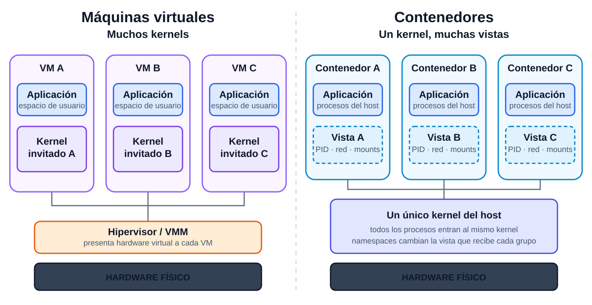
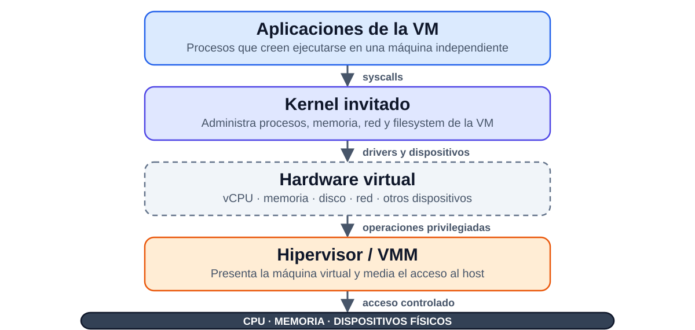

# Linux Containers y Máquinas Virtuales

## De separar procesos a construir límites operacionales

---

# El problema: compartir un host sin compartir el destino

Tenemos una aplicación web, una base de datos y un procesador de trabajos en el mismo servidor.

* Si la aplicación web es comprometida, ¿puede leer los datos de la base?
* Si un proceso consume toda la memoria, ¿sobrevive el resto?
* Si dos servicios requieren versiones incompatibles de una biblioteca, ¿cómo los desplegamos?
* Si necesitamos reproducir el sistema mañana, ¿qué debemos capturar?

**Objetivo:** ejecutar software junto, pero reducir cuánto puede **ver, usar y hacer** cada componente.

---

# Desde la clase anterior

* En OKWS vimos **separación por procesos** y **separación de privilegios**
  * mínimo privilegio
  * separación de responsabilidades
  * menor radio de explosión
* Esa estrategia funciona, pero exige coordinar manualmente:
  * usuarios, filesystem, red y dependencias
  * límites de CPU y memoria
  * privilegios y syscalls

**Pregunta guía:** ¿puede el sistema operativo entregar estas separaciones como una unidad manejable?

---

# Ruta de la clase

Al terminar, deberíamos poder:

1. Explicar qué es —y qué no es— un contenedor
2. Elegir entre una máquina virtual y un contenedor según el límite requerido
3. Relacionar cada mecanismo de Linux con una pregunta concreta:
   * **¿qué puede ver?** → namespaces
   * **¿cuánto puede usar?** → cgroups
   * **¿qué privilegios tiene?** → capabilities
   * **¿qué le puede pedir al kernel?** → seccomp-bpf
4. Entender por qué estos mecanismos se usan **en conjunto**

---

# Dos modelos de aislamiento

* **Máquina virtual:** una máquina física ejecuta varios kernels
  * cada VM incluye su propio sistema operativo invitado
  * el hipervisor media el acceso al hardware
* **Contenedor:** un kernel ejecuta varios espacios de usuario aislados
  * los procesos siguen siendo procesos del host
  * el kernel aplica aislamiento y límites

> VM: **muchos kernels**. Contenedor: **un kernel, muchas vistas del sistema**.

---

# Muchos kernels vs. muchas vistas

<style scoped>
section { align-items: stretch; }
img { display: block; margin: 4px auto 0; }
</style>



---

# ¿Qué es el kernel?

* Es la parte del sistema operativo que administra:
  * procesos y memoria
  * dispositivos y filesystem
  * red
  * permisos y llamadas de sistema (*syscalls*)
* Las aplicaciones no acceden directamente al hardware: solicitan servicios al kernel

**Consecuencia:** los contenedores pueden ser livianos porque comparten el kernel, pero ese kernel también es parte de su frontera de seguridad.


---

# ¿Qué es una máquina virtual?

* Es una computadora implementada en software
* El **hipervisor** o *Virtual Machine Monitor* (VMM) presenta hardware virtual:
  * CPUs virtuales (*vCPU*)
  * memoria virtual
  * disco, red y otros dispositivos virtuales
* Sobre ese hardware arranca un sistema operativo completo, con su propio **kernel invitado**
* Las aplicaciones dentro de la VM creen que están ejecutándose en una máquina independiente

> Una VM virtualiza una **máquina**; no solamente un proceso.

---

# ¿Cómo se ejecuta una máquina virtual?

<style scoped>
section { align-items: stretch; }
img { display: block; margin: 6px auto 0; }
</style>



---

# chroot: una primera aproximación

* `chroot` cambia el directorio raíz que ve un proceso
  * por ejemplo, de `/` a `/home/ignacio`
* Ayuda a controlar la **vista del filesystem**
* No aísla por sí solo procesos, red, recursos ni privilegios
* Un proceso suficientemente privilegiado puede escapar

**Lección:** cambiar `/` resuelve una dimensión; un contenedor necesita varias capas coordinadas.

---

# Entonces, ¿qué es un contenedor?

* No es una “mini VM”: es un **grupo de procesos** del host
* El runtime configura para esos procesos:
  * **namespaces** para vistas privadas
  * **cgroups** para contabilizar y limitar recursos
  * **capabilities** para dividir el poder de `root`
  * **seccomp-bpf** para filtrar syscalls
  * un filesystem raíz y configuración de ejecución
* Suele arrancar en milisegundos o segundos y tener menor overhead que una VM

**El contenedor es el resultado de componer mecanismos, no un único mecanismo del kernel.**

---

# Casos de uso

* Segregación de privilegios entre servicios en un mismo host
* Contención del radio de explosión ante fallas o compromisos
* Uso eficiente de recursos con aislamiento y límites explícitos
* Despliegues reproducibles con aplicación y dependencias empaquetadas
* Escalamiento y reemplazo rápido de instancias desechables

**Primero veremos la visibilidad; después, consumo y poder.**

---

# Namespaces: ¿qué puede ver el proceso?

* Un namespace entrega a un grupo de procesos una **vista aislada** de un recurso global del kernel
* No es una autorización universal: controla principalmente qué aparece en esa vista
* **Analogía:** habitaciones separadas en una casa
  * cada habitación ve sus propios objetos
  * la casa y su infraestructura siguen siendo compartidas
* Linux moderno ofrece ocho tipos principales de namespaces

---

# Tipos de Namespaces

* **PID:** procesos e identificadores
* **UTS:** hostname y nombre de dominio
* **cgroup:** vista de la jerarquía de cgroups
* **IPC:** mecanismos de comunicación entre procesos
* **User:** IDs de usuarios y privilegios
* **Mount:** árbol de puntos de montaje
* **Network:** interfaces, rutas, puertos y firewall
* **Time:** offsets de algunos relojes del sistema

---

# PID Namespace - Ejemplo

* Cada contenedor ve sus procesos empezando desde PID 1
* Los procesos del contenedor no ven procesos fuera de su PID namespace

**Host:**
```
PID 1234: nginx (contenedor A)
PID 5678: postgres (contenedor B)
```

**Dentro del contenedor A:**
```
PID 1: nginx  ← Ve su propio árbol de procesos
```

*El host sí puede observar ambos contenedores.*

---

# Network Namespace - Ejemplo

* Cada contenedor puede tener su propia pila de red:
  * interfaces (`eth0`, `lo`)
  * direcciones IP y rutas
  * puertos y reglas de firewall
* Dos contenedores pueden escuchar en el puerto 80 sin conflicto
* Para comunicarlos, el host o runtime conecta sus namespaces
  * por ejemplo, con pares `veth` y un bridge

---

# Mount Namespace - Ejemplo

* Cada contenedor ve su propio árbol de montajes
* El proceso interpreta ese árbol como `/`
* La implementación puede usar un directorio, volúmenes y/o capas de filesystem

<style scoped>
  pre { font-size: 24px; }
</style>

**Dentro del contenedor:**
```
/app
/etc/nginx
/var/log
```

**Ejemplo en el host (LXC):**
```
/var/lib/lxc/mi-contenedor/rootfs/app
```

---

# User Namespace - Ejemplo

* Mapea UIDs y GIDs internos a IDs diferentes en el host
* `root` (UID 0) dentro del contenedor puede mapearse a un UID no privilegiado, por ejemplo 100000, fuera
* Así, `root` dentro del namespace no equivale automáticamente a `root` en el host

**Importante:** mejora la frontera, pero no elimina el riesgo de vulnerabilidades del kernel ni de configuraciones peligrosas.

---

# IPC Namespace

* IPC = *Inter-Process Communication*
* Aísla mecanismos como:
  * semáforos
  * colas de mensajes
  * memoria compartida System V y POSIX
* Esos objetos IPC no cruzan namespaces por defecto
* Los servicios aún pueden comunicarse mediante canales compartidos explícitamente
  * por ejemplo, sockets o la red

---

# De la vista al consumo

Los namespaces responden **“¿qué ve este proceso?”**, pero no evitan que consuma toda la memoria o CPU del host.

Para eso necesitamos agrupar procesos y aplicar políticas de recursos.

---

# Control Groups - cgroups

* Contabilizan y controlan recursos usados por un grupo de procesos
* **Problema que resuelven:** un servicio sin límites puede degradar a todos sus vecinos
* Funciones principales:
  * **límites:** máximos de memoria, CPU o I/O
  * **contabilidad:** observación del consumo
  * **priorización:** distribución relativa de recursos
  * **control:** congelar o gestionar grupos de procesos

Los ejemplos siguientes usan **cgroups v2** mediante configuración de LXC.

---

# cgroups - Ejemplo de Memoria

<style scoped>
  pre { font-size: 22px; }
</style>

**Sin límites:**
```
Contenedor A: usa 8 GB de RAM
Contenedor B: usa 500 MB de RAM
Host: entra en presión de memoria
```

**Con cgroups v2 (configuración LXC):**
```
lxc.cgroup2.memory.max = 2G
```

* A no puede superar 2 GB dentro de ese cgroup
* Al alcanzar el límite, puede activar reclaim y eventualmente el OOM killer del cgroup
* El límite reduce el impacto sobre el resto del host

---

# cgroups - Ejemplo de CPU

<style scoped>
  pre { font-size: 22px; }
</style>

* Limitar a 50% de un núcleo (`cuota período`):
```
lxc.cgroup2.cpu.max = 50000 100000
```

* Restringir a núcleos específicos:
```
lxc.cgroup2.cpuset.cpus = 0-1
```

* **Uso real:** evitar que un servicio monopolice CPU y reservar capacidad para otros

---

# cgroups - Ejemplo de Disco I/O

<style scoped>
  pre { font-size: 22px; }
</style>

* Limitar lectura a 10 MB/s en el dispositivo `8:0`:
```
lxc.cgroup2.io.max = 8:0 rbps=10485760
```

* **Escenario:** una base de datos realiza escrituras intensivas
  * sin política: puede aumentar la latencia de todos los servicios
  * con política: se acota su impacto sobre el I/O compartido

---

# De los recursos a los privilegios

Un proceso puede respetar sus límites de CPU y memoria y aun así tener demasiado poder.

La siguiente pregunta es: **¿qué operaciones privilegiadas necesita realmente?**

---

# Capabilities

* El modelo tradicional parece binario:
  * usuario `root` → puede hacer casi todo
  * usuario normal → tiene privilegios limitados
* Pero algunas aplicaciones necesitan solo una operación privilegiada
  * ejemplo: crear ciertos sockets de red para `ping`
* Entregar todo `root` viola el principio de mínimo privilegio

---

# Capabilities - La Solución

* Linux divide privilegios en capabilities independientes, por ejemplo:
  * **CAP_CHOWN:** cambiar dueño de archivos
  * **CAP_NET_ADMIN:** configurar la red
  * **CAP_NET_RAW:** crear sockets RAW
  * **CAP_SYS_TIME:** cambiar la hora del sistema
  * **CAP_KILL:** enviar señales a procesos permitidos por sus reglas
* Podemos conservar solo las capabilities necesarias y eliminar el resto

---

# Capabilities - Ejemplo: ping

<style scoped>
  pre {
    width: 75%;
    margin-left: 0px;
  }
</style>

* En este sistema, `ping` no es setuid root:
```
ignacio@ubuntu:~$ ls -al /bin/ping
-rwxr-xr-x 1 root root 72776 Jan 30 15:11 /bin/ping
```

* El archivo tiene `CAP_NET_RAW`:
```
ignacio@ubuntu:~$ getcap /bin/ping
/bin/ping = cap_net_raw+ep
```

* Puede abrir el socket necesario sin recibir todos los privilegios de `root`

---

# Capabilities - Sets

* Para este ejemplo importan dos conjuntos:
  * **Permitted (p):** capabilities que el proceso puede activar
  * **Effective (e):** capabilities activas ahora
* En `cap_net_raw+ep`, la capability queda permitted y effective
* Linux también mantiene conjuntos *inheritable*, *bounding* y *ambient* para controlar propagación y límites

**Idea central:** una capability es una unidad de privilegio, no una identidad de usuario.

---

# Capabilities - ¿Qué pasa si copiamos ping?

<style scoped>
  pre {
    width: 75%;
    margin-left: 0px;
  }
</style>

* Las file capabilities son atributos extendidos y una copia normal puede no preservarlas:
```
ignacio@ubuntu:~$ cp /bin/ping .
ignacio@ubuntu:~$ getcap ./ping
                      ← No tiene capabilities
ignacio@ubuntu:~$ ./ping google.com
ping: socket: Operation not permitted
```

*El resultado exacto depende también de la configuración de red y del sistema.*

---

# Capabilities - Asignando Manualmente

<style scoped>
  pre {
    width: 75%;
    margin-left: 0px;
  }
</style>

```
ignacio@ubuntu:~$ sudo setcap cap_net_raw=ep ./ping
ignacio@ubuntu:~$ getcap ./ping
./ping = cap_net_raw+ep
ignacio@ubuntu:~$ ./ping google.com
PING google.com (172.217.11.14) 56(84) bytes of data.
64 bytes from lax31s10-in-f14.1e100.net: icmp_seq=1 ttl=117
```

* **Ventaja:** privilegio específico en vez de setuid root
* En contenedores, normalmente partimos eliminando capabilities innecesarias

---

# De privilegios a superficie de ataque

Incluso sin capabilities peligrosas, un proceso todavía puede invocar muchas syscalls sobre el kernel compartido.

Podemos reducir esa interfaz a lo que la aplicación necesita.

---

# Seccomp-bpf

* **Seccomp:** *Secure Computing Mode*
* **BPF:** mecanismo usado para evaluar filtros en el kernel
* **Función:** permitir, negar o registrar syscalls según una política
* Linux expone cientos de syscalls; una aplicación suele necesitar solo un subconjunto

**Seccomp reduce superficie de ataque; no reemplaza namespaces, capabilities ni parches del kernel.**

---

# Seccomp-bpf - Motivación

* **Escenario de ataque:**
  1. un atacante explota la aplicación web
  2. ejecuta código dentro del contenedor
  3. intenta usar syscalls innecesarias para ampliar el compromiso
* **Sin filtro:** puede intentar toda la interfaz de syscalls disponible
* **Con seccomp:** el kernel aplica una acción definida para llamadas no permitidas
  * por ejemplo, retornar `EPERM`, registrar o terminar el proceso

---

# Seccomp-bpf - Ejemplo

* Docker aplica por defecto un perfil seccomp que niega decenas de syscalls sensibles, entre ellas algunas relacionadas con:
  * `reboot` — reiniciar el sistema
  * `swapon/swapoff` — administrar swap
  * `mount/umount` — montar filesystems
  * `kexec_load` — cargar un nuevo kernel
  * ciertos usos de `ptrace` — inspeccionar otros procesos
* La acción depende del perfil; comúnmente la syscall falla con “operación no permitida”

---

# Seccomp-bpf - Aplicando un Perfil

<style scoped>
  pre { font-size: 22px; }
</style>

**Configuración LXC:**
```
lxc.seccomp.profile = /path/to/seccomp-profile
```

* El perfil define syscalls y acciones
* Dos estrategias:
  1. **allowlist:** permitir solo lo necesario
  2. **denylist:** bloquear operaciones conocidas como peligrosas
* Una allowlist reduce más la superficie, pero requiere conocer bien la aplicación

---

# ¿Cómo funciona todo junto?

* **Namespaces — visibilidad:** no ve procesos, red o montajes ajenos
* **cgroups — consumo:** no puede superar políticas de memoria, CPU o I/O
* **Capabilities — privilegios:** `root` no conserva todo su poder tradicional
* **seccomp-bpf — interfaz:** no puede invocar syscalls fuera de la política

**Cada capa responde una pregunta distinta. Ninguna basta por sí sola.**

---

# Ejemplo Completo: Contenedor Web

<style scoped>
  pre {
    width: 85%;
    margin-left: 0px;
    font-size: 21px;
  }
</style>

```ini
# Fragmento ilustrativo de configuración LXC
lxc.cgroup2.memory.max = 1G
lxc.cgroup2.cpu.max = 50000 100000
lxc.cap.drop = sys_admin sys_module sys_time
lxc.seccomp.profile = /etc/lxc/seccomp-web.profile
```

* **Namespaces:** configurados por el runtime para procesos, mounts y red
* **cgroups:** 1 GB de memoria y 50% de un núcleo
* **capabilities + seccomp:** menos privilegios y menor superficie de syscall

*La sintaxis y los defaults exactos dependen de la versión del runtime.*

---

# La frontera tiene límites

* Los contenedores **comparten kernel**
  * una vulnerabilidad del kernel puede atravesar el aislamiento
* Montajes privilegiados, sockets del host o capabilities amplias pueden abrir la frontera
* Ejecutar como `root`, usar imágenes no confiables o no definir límites aumenta el riesgo
* Para cargas con distinta confianza, una VM puede ser una frontera más apropiada

**Aislamiento es una propiedad del diseño y la configuración, no una etiqueta.**

---

# Cierre: volver al problema inicial

Para que web, base de datos y workers compartan un host sin compartir el destino:

1. **Namespaces** separan lo que observan
2. **cgroups** contienen competencia y agotamiento de recursos
3. **capabilities** aplican mínimo privilegio
4. **seccomp-bpf** reduce la interfaz disponible al kernel
5. **VMs** agregan otra frontera cuando compartir kernel no es aceptable

> Un contenedor empaqueta procesos; su aislamiento emerge de varias defensas superpuestas.

---

# Máquinas Virtuales v/s Containers

<style scoped>
table { font-size: 18px; }
th, td { padding: 7px 10px; }
</style>

| | **Máquina virtual** | **Contenedor Linux (LXC)** |
|---|---|---|
| **Sistema operativo** | Ejecuta un sistema operativo invitado aislado dentro de la VM. | Ejecuta el mismo sistema operativo que el host y comparte su kernel. |
| **Red** | Utiliza dispositivos de red virtuales. | Usa namespaces para obtener una vista aislada de un adaptador de red virtual. |
| **Aislamiento** | Aislamiento completo respecto de otros sistemas invitados y del sistema host. | Aislamiento mediante namespaces y cgroups respecto del host y de otros contenedores LXC. |
| **Tamaño** | Normalmente del orden de gigabytes. | Normalmente del orden de megabytes. |
| **Tiempo de inicio** | Del orden de segundos a minutos, dependiendo del medio de almacenamiento. | Del orden de segundos. |

---

# ¿Cuándo elegir cada uno?

* **Máquinas virtuales**
  * kernels o sistemas operativos distintos
  * frontera de aislamiento más fuerte frente a fallas del kernel invitado
  * mayor costo de arranque y memoria
* **Contenedores**
  * alta densidad y arranque rápido
  * empaquetar dependencias y reproducir despliegues
  * aislamiento entre servicios que pueden compartir un kernel

**No son rivales absolutos:** es común ejecutar contenedores dentro de VMs.
