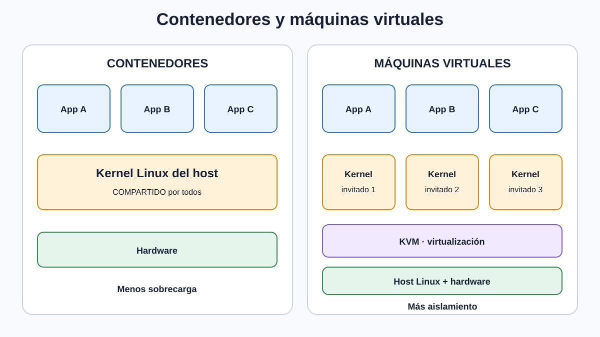
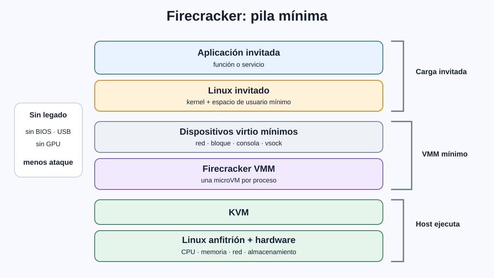
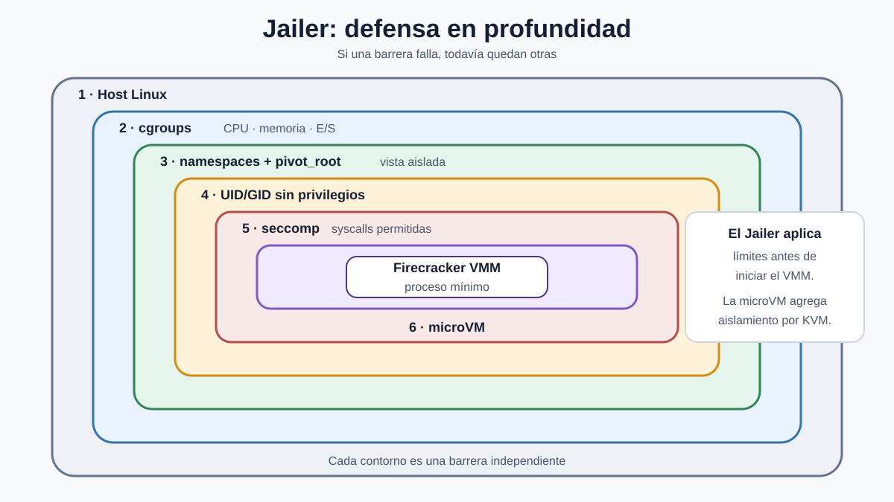
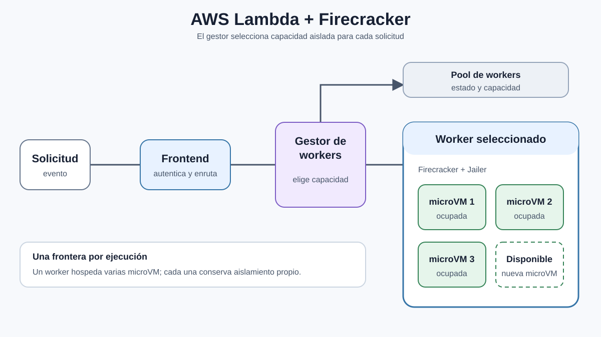

# Aislamiento de SO y VM

---

# Objetivos de esta clase
  * Comparar procesos, contenedores y VMs como mecanismos de aislamiento
  * Analizar los trade-offs de seguridad, rendimiento y funcionalidad al diseñar mecanismos de aislamiento
  * Usar como caso de estudio Firecracker, utilizado para ejecutar funciones de AWS Lambda

---

# ¿Qué es AWS Lambda?
  * Servicio de Function as a Service (FaaS): ejecuta código sin que el cliente administre servidores
  * El cliente entrega una función y configura su runtime, memoria y eventos que la invocan
  * AWS inicia instancias cuando llegan solicitudes y escala automáticamente según la carga
  * El cliente paga por las invocaciones y el tiempo de ejecución

---

# Caso de estudio: Paper de Firecracker de Amazon
  * Desafío de seguridad: código arbitrario, necesita aislarlo de otros clientes
  * Desafío de rendimiento: la carga puede variar ampliamente
    * Podría ser mucho menos que una máquina (muchos clientes por máquina)
    * Podría crecer rápidamente y necesitar ejecutar código de cliente en nueva máquina
  * Objetivo: dominios de aislamiento de bajo overhead pero fuertes

---

# Enfoques de aislamiento
  * Procesos Linux (como en OKWS)
  * Contenedores, usando namespaces de Linux + cgroups
  * VMs
  * Runtimes de lenguaje (esto no lo veremos hoy)
    * Ejecutan código dentro de un entorno controlado que restringe memoria y acceso al sistema (ej., JVM, V8 o WebAssembly)

---

# Procesos Linux
  * IDs de usuario
  * Permisos por archivo
  * Diseñado para compartir granular entre usuarios, no aislamiento grueso
    * Básicamente tenemos demasiados recursos compartidos
  * Usamos permisos, chroot, etc. pero no es suficiente

---

# Aislamiento en contenedores Linux
  * Los contenedores empaquetan software y sus dependencias, y aíslan su ejecución
  * Los procesos siguen compartiendo el kernel y sus recursos
  * Los namespaces restringen qué recursos puede ver y nombrar cada proceso
    * Sistema de archivos, PIDs, red, usuarios, etc.
  * Un mount namespace junto con pivot_root/chroot aísla el sistema de archivos
  * Los cgroups limitan el consumo de CPU, memoria e I/O
    * Ayudan a prevenir ataques DoS, pero no son un límite de seguridad
  * Un runtime combina estas técnicas y ejecuta el proceso dentro del entorno resultante

---

# ¿Por qué los namespaces no son suficientes para Lambda?
  * Kernel Linux compartido
  * Superficie de ataque amplia: cientos de llamadas al sistema, además de muchas operaciones especializadas mediante ioctl
    * El número exacto depende de la arquitectura y versión del kernel
  * Gran cantidad de código, escrito en C
    * Los errores (buffer overflows, use-after-free, ...) continúan siendo descubiertos
    * No hay aislamiento dentro del kernel Linux mismo
  * Los errores del kernel permiten al adversario escapar del aislamiento ("escalación de privilegios local" o LPE)
    * Relativamente común: nuevos errores LPE cada año

---

# Mecanismo de seguridad adicional: seccomp-bpf
  * Filtra qué llamadas al sistema puede invocar un proceso
    * El kernel ejecuta un pequeño programa BPF antes de procesar cada syscall
    * El filtro puede examinar el número de syscall y sus argumentos
    * Los procesos hijos heredan el filtro
  * Reduce la superficie de ataque bloqueando syscalls innecesarios o sospechosos
  * ¿Por qué no es suficiente para Lambda?
    * Bloquear syscalls poco comunes puede romper código legítimo del cliente
    * Permitir syscalls comunes todavía expone una parte importante del kernel

---

# Enfoque más pesado: VMs
  * Ejecutar Linux en una VM guest
  * ¿Por qué esto es mejor que Linux?
    * Superficie de ataque más pequeña: no hay syscalls complejos, solo instrucciones de CPU y dispositivos virtuales
    * Históricamente, menos vulnerabilidades de escape que en un kernel compartido
      * Según los datos citados por el paper, se descubrían errores de escape de VM menos de una vez al año
  * ¿Por qué estos tampoco son suficientes para Lambda?
    * Alto costo de inicio: toma mucho tiempo arrancar la VM
    * Alto overhead: gran costo de memoria para cada VM en ejecución
    * Errores potenciales en el VMM mismo (qemu): 1.4M líneas de código C
  * Plan del paper: escribir un nuevo VMM, pero seguir usando KVM

---

---

# ¿Qué implica implementar soporte para VMs?
  * Virtualizar la CPU y memoria
    * Soporte de hardware en procesadores modernos
    * Tablas de páginas anidadas
    * Virtualizar registros privilegiados que normalmente solo son accesibles al kernel
  * Virtualizar dispositivos
    * Controlador de disco
    * Tarjeta de red
    * PCI
    * Tarjeta gráfica
    * Teclado, puertos serie, ...
  * Virtualizar el proceso de arranque
    * BIOS, boot loader

---

# Linux KVM
  * Subsistema del kernel Linux para virtualización asistida por hardware
  * Expone `/dev/kvm`, utilizado por un VMM en user space
  * Gestiona vCPUs, memoria guest y ejecución de código virtualizado
  * No implementa una VM completa
    * El VMM todavía debe proporcionar dispositivos, arranque y administración
  * [Documentación oficial de la API de KVM](https://www.kernel.org/doc/html/latest/virt/kvm/api.html)

---

# QEMU
  * Implementa dispositivos virtuales similares al hardware real
  * También implementa dispositivos puramente virtuales (virtio)
    * Interfaces estandarizadas basadas en memoria compartida
  * Puede ejecutar la CPU guest de dos maneras:
    * Emulación por software (TCG): traduce instrucciones y permite ejecutar una arquitectura distinta a la del host
    * Virtualización por hardware (KVM): la mayoría de las instrucciones se ejecutan directamente en la CPU
      * Operaciones sensibles producen un VM exit y son manejadas por KVM o QEMU
  * Proporciona mecanismos para iniciar la VM
    * Puede cargar firmware como SeaBIOS u OVMF, o iniciar un kernel directamente
      * SeaBIOS implementa el BIOS tradicional; OVMF implementa UEFI

---

# Diseño de Firecracker
  * Usar KVM para CPU virtual y memoria
  * Implementar un VMM mínimo y especializado en lugar de usar QEMU
  * Soportar un conjunto mínimo de dispositivos
    * virtio network, virtio block (disco), teclado y puerto serie
  * Dispositivos de bloque en lugar de sistema de archivos: límite de aislamiento más fuerte
    * El sistema de archivos tiene estado complejo
      * Directorios, archivos de longitud variable, symlinks / hardlinks
    * El sistema de archivos tiene operaciones complejas
      * Crear/eliminar/renombrar archivos, mover directorios completos, r/w range, append, ...
    * El dispositivo de bloque es mucho más simple:
      * Bloques de 4 KByte
      * Los bloques están numerados del 0 al N, que es el tamaño del disco
      * Leer y escribir un bloque completo (Y tal vez flush / barrier)

---

# Diseño de Firecracker (cont.)
  * No incluir un emulador general de CPU
    * Las instrucciones guest se ejecutan directamente en el procesador mediante KVM
    * Algunas operaciones sensibles producen VM exits manejados por KVM o el VMM
  * No soportar BIOS en absoluto
    * Solo cargar el kernel en la VM en la inicialización y comenzar a ejecutarlo

---

---

# Implementación de Firecracker: Rust
  * Lenguaje memory-safe (módulo código "unsafe")
  * Al momento del paper: aproximadamente 50K líneas de código, mucho menos que QEMU
  * Hace improbable que la implementación VMM tenga errores como buffer overflows
  * [Repositorio de Firecracker en GitHub](https://github.com/firecracker-microvm/firecracker)

---

# Aislamiento del proceso VMM: el jailer
  * Firecracker incluye un programa separado llamado jailer
    * Configura el aislamiento antes de ejecutar el proceso VMM
  * Crea un mount namespace y usa pivot_root/chroot para restringir el sistema de archivos visible
  * Ejecuta el VMM con un usuario y grupo sin privilegios
  * Puede configurar cgroups y límites de recursos
  * Los namespaces de red y PID son opcionales
  * Firecracker instala filtros seccomp-bpf para limitar las llamadas al sistema permitidas
  * Defensa en profundidad: si se explota un error del VMM, estas capas dificultan escalar el ataque

---

---

# Arquitectura Lambda alrededor del mecanismo central de Firecracker
  * Muchos workers (máquinas físicas ejecutando MicroVMs basados en Firecracker)
  * Cada worker tiene un número fijo de "slots" de MicroVM disponibles para ejecutar cosas
  * El código del cliente se carga en un "slot" iniciando una VM, cargando código del cliente
  * El manager de workers se encarga de decidir dónde se enrutan las solicitudes
  * El frontend busca worker del manager de workers, envía solicitud directamente allí

---

---

# Evaluación de Firecracker en el paper (2020)
  * Overhead bajo
    * 3MB de overhead de memoria por VM inactiva
    * 125ms de tiempo de arranque
  * Rendimiento de CPU cercano a KVM
  * Limitaciones de I/O observadas en la versión evaluada
    * El disco virtual requería mayor concurrencia para mejorar su rendimiento
    * La red virtual era más lenta; el paper menciona PCI passthrough como posible optimización

---

# ¿Qué tan bien logra Firecracker sus objetivos? (cont.)
  * Seguridad probablemente bastante buena
    * Implementación en Rust: menos propensa a errores de memoria
    * VMM y modelo de dispositivos mucho más pequeños que los de QEMU
    * Capas adicionales de aislamiento mediante el jailer
  * KVM y el kernel del host todavía forman parte del Trusted Computing Base (TCB)
    * Una vulnerabilidad en KVM podría romper el aislamiento de Firecracker
    * [Google Project Zero: An EPYC Escape - KVM Vulnerability Case Study](https://googleprojectzero.blogspot.com/2021/06/an-epyc-escape-case-study-of-kvm.html)

---

# ¿Qué ha cambiado desde la publicación del paper?
  * Firecracker ahora soporta x86_64 y ARM de 64 bits (aarch64)
  * El conjunto de dispositivos virtuales se ha expandido
    * Incluye vsock, balloon y virtio-rng, entre otros
  * Soporte opcional para virtio-pci
    * Mejora el rendimiento de I/O sin entregar un dispositivo físico directamente a la VM
  * La implementación ha crecido desde aproximadamente 50K a más de 120K líneas de Rust
    * Sigue siendo considerablemente menor que QEMU, que supera los 2.4M de líneas de C y headers

---

# Algunos errores encontrados en Firecracker
  * [Issue #1462: error de límites en vsock](https://github.com/firecracker-microvm/firecracker/issues/1462)
    * Descriptores creados por un guest malicioso permitían leer o escribir fuera de su memoria, en el heap del proceso VMM
    * Podía causar un crash y no se descartaba ejecución de código dentro del proceso Firecracker
  * [Issue #2057: denegación de servicio en virtio-net](https://github.com/firecracker-microvm/firecracker/issues/2057)
    * Tráfico de entrada intenso podía llenar las colas y congelar permanentemente la interfaz de red de la microVM
  * [Issue #2177: buffer sin límite en la consola serie](https://github.com/firecracker-microvm/firecracker/issues/2177)
    * Entrada enviada rápidamente al stdin de Firecracker podía agotar la memoria del host si el proceso no tenía límites
  * Lección: Rust reduce errores de memoria, pero no elimina errores lógicos o de gestión de recursos

---

# Firecracker fuera de AWS: Fly.io
  * Fly.io ejecuta aplicaciones de clientes sobre servidores físicos compartidos y distribuidos geográficamente
  * Usar solo contenedores dejaría a distintos clientes compartiendo el mismo kernel del host
    * Una vulnerabilidad LPE del kernel podría romper el aislamiento entre clientes
  * Fly.io adoptó Firecracker para ejecutar cada workload dentro de una microVM con su propio kernel guest
  * Obtiene una barrera de VM más fuerte, manteniendo tiempos de inicio y overhead compatibles con workloads de contenedores
  * [Fly.io: Sandboxing and Workload Isolation](https://fly.io/blog/sandboxing-and-workload-isolation/)

---

# Resumen
  * Los mecanismos de aislamiento ofrecen distintos trade-offs de seguridad, rendimiento y compatibilidad
  * Los contenedores son livianos, pero comparten el kernel del host
  * Las VMs ofrecen una frontera más fuerte, pero tradicionalmente tienen mayor overhead
  * Firecracker reduce ese overhead mediante KVM, un VMM mínimo y un conjunto limitado de dispositivos
  * Rust y el jailer agregan defensa en profundidad, pero KVM y el kernel del host siguen siendo parte del TCB
