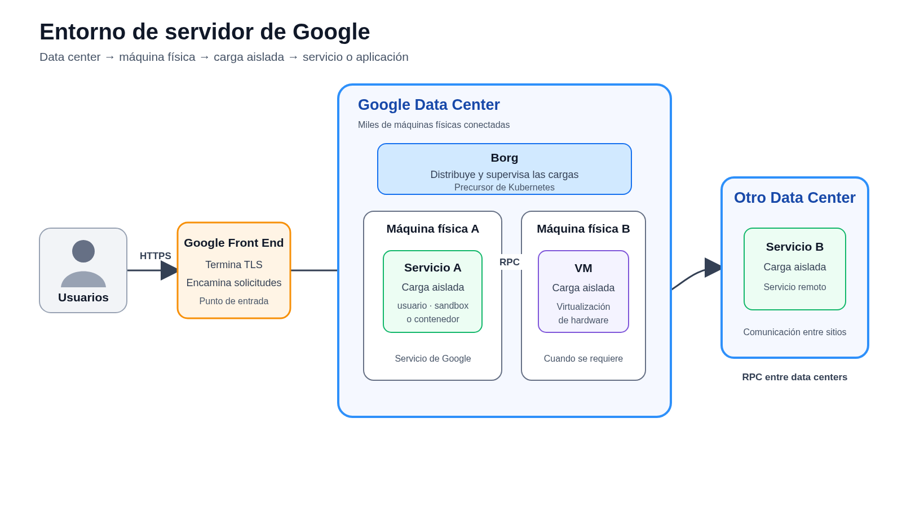
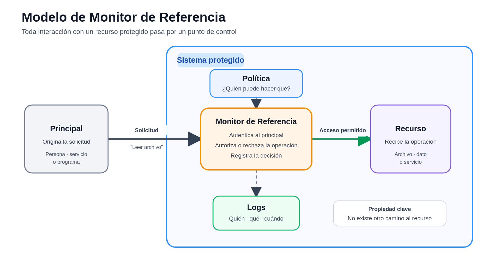
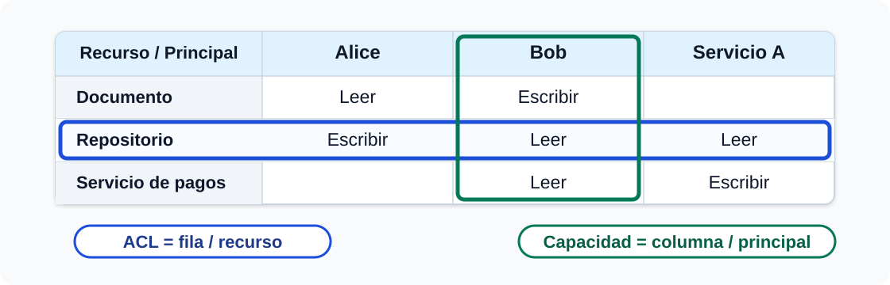

# Arquitectura de Seguridad

---

<!-- _class: objective-slide -->

# Objetivo de la clase

Comprender cómo una arquitectura de seguridad combina aislamiento, autenticación, autorización y control de recursos para contener fallas y compromisos.

Al finalizar esta clase, podremos:

* Razonar sobre seguridad a nivel de arquitectura
* Explicar cómo las fronteras de confianza, identidades y permisos contienen el daño
* Analizar cómo Google aplica estos principios a escala y sus límites ante DoS

---
# 1. El problema de seguridad
---

# ¿Qué es la arquitectura de seguridad?

* Diseño de sistemas completos para:
  * Defender contra clases conocidas de ataques
  * Resistir ataques que aún no conocemos
  * Contener el daño cuando un ataque tiene éxito
* El objetivo es adelantarnos a los atacantes
  * No limitarnos a reaccionar aplicando parches

---

# ¿Cómo diseñamos una arquitectura de seguridad?

* Definimos un **modelo de amenaza**
  * ¿Qué activos protegemos?
    * Datos personales, claves criptográficas
  * ¿De quién los protegemos?
    * Atacantes externos, empleados maliciosos
  * ¿Qué capacidades suponemos que tiene el atacante?
    * Control de la red, credenciales robadas

* Elegimos principios de diseño
  * Por ejemplo: minimizar la confianza

* Aplicamos mecanismos concretos
  * Aislamiento, autenticación, autorización
  * Separación de privilegios y canales seguros

---

# Caso de estudio: arquitectura de seguridad de Google

* **Google Infrastructure Security Design Overview**
  * Google, junio de 2024
* Describe la infraestructura compartida que sustenta:
  * Servicios de Google y Google Workspace
  * Google Cloud
* No pretende describir todos los controles de todos los servicios
* Ofrece un caso real de arquitectura de seguridad a gran escala
* Referencia conceptual:
  * [Perspectives on Security — Butler Lampson, SOSP 2015 (PDF)](http://css.csail.mit.edu/6.858/2015/lec/lampson.pdf)

---

# ¿Cuáles son los objetivos de seguridad en el paper de Google?

* Evitar la divulgación de datos de los clientes
  * Por ejemplo, correos electrónicos
* Mantener disponibles las aplicaciones y servicios de Google
* Permitir investigar qué ocurrió después de un incidente
* Ayudar a los ingenieros a construir aplicaciones seguras
* Explicar estas protecciones para mantener la confianza de los clientes

---

# Preocupados por muchas amenazas; ejemplos:

* **Software y redes**
  * Errores en el software de Google
  * Redes comprometidas: cliente, Internet o red interna

* **Identidades y dispositivos**
  * Credenciales de empleados robadas
  * Malware en sus computadores o smartphones

* **Personas y cadena de suministro**
  * Ingenieros u operadores internos maliciosos
  * Hardware de servidor comprometido

* **Ciclo de vida de los datos**
  * Información remanente en discos descartados

---

# Entorno de servidor: piezas principales

* Centros de datos
  * Miles de máquinas físicas conectadas
    * Cargas de trabajo aisladas mediante:
      * Usuarios de Linux, sandboxes, contenedores o VMs
    * Servicios y aplicaciones se ejecutan dentro de estas cargas

* **Borg** distribuye y ejecuta las cargas entre las máquinas
  * Es el precursor de Kubernetes

* Los servicios se comunican principalmente mediante RPC
* Los Google Front Ends reciben HTTP/HTTPS y encaminan las solicitudes

---

# Entorno de servidor: mapa de comunicación

---
# 2. Primer requisito: aislar componentes
---

# Aislamiento: el punto de partida para la seguridad
  * El objetivo: por defecto, la actividad X no puede afectar la actividad Y
    * incluso si X es maliciosa
    * incluso si Y tiene errores
  * Sin aislamiento, no hay esperanza para la seguridad
  * Con aislamiento, podemos permitir interacción (si se desea) y controlarla

---

# Aislamiento por software

* **Separación de usuarios de Linux**
  * Ejemplo: un UID distinto para cada servicio
  * El kernel utiliza estos identificadores para controlar el acceso entre procesos

* **Sandboxes basados en lenguajes**
  * Ejemplo: Sandboxed API
  * Ejecuta una biblioteca en un proceso aislado y expone una interfaz limitada

* **Sandboxes de kernel**
  * Ejemplo: gVisor
  * Intercepta las llamadas del contenedor antes de que lleguen al kernel del host

---

# Aislamiento por hardware

* **Máquinas virtuales**
  * Ejemplo: KVM
  * Usa virtualización de hardware para aislar el sistema operativo guest del host

* **Máquinas físicas dedicadas**
  * Ejemplo: Borg y algunos servicios de gestión de claves
  * Eliminan el riesgo de compartir el host con cargas menos sensibles

Google utiliza más capas de aislamiento para las cargas de mayor riesgo.

---

# ¿Qué aporta el aislamiento mediante VMs?

* Una máquina física ejecuta un **VMM** o hipervisor
  * El VMM administra varias máquinas virtuales guest
* Cada VM ejecuta su propio sistema operativo y aplicaciones

* Esto permite compartir eficientemente una máquina física
  * Cada carga puede utilizar solo una fracción de sus recursos

* El VMM establece una frontera de seguridad entre las VMs
  * Una VM comprometida no debería poder acceder directamente a otra

---

# Las VMs también proporcionan confinamiento

* El VMM intenta mantener al atacante dentro de la VM comprometida
  * Incluso si controla el sistema operativo guest

* Esto permite ejecutar código altamente riesgoso
  * Sin entregarle acceso directo al host ni a otras VMs

* El aislamiento no controla todas las interacciones
  * También debemos controlar con quién puede comunicarse cada VM

**Si algunos componentes necesitan comunicarse, ¿dónde controlamos esa interacción?**

---
# 3. Interacción controlada: el Monitor de Referencia
---

# Compartir de forma controlada: Monitor de Referencia

* El aislamiento absoluto impediría toda colaboración
* Los componentes necesitan interactuar y compartir recursos
* Estas interacciones deben pasar por un punto de control

El **Monitor de Referencia** es un modelo para decidir qué interacciones permitir.

---

---

# Elementos del Monitor de Referencia

* **Principal:** quien solicita una operación
  * Persona, dispositivo, programa o servicio

* **Recurso:** aquello que queremos proteger
  * Servicio, método, archivo o dato

* **Monitor:** intercepta cada solicitud
  * Autentica al principal
  * Autoriza la operación
  * Registra la decisión en los logs

---

# ¿Por qué separar política, monitor y recurso?

* Cada componente tiene una responsabilidad clara
  * La política define quién puede hacer qué
  * El monitor aplica la política
  * El recurso implementa la operación

* **Implicancia:** evitar incrustar verificaciones de política en el recurso
  * Aunque hacerlo sea conveniente
  * Mezclar política e implementación dificulta razonar sobre la seguridad

* Esta separación facilita modificar y auditar la política

* Requiere **mediación completa**
  * No debe existir un camino alternativo hacia el recurso

---

# ¿El Monitor de Referencia siempre es suficiente?

* Algunas decisiones dependen del estado interno del recurso
  * Ejemplo: puedo ver una oferta solo después de realizar una más alta
  * Estas verificaciones deben permanecer cerca de la lógica del recurso

* No todos los ataques consisten en accesos no autorizados
  * Un ataque DoS busca agotar recursos y afectar la disponibilidad

* En sistemas distribuidos puede ser difícil identificar un único monitor
  * Existen múltiples máquinas, servicios y caminos de comunicación

El Monitor de Referencia es un modelo útil, pero no una arquitectura completa.

---
# 4. Establecer identidad: autenticación en cada nivel
---
# Del Monitor de Referencia a la autenticación

* El monitor recibe una solicitud de un **principal**
* Antes de aplicar la política debe responder:
  * ¿Quién está realizando la solicitud?

* No basta con declarar una identidad
  * El principal debe demostrar que realmente la controla

Este proceso se llama **autenticación**.

Debemos autenticar distintos tipos de principales:
* Personas
* Servicios
* Máquinas

---

# Autenticar: ¿cómo demuestra su identidad una persona?

* **Contraseña:** demuestra conocer un secreto
  * Puede ser robada, reutilizada o entregada mediante phishing
* **Segundo factor:** exige una prueba adicional, como un código o dispositivo
  * Reduce el daño de una contraseña robada, pero un atacante aún puede retransmitir códigos mediante phishing
* **Clave pública:** demuestra posesión de una clave privada sin compartirla
  * Puede vincular la prueba al servicio correcto y resistir mejor el phishing

Distintos principales requieren mecanismos distintos. A continuación veremos cómo Google autentica **servicios y máquinas**.

*Estudiaremos criptografía de clave pública con mayor profundidad más adelante en el curso.*

---

# ¿Cómo autentica Google a sus servicios?

* Cada servicio tiene una **identidad de servicio**
  * Recibe credenciales criptográficas para demostrarla

* Cuando dos servicios se comunican mediante RPC:
  * El cliente demuestra su identidad al servidor
  * El cliente también verifica la identidad del servidor

* Google utiliza **ALTS** (*Application Layer Transport Security*)
  * Sistema interno para crear un canal seguro entre servicios
  * Proporciona autenticación mutua, integridad y cifrado

* La infraestructura administra las credenciales
  * Las emite, rota y revoca cuando es necesario

**Pero ¿cómo decide Google qué máquinas pueden recibir estas credenciales?**

---

# ¿Cómo sabe Google si puede confiar en una máquina?

* Una máquina de producción recibe acceso a:
  * Datos sensibles
  * Credenciales criptográficas
  * La red y los servicios internos

* Pero la identidad física de la máquina no es suficiente:
  * Un atacante podría reemplazarla por otra
  * Su sistema operativo o firmware podría haber sido modificado
  * Un proveedor podría entregar componentes comprometidos

Antes de entregarle credenciales, Google debe verificar su **identidad** e **integridad**.

---

# Primera defensa: raíz de confianza y arranque verificado

* Google diseña sus propias placas y el chip de seguridad **Titan**

* Titan funciona como una **raíz de confianza**
  * Componente mínimo que el sistema asume que no ha sido alterado
  * A partir de él se verifica la identidad e integridad del resto del sistema

* Durante el arranque, cada etapa verifica la siguiente
  * Solo deberían ejecutarse firmware y software aprobados por Google

* Mediante **atestación**, la máquina demuestra qué software y firmware ejecuta

Una máquina que no supera estas verificaciones no recibe credenciales de producción.

*Estudiaremos seguridad de hardware en detalle más adelante en el curso.*

---
# 5. Decidir qué puede hacer una identidad: autorización
---

# De la autenticación a la autorización

Ya podemos verificar la identidad de distintos principales:

* Una persona
* Un servicio
* Una máquina

Pero conocer su identidad no significa confiar en todo lo que haga.

Para cada solicitud, el Monitor de Referencia debe preguntar:

* ¿Qué operación quiere realizar?
* ¿Sobre qué recurso?
* ¿Tiene este principal permiso para hacerlo?

Este proceso se llama **autorización**.

---

# Dos formas de representar permisos

Función de política:

`permisos = POLÍTICA(principal, recurso)`

Equivalente: una **matriz de acceso**.

* **ACL:** fila por recurso; **capacidad:** columna por principal.
* En sistemas reales pueden definirse permisos adicionales.

---

# ACLs y capacidades: ¿qué pregunta responde cada una?

| ACL: archivo | Capacidad: API key |
| --- | --- |
| ¿Quién puede acceder a este archivo? | ¿Qué puede hacer quien posee esta clave? |
| El archivo mantiene una lista de usuarios y permisos: `Alice: leer`, `Bob: escribir`. | La API key permite ejecutar operaciones concretas, por ejemplo leer datos o enviar mensajes. |
| Para cambiar el acceso, se modifica la ACL del archivo. | Para delegar acceso, se entrega una clave con permisos limitados. |

Una API key con permisos acotados puede funcionar como una **capacidad portadora**: quien la posee puede ejercer esos permisos.

---

# El costo de delegar capacidades

Las capacidades son fáciles de delegar: basta entregar el descriptor, referencia o token.

El problema aparece después:

* Enumerar todos los tenedores puede ser difícil.
* Revocar acceso requiere indirección, expiración u otro mecanismo.

Las ACL favorecen la auditabilidad y la revocación; las capacidades favorecen la delegación y la mínima autoridad.

---

<!-- _class: google-auth-controls -->

# Dos controles complementarios en Google

| ACL entre servicios | Ticket de usuario final |
| --- | --- |
| **Identifica:** al servicio que realiza la RPC. | **Representa:** a un usuario autenticado. |
| **Autoriza:** qué servicios pueden invocar al servicio de destino. | **Autoriza:** operaciones específicas en nombre del usuario. |
| **Aplicación:** la infraestructura RPC comprueba automáticamente la ACL. | **Alcance:** permisos acotados y corta duración. |
| **Ejemplo:** Gmail puede invocar Contactos; un servicio no autorizado, no. | **Ejemplo:** un token OAuth de Google con alcance `Calendar.readonly` permite a una aplicación consultar el calendario del usuario, pero no modificarlo ni acceder a Gmail. |

La solicitud debe satisfacer **ambos controles**: servicio autorizado y ticket de usuario válido.

---
# 6. Aplicar el modelo a toda la infraestructura
---

# De una solicitud a toda la infraestructura

Hasta ahora analizamos una solicitud individual:

**Principal → solicitud → Monitor de Referencia → recurso**

A escala de Google, la misma decisión debe repetirse entre:

* Miles de máquinas y servicios
* Millones de RPCs
* Múltiples fronteras de confianza

La pregunta arquitectónica es:

> **¿Ubicamos el Monitor de Referencia solo en el perímetro de la red o frente a cada servicio?**

---

# ¿Por qué no basta el perímetro?

**Modelo clásico:** Internet → **Firewall** → Red interna “confiable”

Sus supuestos:

* Existe una frontera clara entre el exterior y el interior.
* El firewall controla qué tráfico puede cruzarla.
* Una máquina dentro de la red recibe confianza amplia.

Pero el firewall solo protege la entrada: si un atacante compromete una máquina interna, puede intentar moverse lateralmente hacia las demás.

**Problema:** cruzar una defensa no debería otorgar acceso al resto de la infraestructura.

---

# Un Monitor de Referencia por servicio

| Pregunta | Aplicación en la infraestructura de Google |
| --- | --- |
| **¿Quién llama?** | Cada RPC identifica y autentica al servicio solicitante. |
| **¿Puede llamar?** | La infraestructura comprueba la ACL del servicio de destino. |
| **¿Cuánto acceso recibe?** | Cada servicio obtiene únicamente las RPC necesarias para su función. |
| **¿Qué ocurre si se compromete?** | Sus permisos limitados contienen el daño y protegen a los demás servicios. |

* **Importante:** el Monitor de Referencia es una abstracción o patrón de diseño, no necesariamente un programa independiente. Aquí se materializa en el sistema RPC: identidades de servicio, ACLs y aplicación de permisos.

Así, la confianza no depende de estar “dentro” de la red: **cada solicitud vuelve a comprobarse**.

---
# 7. Disponibilidad: límites del control de acceso
---

# ¿Cuáles son los límites del Monitor de Referencia?

Un Monitor de Referencia puede decidir:

* ¿Quién realiza la solicitud?
* ¿Qué operación intenta ejecutar?
* ¿Está autorizado para realizarla?

Pero autorizar correctamente una solicitud no garantiza que el sistema pueda atenderla.

El Monitor de Referencia no resuelve por sí solo:

* El agotamiento de recursos finitos
* La sobrecarga causada por demasiadas solicitudes
* La dificultad de distinguir demanda legítima de un ataque

El siguiente problema es la **disponibilidad**.

---

# DoS: agotar recursos para negar servicio

**Escenario típico:** un atacante reúne una botnet de miles de máquinas y envía suficientes solicitudes para sacar un servicio del aire o extorsionar a su operador.

| Recurso atacado | Ejemplo |
| --- | --- |
| **Ancho de banda** | Saturar el enlace con grandes volúmenes de tráfico. |
| **CPU o memoria del router** | Paquetes pequeños, opciones inusuales o abuso de protocolos de enrutamiento. |
| **Memoria del servidor** | Mantener estado de protocolo, como en un SYN flood. |
| **CPU del servidor** | Provocar operaciones de aplicación costosas. |

El ataque no necesita vulnerar la autorización: basta con consumir un recurso finito.

---

# DoS: principios de mitigación

**Desafío central:** distinguir tráfico de ataque de demanda legítima.

| Momento | Principio | Ejemplo |
| --- | --- | --- |
| **A escala global** | Absorber y distribuir carga. | Capacidad masiva y balanceo de carga. |
| **Antes de autenticar** | Minimizar trabajo y estado; autenticar cuanto antes. | Reducir estado de conexiones TCP; concentrar esta fase en GFE y login. |
| **Después de autenticar** | Limitar y priorizar el consumo. | Dar prioridad a usuarios legítimos autenticados. |

La defensa combina capacidad, autenticación temprana y control explícito de recursos.

---

# DoS: defensa en varias capas en Google

| Capa | Ejemplo descrito por Google |
| --- | --- |
| **Balanceadores de red** | Reportan telemetría a un servicio central de defensa DoS, que puede ordenar descartar o limitar el tráfico asociado al ataque. |
| **Google Front End (GFE)** | Aporta información de las solicitudes a nivel de aplicación; el servicio central puede configurar los GFE para descartar o limitar patrones de ataque. |
| **Mitigación para usuarios reales** | Ante fuentes sospechosas, Google puede limitar las IP más activas o presentar desafíos JavaScript/CAPTCHA en vez de bloquear indiscriminadamente. |

Estas defensas combinan señales de red y aplicación antes de que el tráfico alcance al servicio final.

*Profundizaremos en ataques DoS, rate limiting y defensas por capas en futuras clases.*

<!--
---

# Implementación.
  * Base de Computación Confiable (TCB): código responsable de la seguridad.
    * Mantenerlo pequeño.
    * Depende de cuál sea el objetivo de seguridad.
    * Compartir máquinas físicas en la nube de Google: KVM.
  * Verificación.
  * Revisiones de diseño.
  * Fuzzing, búsqueda de errores.
    * Red-team/programa de recompensas.
  * Bibliotecas seguras para evitar clases comunes de errores.
  * "Curitas"/"defensa en profundidad" aumenta el costo del ataque.
    * Firewalls, seguridad de memoria, detección de intrusos, ...

---

# Configuración: incluso si la implementación está libre de errores, el sistema puede estar mal configurado.
  * Grupos.
  * Roles.
  * Gestión experta.
  * Querer política de grano fino para flexibilidad vs de grano grueso para manejabilidad.
-->
---

# Resumen: construir una arquitectura segura

* La **arquitectura de seguridad** define principales, recursos, fronteras de confianza y mecanismos de aplicación.
* El **aislamiento**, los **canales seguros** y la **separación de privilegios** reducen la superficie de ataque y contienen fallas.
* El **Monitor de Referencia** media cada solicitud: autentica al principal, aplica la política de autorización y permite auditar el resultado.

---

<!-- _class: takeaway -->

# Resumen: aplicar y contener

* En Google, identidades de máquinas, servicios y usuarios se combinan con ACLs, tokens acotados y controles integrados en la infraestructura RPC.
* El **privilegio mínimo** y la simplicidad reducen cuánto debemos confiar y cuánto daño puede causar un componente comprometido.
* El control de acceso no garantiza **disponibilidad**: los ataques DoS requieren capacidad, priorización, rate limiting y defensas por capas.

**Idea central:** no confiar por ubicación; verificar cada solicitud y diseñar para contener el daño.
