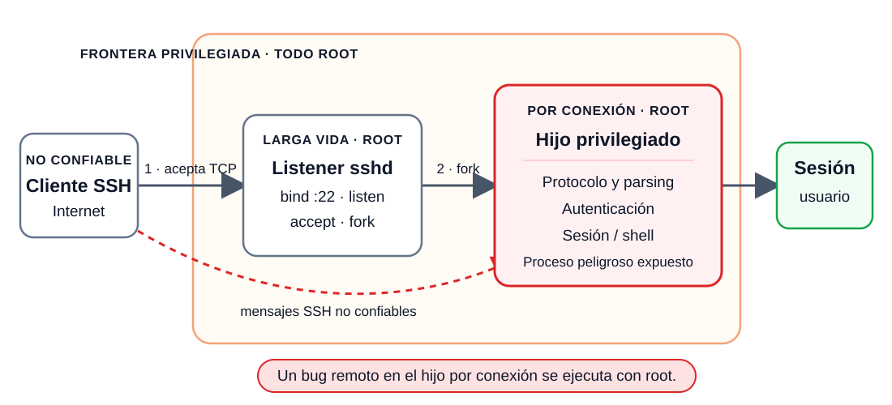
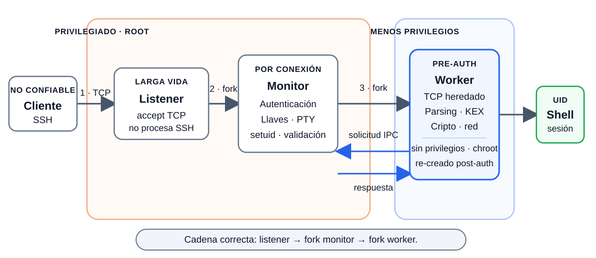
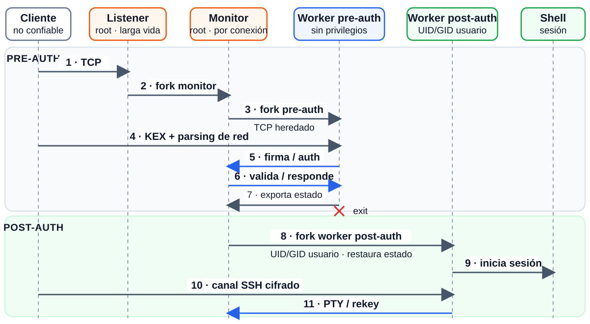

# Separación de Privilegios en OpenSSH

Comenzamos un nuevo módulo: **casos de estudio de separación de privilegios en aplicaciones**.

---

# 1. El problema

---

# El Problema: Bugs Explotables en Software

* El software es complejo → bugs → exploits.
* ¿Qué hacer al respecto?

**Plan A:** Encontrarlos, arreglarlos, evitar crear nuevos.
  * Mucho progreso aquí, pero para sistemas grandes, no es suficiente.

**Plan B: Construir sistemas seguros incluso con bugs**

¿Podemos hacer algo así?

**Meta: Principio de Mínimo Privilegio**
  * Cada componente debería tener los mínimos privilegios necesarios para hacer su trabajo.

---

# 2. ¿Qué es SSH?

---

# ¿Qué es SSH?

* **SSH (Secure Shell)** es un protocolo para iniciar sesiones remotas y ejecutar comandos de forma segura sobre una red no confiable.
* Usa un modelo **cliente-servidor** y establece un canal **cifrado y autenticado**.
* Usos comunes: administración remota, transferencia de archivos y túneles de red.
* **SSH es el protocolo**, no una implementación específica.

---

# ¿Qué es OpenSSH?

* Es una implementación de código abierto de SSH, ampliamente utilizada.
* Se originó en **OpenBSD**.
* Incluye cliente (`ssh`), servidor (`sshd`) y herramientas relacionadas como `scp`, `sftp` y `ssh-keygen`.
* En esta clase estudiamos su diseño de **separación de privilegios** para limitar el daño de bugs.

---

# 3. OpenSSH antes de la separación de privilegios

---

# Ejemplo: OpenSSH antes de separación de privilegios

* Un **listener de larga vida** corre como root, hace `bind` al puerto 22 y acepta conexiones.
* Por cada conexión aceptada, el listener hace `fork` de un **hijo privilegiado**.
* Ese hijo sigue como root y maneja toda la conexión:
  * protocolo y mensajes de red no confiables;
  * autenticación;
  * creación y mantenimiento de la sesión.

**Riesgo:** un bug remoto en el hijo por conexión expone directamente privilegios de root.

---

# Arquitectura antigua de OpenSSH

---

# ADEMÁS: Mucho código potencialmente con bugs

* zlib para compresión sobre la red.
* Parsing de paquetes de red.
* Cifrado e intercambio de llaves.
* Autenticación: contraseñas, llaves públicas, challenge-response, etc.
* Creación de la sesión y de la shell.
* Re-negociación de llaves después de cierto tiempo.

**Antes de privsep, el hijo root por conexión ejecutaba toda esta superficie expuesta.**

---

# Los bugs pueden ser muy dañinos

* Buffer overflows y similares.
* Pero también filtrar contenidos sensibles de memoria (como la llave privada).
* O acceder a archivos incorrectos como root.

**Este diseño de "cáscara dura, interior blando" hace que los bugs sean devastadores.**

---

# 4. Gran Idea: Separación de Privilegios

---

# Gran Idea: Separación de Privilegios

Dividir el software y los datos para limitar el daño de los bugs.

**Dos beneficios relacionados:**
  * Limitar daño de un exploit exitoso → **mínimo privilegio**.
  * Limitar el código privilegiado alcanzable por el atacante → menor **superficie de ataque**.

**No evita el bug: reduce lo que el atacante obtiene al explotarlo.**

---

# La Separación de Privilegios es Difícil

* Necesitas diseñar un plan de separación fructífero.
* Necesitas aislar (cliente/servidor, VMs, contenedores, procesos, SFI, etc.).
* Necesitas permitir interacción controlada (API estrecha, verificaciones de seguridad significativas).
* Necesitas mantener buen rendimiento (pocos cruces de dominio en ruta crítica).
* Necesitas refactorizar el software para trabajar con el plan de separación.

---

# El diseñador debe elegir el plan de separación

Posibles criterios:
  * Por servicio / tipo de datos (listas de amigos vs contraseñas)
  * Por usuario (mi email vs tu email)
  * Por propensión a bugs (redimensionar imágenes vs todo lo demás)
  * Por exposición a ataque directo (parsing de mensajes de red vs todo lo demás)
  * Por privilegio inherente (ocultar procesos de superusuario; ocultar llaves o BD)

**El plan de separación depende mucho de la aplicación.**

---

# 5. OpenSSH con separación de privilegios

## Cómo implementa la separación de privilegios

---

# ¿Cómo hace OpenSSH la separación de privilegios?

* El **listener privilegiado** acepta la conexión y hace `fork` de un **monitor privilegiado por conexión**.
* El monitor hace `fork` de un **worker pre-auth no privilegiado**, que hereda la conexión TCP.
  * El worker procesa paquetes, protocolo criptográfico, intercambio de llaves y compresión.
* El worker pide por IPC solo las operaciones sensibles que expone el monitor.
* Tras autenticar, el worker pre-auth exporta estado y termina; el monitor crea un **worker post-auth** con el UID/GID del usuario.
* Finalmente se crea la shell o sesión del usuario; el worker continúa manejando el canal cifrado.

---

# Arquitectura de OpenSSH con separación de privilegios

---

# ¿Qué debe quedar detrás de la frontera privilegiada?

**Capacidades que históricamente requieren root**
* Leer la llave privada del host protegida por permisos del sistema.
* Crear y limpiar pseudo-terminales (PTY).
* Crear un proceso con el UID/GID del usuario autenticado.

**Decisiones confiables u operaciones con secretos**
* Verificar contraseñas contra el backend protegido.
* Decidir si una cuenta o llave pública está autorizada y validar la prueba.
* Firmar el intercambio de llaves sin revelar la llave privada del host.

> No toda decisión de autenticación es un *syscall* exclusivo de root; debe quedar fuera del worker comprometible porque su **resultado es de seguridad**.

---

# ¿Cómo pide operaciones el worker no privilegiado?

La separación introduce una **API IPC explícita** entre worker y monitor.

* Mensajes estructurados: tipo de solicitud, longitud y argumentos serializados.
* Lista cerrada de operaciones y handlers permitidos.
* El monitor valida solicitud **y estado del protocolo** antes de ejecutar.
* Para estas operaciones, el worker recibe un resultado o recurso acotado — no la llave privada del host ni la base de autenticación.

Código: [`monitor.h`](https://github.com/openssh/openssh-portable/blob/master/monitor.h), [`monitor.c`](https://github.com/openssh/openssh-portable/blob/master/monitor.c) y [`monitor_wrap.c`](https://github.com/openssh/openssh-portable/blob/master/monitor_wrap.c).

---

# Ejemplos de la API del monitor: autenticación

* **Contraseña:** el worker solicita verificarla; el monitor consulta el backend protegido y devuelve **sí/no**.
* **Llave pública:** primero pregunta si la llave está autorizada; luego solicita verificar la firma sobre los datos correctos.
* **Challenge-response:** el monitor genera u obtiene el challenge y valida la respuesta; el worker no puede inventar un transcript ganador.

**Son flujos distintos:** autenticación por llave pública no es challenge-response. En todos, el monitor conserva la decisión confiable.

---

# Secuencia de una conexión: dos workers

---

# El monitor controla qué se puede pedir y cuándo

**Una API pequeña no basta:** el monitor también valida orden, contexto y frecuencia.

### `Conexión nueva` → `Usuario identificado` → `Autenticado`

* **Solo una vez:** firmar el intercambio con la llave del host (`MON_ONCE`).
* **Solo en fase de autenticación:** verificar una credencial (`MON_AUTH`).
* **Fuera del estado esperado:** rechazar la solicitud o terminar el worker.

> Aunque controle el worker, el atacante no puede invocar operaciones privilegiadas arbitrariamente.

---

# Frontera de seguridad significativa

El diseño parte de una hipótesis deliberadamente hostil:

* **Asumir comprometido al worker** que procesa la red.
* El adversario puede emitir cualquier solicitud IPC que el worker pueda construir.
* El monitor sigue como root, pero solo acepta una interfaz estrecha y dependiente del estado.

**La frontera no es “root vs. no root” por sí sola: la seguridad depende de validar correctamente cada cruce.**

---

# Operaciones limitadas del monitor

Un worker comprometido:

* No obtiene la llave privada: solicita una **firma ligada a esta conexión**.
* No enumera usuarios: consulta si **un nombre específico** es válido.
* No lee la base de contraseñas: solicita verificar **una credencial concreta**.
* No recibe autoridad general: obtiene respuestas o file descriptors acotados.

**Patrón:** exponer una operación mínima, no el recurso privilegiado subyacente.

---

# Superficie de ataque: worker

* Recibe mensajes de red arbitrarios antes de autenticar.
* Ejecuta parsing de paquetes, negociación, criptografía y —históricamente— compresión.
* Por eso concentra gran parte del código más propenso a bugs remotos.

**Alta exposición, bajos privilegios:** el worker está diseñado como un dominio sacrificable y reemplazable.

---

# Superficie de ataque: monitor

* **No acepta la conexión:** esa función pertenece al listener.
* Recibe solicitudes IPC estructuradas **desde su worker**.
* Valida tipo, longitud, argumentos, fase y frecuencia de cada solicitud.
* Ejecuta solo operaciones privilegiadas estrechas y devuelve resultados acotados.

**Exposición menor, no nula:** el parser IPC y la lógica de validación son código crítico.

---

# ¿Qué daño causa comprometer el worker pre-autenticación?

* El atacante puede probar credenciales mediante el monitor, pero no saltarse la autenticación: necesita credenciales válidas, igual que un cliente SSH normal.
* Puede obtener una única firma de la llave del servidor (`MON_ONCE`), pero no extraer la llave privada.
  * Esa firma podría servir para suplantar al servidor en una conexión simultánea cuidadosamente coordinada.
  * No sirve para conexiones posteriores: cada sesión firma un hash de intercambio nuevo, ligado a los valores frescos de esa conexión.

**Comprometer el worker entrega un oráculo de firma limitado, no la llave privada del servidor.**

---

# ¿Qué daño si se compromete el worker post-autenticación?

* Puede actuar con los permisos del **usuario autenticado**, no como root.
  * Ese usuario ya podía ejecutar sus comandos tras iniciar sesión.
* Puede abusar de recursos accesibles a ese usuario o de conexiones de red salientes.
* Puede intentar agotar CPU, memoria, procesos o conexiones.
  * Privsep por sí sola no impone todas las cuotas necesarias.

**El impacto queda acotado al usuario y a la disponibilidad; no desaparece.**

---

# Mecanismos de aislamiento y control

El diseño del paper combina:

* Procesos Unix como dominios de protección.
* User IDs (UIDs) y permisos de archivos.
* `chroot` para reducir la vista del filesystem pre-auth.
* Paso de file descriptors para delegar recursos concretos.
* IPC estructurada para cruzar la frontera.

**El mecanismo aísla; la política la implementa la API validada del monitor.**

---

# `setuid(uid)`: abandonar privilegios correctamente

* Un proceso root puede cambiar a un UID/GID ordinario para reducir su autoridad.
* El drop permanente debe limpiar IDs real, efectivo y guardado, además de grupos suplementarios.
  * Cambiar solo el UID efectivo puede ser reversible.
* OpenSSH crea el worker y realiza un **drop irreversible** antes de procesar la red como usuario no privilegiado.

---

# `chroot(dirname)`

* Hace que `/` se refiera a `dirname` para el proceso y sus descendientes.
* En el diseño del paper, restringe la vista del filesystem del **worker pre-auth no privilegiado** a un directorio vacío y de solo lectura.
* Reduce qué rutas puede nombrar, pero conserva syscalls, file descriptors heredados y acceso de red.

> **Defensa en profundidad, no sandbox absoluto:** no debe tratarse como contención segura de un proceso que conserva privilegios de root.

---

# Prevenir interferencia entre workers

* `P_SUGID` previene que un proceso haga debug de otro proceso usando ptrace.
* Incluso aunque los dos procesos corran con el mismo user ID.
* Importante porque múltiples workers corren como el mismo usuario "sshd".

---

# FD passing: delegar un recurso, no el privilegio

* Un proceso privilegiado abre o crea un recurso y pasa su file descriptor por un socket Unix.
* Ejemplo: el monitor crea un pseudo-terminal y entrega el fd al worker.
* El worker puede usar **ese recurso concreto** sin obtener la capacidad general de crear otros.

**El file descriptor funciona como una capacidad acotada por el objeto abierto y sus permisos.**

---

# Desafío: ¿Cómo establecer User ID después de autenticación exitosa?

* No se puede pasar user ID como file descriptor.
* **Plan de OpenSSH:** matar el viejo proceso hijo worker, iniciar uno nuevo.
* Necesita pasar todo el estado relevante del proceso viejo al nuevo.

---

# Estado que debe transferirse (Sección 4.1)

* Algoritmos y llaves de cifrado/autenticación.
* Contadores de secuencia de mensajes de red.
* Datos de red ya recibidos y aún en buffer.
* Estado de compresión del stream (en el diseño histórico).

**El nuevo worker debe continuar exactamente la misma sesión; perder un contador o buffer rompe el protocolo.**

---

# Refactorización de OpenSSH para separar privilegios

## Cómo adaptar código existente

---

# Refactorización: frontera y wrappers RPC

**Paso 1:** identificar la frontera y extraer las operaciones privilegiadas.

**Paso 2:** conservar la llamada lógica, pero elegir implementación local o stub RPC.

### `authok = PRIVSEP(auth_password(authctxt, pwd));`

* Sin privsep: llama `auth_password(...)` directamente.
* Con privsep: llama `mm_auth_password(...)`, que serializa la solicitud al monitor.
* El handler privilegiado vive al otro lado de una interfaz auditable.

Ver [`monitor_wrap.c`](https://github.com/openssh/openssh-portable/blob/master/monitor_wrap.c).

---

# Refactorización: transferir estado explícito

**Paso 3:** al autenticar, exportar al monitor el estado necesario de la conexión.

* El worker pre-auth serializa estado y termina.
* El monitor espera su salida y hace `fork` del worker post-auth.
* El nuevo worker adopta UID/GID del usuario y reconstruye la sesión.

La frontera obliga a distinguir **estado transferible** de punteros o detalles internos del proceso.

Código histórico/moderno relacionado: [`mm_send_keystate()` en `sshd-auth.c`](https://github.com/openssh/openssh-portable/blob/master/sshd-auth.c).

---

# Desafío: separación de privilegios para bibliotecas existentes

**Ejemplo:** worker pre-autenticación usaba zlib para compresión.
  * zlib asignaba sus propios buffers.
  * ¿Cómo transferir esos buffers al nuevo worker post-autenticación?

---

# Solución de OpenSSH para zlib

* Dar a zlib una implementación especial de malloc/free.
* Asigna memoria en una **región de memoria compartida**.
* Esta región de memoria compartida se pasará al nuevo worker tal cual.

---

# Pros y contras de memoria compartida

**Bueno:** Transparente al código existente (como zlib).
  * Muchas bibliotecas/toolkits de separación de privilegios usan trucos similares.

**Malo:** Interfaz complicada con el proceso monitor.
  * Pero al menos el monitor no mira esta región de memoria compartida.
  * Solo pasa la memoria compartida al nuevo proceso worker post-autenticación.

**Malo:** Podría tener punteros corruptos, causará errores arbitrarios en worker.
  * Probablemente no muy malo, porque requiere poder iniciar sesión como usuario.

---

# La asignación de memoria compartida fue removida

* Por razones criptográficas, la compresión pre-autenticación era indeseable.
* El código de asignación de memoria compartida era complejo.
  * Bugs en él debido a comportamiento indefinido, incluso.
  * [Commit que removió la memoria compartida de zlib](https://github.com/openssh/openssh-portable/commit/0082fba4efdd492f765ed4c53f0d0fbd3bdbdf7f)
* Removido en 2016 al no hacer compresión en el proceso slave pre-auth.

---

# Evaluación de seguridad y rendimiento

---

# ¿Dónde debería buscar un atacante debilidades?

* **Worker:** bugs remotos aún permiten control del proceso, DoS y abuso de la API disponible.
* **Monitor:** parser IPC, máquina de estados y decisiones de autenticación siguen siendo críticos.
* **Listener:** conserva root y acepta conexiones, aunque ejecuta mucho menos protocolo.
* **Kernel:** un exploit local podría escapar del aislamiento y obtener root.

**Privsep desplaza el objetivo: desde mucho código expuesto hacia un TCB menor que merece auditoría intensa.**

---

# ¿Cuánto código se ejecutaba con privilegios? (paper, 2003)

**Todo el código ejecutado, incluidas bibliotecas**
* **67,70%** sin privilegios: 17.589 LOC.
* **32,30%** con privilegios: 8.391 LOC.

**El monitor no equivale a todo el código privilegiado**
* Monitor: ~**900 LOC**, **3,46%** del total.
* El resto incluye OpenSSH privilegiado, OpenSSL y S/Key.
* Solo código propio de OpenSSH: aproximadamente **75% / 25%** sin/con privilegios.

> Contar LOC es una aproximación. La reducción estimada supone, de forma simplificadora, que los defectos se distribuyen aproximadamente uniformemente.

---

# Estudio empírico: vulnerabilidades históricas

El paper revisó fallas anteriores cuyo impacto habría quedado contenido:

* **Pre-auth:** integer overflow en procesamiento de paquetes.
* **Pre-auth:** bug en zlib.
* **Post-auth:** off-by-one en código de canales.
* **Post-auth:** manejo incorrecto de tickets Kerberos.

**“Prevenida” aquí significa prevenir la escalación de privilegios; el bug y un posible DoS pueden seguir existiendo.**

---

# ¿Cuál es el overhead de rendimiento?

* **Diseño descrito/desplegado: ¡prácticamente sin overhead de rendimiento!**

* Rápido porque la separación de privilegios **no está en la ruta crítica** para transferencia de datos.
  * Después del login, todo funciona básicamente igual que sin privsep.
* Overhead menor para establecer nueva conexión / login, pero no significativo.
* **Resultado directo de elegir cuidadosamente la interfaz de separación de privilegios correcta.**

---

# 6. Conclusiones

---

# OpenSSH hoy: la descomposición siguió evolucionando

* **9.8 (2024):** creó `sshd-session` para cada conexión; `sshd` quedó como listener mínimo sin implementar el protocolo SSH.
* **10.0 (2025):** creó `sshd-auth` para la autenticación de usuario, separando esa superficie pre-auth del resto de la conexión.
* Tras autenticar, el código de `sshd-auth` deja de estar presente en el proceso que continúa la sesión.

**La composición cambió sustancialmente; permanece el principio de aislar código expuesto y mediar la autoridad con fronteras estrechas.**

---

# ¿Por qué este plan funciona bien para OpenSSH?

* Cada conexión es mayormente **independiente**.
  * Un monitor por conexión acota estado, fallas y decisiones a un cliente.
* Hay pocos recursos privilegiados durables.
  * Llave privada del host, autenticación, PTY y cambio de identidad.
* La transferencia de datos post-login no necesita cruzar el monitor por cada paquete.

**Independencia por conexión + pocas operaciones privilegiadas = frontera pequeña y barata.**

---

# Otros sistemas son bastante diferentes

Otros sistemas que veremos son bastante diferentes:
  * **Aplicaciones web y servicios distribuidos.**
  * Muchos recursos diferentes (autenticación de usuario, bases de datos, servicios, etc.).
  * Servicios con estado (ej., BD) en lugar de iniciar un worker fresco cada vez.
  * Permisos dinámicos (ej., tickets de permiso de usuario de Google).

---

# Resumen

* **Privsep limita el impacto de bugs; no evita los bugs.**
* OpenSSH pone el procesamiento de red no confiable en workers con menos privilegios y deja autoridad estrecha en el monitor.
* La API IPC y su máquina de estados hacen significativa la frontera: cada solicitud debe validarse.
* No contiene todo: quedan posibles DoS, abuso con permisos del usuario y escapes por el kernel.
* **TCB restante:** listener, monitor, kernel y la implementación/validación de la interfaz IPC.
* El overhead puede ser bajo si el monitor queda fuera de la ruta crítica de datos.

---

# Referencias

* Niels Provos, Markus Friedl y Peter Honeyman. **“Preventing Privilege Escalation.”** 12th USENIX Security Symposium, 2003.
* OpenSSH 9.8 release notes — separación de `sshd` y `sshd-session`:
  * https://www.openssh.com/txt/release-9.8
* OpenSSH 10.0 release notes — nuevo `sshd-auth`:
  * https://www.openssh.com/txt/release-10.0
* Código: [`monitor.h`](https://github.com/openssh/openssh-portable/blob/master/monitor.h), [`monitor.c`](https://github.com/openssh/openssh-portable/blob/master/monitor.c), [`monitor_wrap.c`](https://github.com/openssh/openssh-portable/blob/master/monitor_wrap.c).
