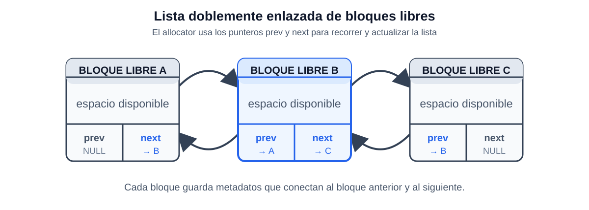
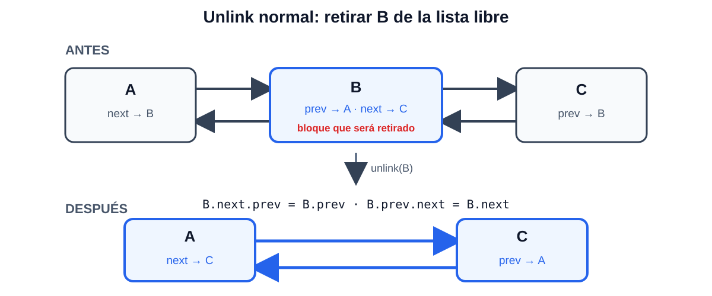
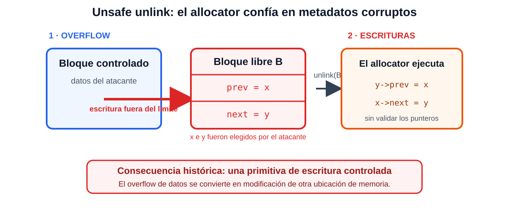

# Algunos Recordatorios de C
  * int a 
  * &a
  * int *a = malloc(sizeof(int))
    * *a
  
---
# Algunos Recordatorios de C (cont.)
   

  <style scoped>
    pre {
      width: 80%; /* Adjust this percentage or use a fixed pixel value like 700px */
      margin-left: auto;
      margin-right: auto; /* Optional: to center the code block */
    }
  </style>
   ```c
   void modifyValue(int x) {
    
        x = 100; 
  }

  int main() {
        int x = 50;
        printf("Before modification: %d\n", x); // Output: 50
        
        modifyValue(x); 
        
        printf("After modification: %d\n", x);  // Output: ?
        return 0;
  }

  ```

---

# Algunos Recordatorios de C (cont.)
   

  <style scoped>
    pre {
      width: 80%; /* Adjust this percentage or use a fixed pixel value like 700px */
      margin-left: auto;
      margin-right: auto; /* Optional: to center the code block */
    }
  </style>
   ```c
   void modifyValue(int *ptr_to_x) {

        // Dereference the pointer to access 
        // and modify the original value
        *ptr_to_x = 100; 
  }

  int main() {
        int x = 50;
        printf("Before modification: %d\n", x); // Output: 50
        
        modifyValue(&x); // Pass the address of x
        
        printf("After modification: %d\n", x);  // Output: 100
        return 0;
  }

  ```

---

# Manejo de Memoria

<style scoped>
    pre {
      width: 35%; /* Adjust this percentage or use a fixed pixel value like 700px */
      margin-left: 0px;
    }

    img[alt~="align-right"] {
      position: absolute;
      top: 140px;
      right: 80px;
      margin-top:0px
    }
</style>

  ```c
   void modifyValue(int *ptr_to_x)
{
    // Dereference the pointer to access
    // and modify the original value
    *ptr_to_x = 100;

    printValue(*ptr_to_x);
}

void printValue(int x)
{
    int anotherNumber = 75;
    printf("In Function: %d\n", x);
    printf("In Function: %d\n", anotherNumber);
}

int main()
{
    int *x = malloc(sizeof(*x));

    *x = 50;
    printf("Before modification: %d\n", *x); // Output: 50

    modifyValue(x); // Pass the address of x

    printf("After modification: %d\n", *x); // Output: 100
    return 0;
}

  ```
 
   

---

# Defendiendo Buffer Overflows

  * Una clase importante de problemas de seguridad, para los cuales se conocen muchos ataques y defensas.
  * Problema básico: código C con errores que escribe más allá del final del búfer/array.
  * Los buffer overflows son una ruta de ataque popular, vale la pena entenderlos. Incluso ahora.
    * Ejemplos de alto perfil en 2019, incluyendo WhatsApp:
      * [Cinco vulnerabilidades de buffer overflow en aplicaciones populares](https://securityboulevard.com/2019/11/5-buffer-overflow-vulnerabilities-in-popular-apps/)
      * [Análisis técnico del buffer overflow de WhatsApp](https://blog.zimperium.com/whatsapp-buffer-overflow-vulnerability-under-the-scope/)
  * Ejemplo de evolución de defensa/ataque a lo largo del tiempo.
    * Ha sido muy valioso elevar la vara.
    * Aunque las defensas aún no son perfectas.

---

# Ejemplo: buffer overflows (cont.)
  * ¿Qué puede hacer el adversario una vez que están ejecutando código inyectado?
    * Si el proceso está ejecutándose como root o Administrator, puede hacer cualquier cosa.
    * Incluso si no, aún puede enviar spam, leer archivos (servidor web, base de datos), ..
    * Puede cargar un programa más grande desde algún lugar de la red.

---

# Ejemplo: buffer overflows

  
  * Este es el tema del Laboratorio 3.
  * Supongamos que nuestro servidor web tiene un error en el parsing de entrada HTTP.
    * En ciertas entradas, se cae.
  * ¿Deberíamos preocuparnos?
  * Echemos un vistazo a un ejemplo simplificado.

---

# Ejemplo: buffer overflows

```c
#include <stdio.h>
#include <stdlib.h>

char *
gets(char *buf) {
  int c;
  while((c = getchar()) != EOF && c != '\n')
    *buf++ = c;
  *buf = '\0';
  return buf;
}

int
read_req(void) {
  char buf[128];
  int i;
  gets(buf);
  i = atoi(buf);
  return i;
}

int
main() {
  int x = read_req();
  printf("x = %d\n", x);
}
```

    % ./readreq
    1234
    % ./readreq
    AAAAAAAAAAAA....AAAA

---

# Ejemplo: buffer overflows (cont.)

  * ¿Por qué se cayó?
  * Deberíamos pensar "este es un error; ¿podría un atacante explotarlo?"
  * Vamos a averiguar qué está pasando exactamente.

---

<style scoped>
    pre {

      width: 35%; /* Adjust this percentage or use a fixed pixel value like 700px */
      margin-left: 100px;
    }

    img[alt~="align-right"] {
      position: absolute;
      top: 140px;
      right: 80px;
      margin-top:0px
    }
</style>

# Ejemplo: buffer overflows (cont.)

  * Dibujemos una imagen de lo que está en el stack.

  ```
                         +------------------+
                         |  main()'s frame  |
                         |                  |
                         |                  |
                         +------------------+
                         |  return address  |
                         +------------------+
            %rbp ------> |    saved %rbp    |
                         +------------------+
                         |        i         |
                         +------------------+
                         |       ...        |
                         +------------------+
                         |     buf[127]     |
                         |       ...        |
            %rsp ------> |      buf[0]      |
                         +------------------+
  ```

---

# Ejemplo: buffer overflows (cont.)
  * ¿Dónde está buf[]?
    * Ajá, buf[] está en el stack, seguido por i.

---

# Empecemos con buffer overflows de stack "clásicos"
  * Los ataques tienen dos partes:
     1) escribir algunas instrucciones en el búfer del stack.
     2) sobrescribir el PC de retorno para apuntar a las instrucciones del atacante.
  * Las instrucciones del atacante pueden hacer cualquier cosa que la aplicación pueda hacer.
    * Por lo tanto es un ataque poderoso.

---

<style scoped>
    pre {

      width: 35%; /* Adjust this percentage or use a fixed pixel value like 700px */
      margin-left: 100px;
    }

    img[alt~="align-right"] {
      position: absolute;
      top: 140px;
      right: 80px;
      margin-top:0px
    }
</style>

# Ejemplo: buffer overflows (cont.)

  * Dibujemos una imagen de lo que está en el stack.

  ```
                         +------------------+
                         |  main()'s frame  |
                         |                  |
                         |                  |
                         +------------------+
                         |  return address  |
                         +------------------+
            %rbp ------> |    saved %rbp    |
                         +------------------+
                         |        i         |
                         +------------------+
                         |       ...        |
                         +------------------+
                         |     buf[127]     |
                         |       ...        |
            %rsp ------> |      buf[0]      |
                         +------------------+
  ```

---


# Ejemplo: buffer overflows (cont.)

  * ¿Es este un problema serio?
    * Es decir, si nuestro código del servidor web tuviera este error, ¿podría un atacante explotarlo para entrar en nuestra computadora?

  * ¿Está el atacante limitado a saltar a algún lugar aleatorio?
    * No: ataque de "inyección de código".
    * ¿Cómo sabe el adversario la dirección del búfer?


---

# Resumen de la situación
  * La solución ideal es usar un lenguaje que haga cumplir los límites, ej. Python o Java. 
    * Es un gran esfuerzo re-entrenar programadores y re-escribir software, pero no imposible (ej. Microsoft y C#).
  * Pero C se usa para muchas aplicaciones y librerías valiosas, así que no podemos abandonarlo, y a menudo no podemos evitar escribir nuevo código C. 
    * La definición de C hace difícil o imposible verificar límites automáticamente con precisión.
  * El programador perfecto verificaría límites 100% del tiempo, pero resulta que ningún programador es perfecto.
  * Así que necesitamos defensas que hagan los desbordamientos de búfer más difíciles de explotar, para programas C grandes y con errores que no entendemos.

---

# ¿Cómo defenderse contra buffer overflows?

  * Para C:
    * No llamar gets().
    * Intel permite marcar el stack como no ejecutable.
      * ¿Es esta una solución 100% para C?
    * Aleatorizar layout, canaries, etc.
    * Estructurar la aplicación para limitar el daño de errores (Laboratorio 2).
    * Buenas noticias: buffer overflows simples como este ya no funcionan.

  * Lecciones de buffer overflows:
    * Los errores son un problema en todas las partes del código, no solo en el mecanismo de seguridad.
    * La política puede ser irrelevante si la implementación tiene errores.
    * Hay esperanza para la defensa. 


---

# Idea de defensa: O/S le dice al hardware que no ejecute en el stack
  * Ej. O/S establece el bit NX (No eXecute) de Intel en cada página del stack.
  * Esto previene la ejecución de instrucciones inyectadas en el stack.
  * P: ¿NX significa que no tenemos que preocuparnos por buffer overflows?
    * No
  * P: ¿NX es una pérdida de tiempo si no es perfecto?
    * Tampoco

---
<style scoped>
pre {
      width: 35%; /* Adjust this percentage or use a fixed pixel value like 700px */
      margin-left: 300px;
    }
</style>


# Idea de defensa: stack canaries (ej., StackGuard, Stack Smashing Protector de gcc)
  * Detecta modificación del PC de retorno en el stack *antes* de que sea usado por RET.
  * El compilador genera código que empuja un valor "canario" en el stack al
    entrar a la función, hace pop y verifica el valor antes del retorno.
  * El canario se sienta entre variables y dirección de retorno, ej.:
  ```
                         |                  |
                         +------------------+
        entry %esp ----> |  return address  |    ^
                         +------------------+    |
        new %ebp ------> |    saved %rbp    |    |
                         +------------------+    |
                         |     CANARY       |    | Overflow goes
                         +------------------+    | this way.
                         |     buf[127]     |    |
                         |       ...        |    |
                         |      buf[0]      |    |
                         +------------------+
                         |                  |
  ```
  * P: ¿qué valor deberíamos usar para el canario?
    * R: tal vez un número aleatorio, elegido al inicio del programa, almacenado en algún lugar.

---

# Idea de defensa: aleatorización del layout del espacio de direcciones (ASLR)
  * Colocar memoria del proceso en direcciones aleatorias.
  * El adversario no conoce la dirección precisa del stack, código, heap de la aplicación, ...
  * Requiere soporte del compilador para hacer todas las secciones reubicables.

---

# ¿Ya terminamos?
  * ¿Qué tipos de ataques podrían funcionar a pesar de ASLR?
  * ¿Qué tipos de ataques podrían funcionar a pesar de los stack canaries?
    * Tal vez el atacante puede escribir o leer el valor secreto aleatorio de alguna manera.
  * Sobrescribir puntero de función en el stack antes del canary.
  * Sobrescribir alguna otra variable crucial en el stack, ej.
    ```
    bool ok = ...;
    char buf[128];
    gets(buf);
    if(ok){
      ...
    }
    ```
  * Desbordamiento de una variable global a la siguiente (muy parecido al stack).
  * Desbordamiento de búfer asignado en heap.

---

# ¿Son explotables los buffer overflows asignados en heap?
  * Importante porque el código moderno tiende a usar heap mucho.
  
  ```
  foo(){
    char *p = malloc(16);
    gets(p);
  }

  ```
  * ¿Puede el atacante predecir qué está después de p en memoria?
  

---

# Resulta que ¡hay ataques de heap bastante poderosos!

  * Ejemplo histórico simplificado de una técnica de explotación real.
  * Algunos allocators organizaban los bloques libres mediante una lista doblemente enlazada.

  

---

# Ataques de heap (cont.)
  * Malloc mantiene bloques libres en una lista doblemente enlazada.
    * En orden de dirección, para poder fusionar bloques pequeños adyacentes en uno grande.
  * Cuando se asigna un bloque libre, aquí está parte de lo que hace malloc():
    * b = elegir un bloque libre
    * b->next->prev = b->prev;
    * b->prev->next = b->next;
  * Si el atacante desborda un bloque malloc()ed, el atacante puede
    * modificar los punteros next y prev en el siguiente bloque.

---

# Cómo funciona `unlink` normalmente

  * Para retirar `b`, el allocator conecta directamente sus vecinos anterior y siguiente.

  

---

# Ataques de heap (cont.)  
  * Así: supongamos que el atacante escribe x y al inicio del siguiente bloque.
    * Llamar siguiente bloque b, entonces b->prev = x, b->next = y.
    * Supongamos que `b` es libre y resulta ser elegido por el siguiente `malloc()`.
    * Al retirar `b` de la lista, el allocator efectivamente ejecutará:
      * `y->prev = x;`
      * `x->next = y;`
    * Así, valores controlados por el atacante se escriben en direcciones derivadas de `x` e `y`.

---

# Cómo el overflow se convierte en una escritura controlada

  * El atacante corrompe `prev` y `next`; luego el allocator usa esos valores como punteros.

  

---

# Ataques de heap (cont.)
  * Si el atacante puede adivinar la dirección del PC de retorno guardado,
    * y puede adivinar la dirección del búfer siendo desbordado, puede cargar instrucciones en el búfer y causar que PC apunte a instrucciones inyectadas.
  * Similarmente para *cualquier* puntero de función con dirección predecible.
---

# Las piezas que el atacante debe ensamblar
  * Encontrar un error de buffer overflows en la aplicación o librería.
  * Encontrar una forma de hacer que el programa ejecute el código con errores de una manera que cause que los bytes del atacante produzcan un buffer overflow.
  * Entender la implementación de malloc().
  * Encontrar un puntero de código y adivinar su dirección.
  * Adivinar la dirección del búfer, es decir, las instrucciones inyectadas del atacante.

---

# Estos ataques requieren esfuerzo y habilidad del atacante
  * El atacante debe entender casos extremos en la lógica de la aplicación, malloc(), salida del compilador.
  * Malas noticias para el defensor: pocos programadores de aplicaciones piensan en casos extremos.
  * Buenas noticias para el defensor: múltiples piezas frágiles en el rompecabezas del atacante.

  * Un punto de alto nivel: si hay un error de buffer overflow, un atacante lo suficientemente inteligente probablemente puede explotarlo. 
    * Más generalmente, muchos errores que parecen inofensivos pueden ser convertidos en ventaja del atacante, tal vez en combinación con otras fallas.

---

# Resumen
