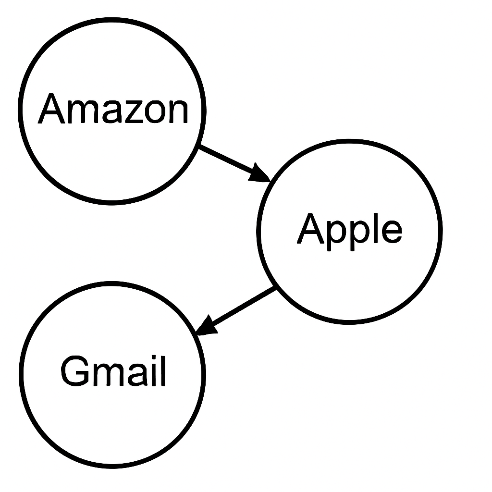

# Estructura del curso
  * Las clases serán Martes y Jueves a las 8:20am, en [SALA].
    * Un paper por clase.
      * Horario tentativo en la web.
      * Pueden cambiar las clases dependiendo de si nos atrasamos o por capricho del profesor.
    * Lean el paper antes de la clase
      * Algunos papers sobre sistemas de producción, otros sobre ideas de investigación
      * Incluso si el sistema general descrito en el artículo no funcionó, muchas de
        las ideas y técnicas en el artículo son importantes y útiles.
    * Interrumpan, hagan preguntas, señalen errores.

---

# Estructura del curso (cont.)
  * Dos Ies y un examen final.
  * Tareas: Cinco laboratorios.
    * Defensas y/o ataques a sistemas bastante reales.
    * No mucho código, pero mucho pensamiento no estándar.
    * Ayudantías son para ayudar tareas o responder preguntas antes de una I.
  * Para proyectos:
    * Presentaciones al final del semestre.
    * Piensen en proyectos en los que le gustaría trabajar mientras leen artículos.
    * Son posibles proyectos orientados tanto al ataque como a la defensa.
    * Discutan ideas de proyecto ayudante y profesores durante el curso.

---

# Estructura del curso - Ignacio Parada
  * Ingeniero Civil en Computación.
    * Hace muchos muchos años.
  * Me dediqué emprender fundando Magnet.
  * Profesor de **Ingeniería de Software** y **Estructuras de Datos y Algoritmos**.
  * Master en Engineering & Management en MIT.
    * Research Assistant en Cybersecurity at MIT Sloan.
  * Actualmente Engineering Manager en Zerofox.
  * No tengo oficina en el DCC, pero me pueden contactar en:
    * ignacio@magnet.cl
    * yo@ignacioparada.com

---

# Estructura del curso - Fernando Smith
  * Ex delegado académico y VP del capítulo de computación.
  * Creamos grupo estudiantiles como el club de ciberseguridad.
    * https://security.ing.puc.cl/
  * Trabajé como ingeniero de software en Platanus software factory y SAWA.
  * Actualmente emprendiendo en eliminar trámites de salud con AI.
    * https://getgokei.com
  * Suelo estar en el HAPLAB en el DCC (primera pecera).
    * Siéntanse libres de hablarme si me ven :)
  * Contáctenme usando mi email también. Añadan [curso ciberseguridad] al subject para darles prioridad
    * fdsmith@uc.cl
---

# Estructura del curso - Alister MacCormack
  * Cofundé el [Security UC Club](https://security.ing.puc.cl/) con Fernando.
  * Trabajé como Ingeniero de Software en Examedi y Ruuf
  * Trabajé como Pentester en [Nivel4](https://nivel4.com)
  * He [reportado vulnerabilidades al Gobierno](https://csirt.gob.cl/incidentes/muro-de-la-fama/2024/) 
    * (aparezco en en el #182 y Fernando en el #192)
  * Actualmente trabajo como Ingeniero de Software en
    * https://shinkansen.finance
    * Escribí un blogpost sobre [un test de phishing que hice hace un tiempo](https://blog.shinkansen.finance/5-ingredientes-de-la-seguridad-en-shinkansen-parte-1-auto-phishing/)
  * Mi correo es amaccormack@uc.cl 
    * Añadan [curso ciberseguridad] al subject para darles prioridad

---

# Construir sistemas seguros es difícil -- ¿por qué?
  * Ejemplo: notas de IIC2531, almacenado en un servidor.
    * Política: solo los ayudantes deberían poder leer y escribir el archivo de con las notas.
  * Fácil de implementar el aspecto *positivo* de la política:
    * Solo tiene que haber una ruta de código que permita a un ayudante acceder al archivo.
  * Pero la seguridad es un objetivo *negativo*:
    * Queremos que no haya forma complicada de que un no-ayudante acceda al archivo.
  * ¡Hay un gran número de ataques potenciales a considerar!
    * Explotar un error en el código del servidor.
    * Adivinar la contraseña de un ayudante.
    * Robar el laptop de un ayudante, tal vez tenga una copia local del archivo con las notas.
    * Interceptar las notas cuando se envían internet.
    * Romper el esquema criptográfico usado para encriptar las notas por internet.
    * Conseguir un trabajo en el DCC, o como ayudante de IIC2531.

---

# IIC2531 trata sobre construir sistemas informáticos seguros
  * Seguro = logra alguna propiedad a pesar de los ataques de adversarios.
  * Se requiere pensamiento sistemico para una defensa exitosa.
    * ¡Los detalles importan!
  * Plan de alto nivel para pensar sobre seguridad:
    * Objetivo
    * Modelo de amenaza
    * Política
    * Mecanismo

---

# IIC2531 trata sobre construir sistemas informáticos seguros (cont.)
  * Plan de alto nivel para pensar sobre seguridad:
    * Objetivo: lo que su sistema está tratando de lograr.
      * ej. solo Alice debería leer el archivo F.
    * Categorías de objetivos: confidencialidad, integridad, disponibilidad.
      * Integridad: no hay forma de que el adversario corrompa el estado del sistema.
      * Disponibilidad: el sistema sigue funcionando a pesar del adversario.
      * Confidencialidad: no hay forma de que el adversario aprenda información secreta.

---

# IIC2531 trata sobre construir sistemas informáticos seguros (cont.)
  * Plan de alto nivel para pensar sobre seguridad:
    * Modelo de amenaza: suposiciones sobre lo que el atacante puede hacer.
      * ej. puede adivinar contraseñas, no puede robar físicamente nuestro servidor.
    * Política: algún plan (reglas) que hará que su sistema logre el objetivo.
      * ej. establecer permisos en F para que solo los procesos de Alice puedan leerlo.
      * ej. requerir una contraseña y autenticación de dos factores.
    * Mecanismo: software/hardware que su sistema usa para hacer cumplir la política.
      * ej. cuentas de usuario, contraseñas, permisos de archivo, encriptación.
      * la política puede incluir componentes humanos (ej., no compartir contraseñas)
        que está fuera del alcance de los mecanismos de seguridad
      * A menudo en capas: el mecanismo de una capa es la política del siguiente nivel.

---

# IIC2531 trata sobre construir sistemas informáticos seguros (cont.)

  * El objetivo define la propiedad de seguridad que quiere lograr.
  * El modelo de amenaza especifica qué ataques están fuera del alcance.
  * La política y el mecanismo son cómo su sistema trata de lograr la seguridad.
    * Se puede hablar de política+mecanismo logrando algún objetivo / modelo de amenaza.
    * En la práctica, la seguridad se rompe si tiene el modelo de amenaza incorrecto.
    * Es difícil hablar formalmente sobre que el modelo de amenaza sea correcto, sin embargo.

---

# Construir sistemas seguros es difícil -- ¿por qué?
  * Ejemplo: notas de IIC2531, almacenado en un servidor.
    * Política: solo los ayudantes deberían poder leer y escribir el archivo de con las notas.
  * Fácil de implementar el aspecto *positivo* de la política:
    * Solo tiene que haber una ruta de código que permita a un ayudante acceder al archivo.
  * Pero la seguridad es un objetivo *negativo*:
    * Queremos que no haya forma complicada de que un no-ayudante acceda al archivo.
  * ¡Hay un gran número de ataques potenciales a considerar!
    * Explotar un error en el código del servidor.
    * Adivinar la contraseña de un ayudante.
    * Robar el laptop de un ayudante, tal vez tenga una copia local del archivo con las notas.
    * Interceptar las notas cuando se envían internet.
    * Romper el esquema criptográfico usado para encriptar las notas por internet.
    * Conseguir un trabajo en el DCC, o como ayudante de IIC2531.

---

# Difícil obtener políticas/amenazas/mecanismos correctos en el primer intento
  * Uno generalmente debe iterar:
    * Diseñar, observar ataques, actualizar comprensión de amenazas y políticas.
    * Usar componentes, diseños, etc. bien entendidos.
    * Los análisis post-mortem son importantes para entender
      * Bases de datos públicas de vulnerabilidades (ej., https://cve.mitre.org/)
      * Animar a las personas a reportar vulnerabilidades (ej., programas de recompensa)
    * Los modelos de amenaza cambian con el tiempo.
  
---

# Difícil obtener políticas/amenazas/mecanismos correctos en el primer intento (cont.)
  * El defensor a menudo está en desventaja en este juego.
    * El defensor generalmente tiene recursos limitados, otras prioridades.
    * El defensor debe equilibrar la seguridad contra la conveniencia.
    * Como defensor puedes pensar en 25 potenciales ataques.
  * ¡Un atacante determinado generalmente puede ganar!
    * Defensa en profundidad
    * Plan de recuperación (ej., copias de seguridad seguras)
  * La mayor parte de esta clase trata sobre fallas para que comience a pensar de esta manera

---

# ¿Cuál es el punto si no podemos lograr seguridad perfecta?
  * Raramente se requiere seguridad perfecta.
  * Hacer que el costo del ataque sea mayor que el valor de la información.
    * Para que no se necesiten defensas perfectas.
  * Hacer que nuestros sistemas sean menos atractivos que los de otras personas.
    * Funciona bien si el atacante ej. solo quiere generar spam.

---

# ¿Cuál es el punto si no podemos lograr seguridad perfecta? (cont.)
  * Encontrar técnicas que tengan gran recompensa de seguridad (es decir, no solo parchar agujeros).
    * Veremos técnicas que cortan clases enteras de ataques.
    * Exitoso: los ataques populares de hace 10 años ya no son muy fructíferos.
  * A veces la seguridad *aumenta* el valor para el defensor:
    * Las VPNs pueden dar a los empleados más flexibilidad para trabajar en casa.
    * El sandboxing (JavaScript, Native Client) puede darme más confianza
      para ejecutar software que no entiendo completamente.
  * Tampoco hay seguridad física perfecta.
    * Pero está bien: costo, disuasión.
    * Una gran diferencia en la seguridad informática: los ataques son baratos.

---

# Lo que sale mal #1: problemas con la política.
  * Es decir, el sistema hace cumplir correctamente la política -- pero la política es inadecuada.

  * Ejemplo: Tarifa aérea de clase ejecutiva.
    * Las aerolíneas permiten que los boletos de clase ejecutiva se cambien en cualquier momento, sin tarifas. **¿Es esta una buena política?**
    * Resulta que, en algunos sistemas, el boleto podría haberse cambiado incluso **después** del embarque.
     - El adversario puede seguir abordando el avión, cambiando el boleto al siguiente vuelo, ad infinitum.
    * Política revisada: el boleto no puede cambiarse una vez que el pasajero ha abordado el vuelo.
      * A veces requiere cambios en la arquitectura del sistema.

---

# Lo que sale mal #1: problemas con la política. (cont.)

  * Ejemplo: Sistema escolar del condado de Fairfax, VA.
    * [ Ref: https://catless.ncl.ac.uk/Risks/26.02.html#subj7.1 ]
    * Políticas
        * El estudiante puede acceder solo a sus propios archivos en el sistema escolar.
        * El superintendente tiene acceso a los archivos de todos.
        * Los maestros pueden agregar nuevos estudiantes a su clase.
        * Los maestros pueden cambiar la contraseña de los estudiantes en su clase.
    * ¿Qué es lo peor que podría pasar si un estudiante obtiene la contraseña del maestro?
        * El estudiante agrega al superintendente a la clase del maestro comprometido.
        * Cambia la contraseña del superintendente, ya que son un estudiante en la clase.
        * Inicia sesión como superintendente y obtiene acceso a todos los archivos.
    * La política equivale a: los maestros pueden hacer cualquier cosa.

---

# Lo que sale mal #1: problemas con la política. (cont.)

* Ejemplo: Cuentas de Mat Honan en Amazon, Apple, Google, etc.
    * [ Ref: https://www.wired.com/gadgetlab/2012/08/apple-amazon-mat-honan-hacking/all/ ]
    * Honan es editor en wired.com; alguien quería entrar en su cuenta de gmail.
    * Restablecimiento de contraseña de Gmail: enviar un enlace de verificación a una dirección de email de respaldo.
        * Google amablemente imprime parte de la dirección de email de respaldo.
        * La dirección de respaldo de Mat Honan era su cuenta Apple @me.com.
    * Restablecimiento de contraseña de Apple: necesita dirección de facturación, últimos 4 dígitos de tarjeta de crédito.
        * La dirección es fácil, pero ¿cómo obtener los 4 dígitos?

---

# Lo que sale mal #1: problemas con la política. (cont.)

* Ejemplo: Cuentas de Mat Honan en Amazon, Apple, Google, etc.
    * Comprar por Amazon y pedir agregar una tarjeta de crédito a una cuenta.
        * No se requiere autenticación,
        * Presumiblemente porque esto no parecía una operación sensible.
    * Llamar al soporte técnico de Amazon nuevamente, y pedir cambiar la dirección de email en una cuenta.
        * ¡Se requiere autenticación!
        * El soporte técnico acepta el número completo de cualquier tarjeta de crédito registrada con la cuenta.
            * Puede usar la tarjeta de crédito que acaba de agregar a la cuenta.
    * Ahora tengo acceso al número de tarjeta de crédito.
      * Ir al sitio web de Amazon y solicitar un restablecimiento de contraseña.
    * Enlace de restablecimiento enviado a la nueva dirección de email.

<!--  Setting width to 200px -->

---

# Lo que sale mal #1: problemas con la política. (cont.)

  * Ahora iniciar sesión en la cuenta de Amazon, ver tarjetas de crédito guardadas.
    * Amazon no muestra el número completo, pero SÍ muestra los últimos 4 dígitos de todas las tarjetas.
    * ¡Incluyendo las tarjetas originales del propietario de la cuenta!
  * Finalmente el atacante puede restablecer la contraseña de Apple, leer el email de restablecimiento de gmail,
    restablecer la contraseña de gmail.
  * Lección: los ataques a menudo juntan partes aparentemente no relacionadas.
  * Lección: políticas individuales OK, pero la combinación no lo es.
    * Apple ve los últimos 4 como un secreto, pero muchos otros sitios no.

---
# Lo que sale mal #1: problemas con la política. (cont.)
  * Ejemplo: Valores predeterminados inseguros.
    * Contraseñas predeterminadas bien conocidas en routers.
    * Permisos predeterminados públicos en servicios en la nube (ej., objetos en bucket AWS S3).
    * Los valores predeterminados seguros son cruciales debido al aspecto de "objetivo negativo".
        * Los sistemas grandes son complicados, muchos componentes.
        * El operador podría olvidar configurar algún componente en su sistema general.
        * Importante que los componentes sean seguros si el operador olvida configurarlos.

---
# Lo que sale mal #1: problemas con la política. (cont.)

* Ejemplo: Cuenta de email de Sarah Palin.
  * [ Ref: https://en.wikipedia.org/wiki/Sarah_Palin_email_hack ]
  * Las cuentas de email de Yahoo tienen un nombre de usuario, contraseña y preguntas de seguridad.
  * El usuario puede iniciar sesión proporcionando nombre de usuario y contraseña.
  * Si el usuario olvida la contraseña, puede restablecerla respondiendo las preguntas de seguridad.
  * Algún adversario adivinó la escuela secundaria, cumpleaños, etc. de Sarah Palin.
  * La política equivale a: puede iniciar sesión con contraseña *o* preguntas de seguridad.
    * No hay forma de hacer cumplir "Solo si el usuario olvida la contraseña, entonces ..."
  * Por lo tanto, el usuario debe asegurar que la contraseña *y* las preguntas de seguridad sean
    ambas difíciles de adivinar.
<!-- ---

# Lo que sale mal #1: problemas con la política. (cont.)

Ejemplo: Verificar la propiedad del dominio para certificados TLS.
  * El navegador verifica el certificado del servidor para asegurar que está hablando con el servidor correcto.
  * El certificado contiene el nombre del host del servidor y la clave criptográfica,
    firmado por alguna autoridad certificadora (CA) de confianza.
  * El navegador tiene la clave pública de la CA integrada para verificar certificados.
  * La CA está a cargo de asegurar que el certificado se emita solo al
    propietario legítimo del dominio (nombre de host).
  * Enfoque típico: enviar email a la dirección de contacto de un dominio.
  * Algunos TLDs (como .eu) no revelan la dirección de contacto en texto ASCII.
    * Muy probablemente para prevenir spam a los propietarios de dominios.
  * En su lugar, revelan una imagen ASCII de la dirección de email.
  * Una CA (Comodo) decidió automatizar esto haciendo OCR de la imagen ASCII.
  * Resulta que ¡algunas imágenes ASCII son ambiguas!
    * Ej., foo@a1telekom.at fue mal-OCR como foo@altelekom.at
    * El adversario puede registrar el nombre de dominio mal analizado, obtener certificado para
      el dominio de otra persona.
  * [ Ref: https://www.mail-archive.com/dev-security-policy@lists.mozilla.org/msg04654.html ]

---

# Lo que sale mal #1: problemas con la política. (cont.)

Las políticas típicamente salen mal en casos de "gestión" o "mantenimiento".
  * ¿Quién puede cambiar permisos o contraseñas?
  * ¿Quién puede acceder a los logs de auditoría?
  * ¿Quién puede acceder a las copias de seguridad?
  * ¿Quién puede actualizar el software o cambiar la configuración?
  * ¿Quién puede gestionar los servidores?
  * ¿Quién revoca privilegios de ex-administradores / usuarios / ...?
-->
---

# Lo que sale mal #2: problemas con el modelo de amenaza / suposiciones.
  * Es decir, el diseñador asumió que un ataque no era factible (o no pensó en el ataque).

  * Ejemplo: asumir que el diseño/implementación es secreto
    * "Seguridad a través de la oscuridad"
    * Chip Clipper
        * [ Ref: https://en.wikipedia.org/wiki/Clipper_chip ]
    * Funciones criptográficas secretas rotas

---

# Lo que sale mal #2: problemas con el modelo de amenaza / suposiciones. (cont.)

  * Ejemplo: la mayoría de usuarios no están pensando en seguridad.
    * El usuario recibe un email diciendo "haga clic aquí para renovar su cuenta",
        luego una página que parece plausible pide su contraseña.
    * O aparece un cuadro de diálogo con "¿Realmente quiere instalar este programa?"
    * O el soporte técnico recibe una llamada de un usuario que suena convincente para restablecer la contraseña.

---

# Lo que sale mal #2: problemas con el modelo de amenaza / suposiciones. (cont.)
  * Ejemplo: los usuarios no darán sus códigos de autenticación de dos factores al adversario.
    * La autenticación de dos factores defiende contra compromisos de contraseña.
        * Ej., aplicación autenticadora (TOTP), código enviado por SMS o email, token de hardware, ..
    * Asume que el usuario mantendrá sus códigos secretos.
        * Solo ingrese el código en la aplicación legítima o sitio web.
    * El adversario puede tratar de confundir / engañar al usuario para que dé su código.
        * El usuario no tiene una buena forma de identificar el sitio web legítimo del adversario.
        * Especialmente si el adversario pregunta por teléfono en lugar de por sitio web.
        * [ Ref: https://www.vice.com/en/article/y3vz5k/booming-underground-market-bots-2fa-otp-paypal-amazon-bank-apple-venmo ]

---

# Lo que sale mal #2: problemas con el modelo de amenaza / suposiciones. (cont.)

  * Ejemplo: asumir un tipo particular de solución al problema.
    * Muchos servicios usan CAPTCHAs para verificar si un humano se está registrando para una cuenta.
    * El objetivo es prevenir el registro masivo de cuentas para limitar el spam, prevenir
        alta tasa de adivinación de contraseñas, etc.
    * Se asumió que el adversario trataría de construir OCR para resolver los puzzles.
        * Buen plan porque es fácil cambiar la imagen para romper el algoritmo OCR.
        * ¡Costoso para el adversario desarrollar nuevo OCR!
    * Resulta que los adversarios encontraron otra forma de resolver el mismo problema.
        * Solucionadores humanos de CAPTCHA en países del tercer mundo.
        * Los humanos son mucho mejores resolviendo CAPTCHAs que OCRs o incluso usuarios regulares.
        * El costo es muy bajo (fracción de un centavo por CAPTCHA resuelto).
    * [ Ref: https://www.cs.uic.edu/pub/Kanich/Publications/re.captchas.pdf ]

---

# Lo que sale mal #2: problemas con el modelo de amenaza / suposiciones. (cont.)

  * Ejemplo: asumir que está ejecutando el software esperado.
    * En los 80, el ejército de Estados Unidos animó la investigación en OSes seguros.
        * Sorpresa: ataques exitosos al obtener acceso a sistemas de desarrollo
        * Error: confianza implícita en el compilador, desarrolladores, distribución, etc.

---

# Lo que sale mal #2: problemas con el modelo de amenaza / suposiciones. (cont.)

  * Ejemplo: asumir que está ejecutando el software esperado.
    * Las herramientas de desarrollo de Apple para aplicaciones de iPhone (Xcode) son grandes.
        * Descargarlas desde China requería ir a los servidores de Apple fuera de China.
            * Toma mucho tiempo.
        * Espejos no oficiales de herramientas Xcode dentro de China.
        * Algunos de estos espejos contenían una versión modificada de Xcode que inyectaba malware en las aplicaciones iOS resultantes.
        * ¡Encontrado en varias aplicaciones iOS populares de alto perfil! [ Ref: https://en.wikipedia.org/wiki/XcodeGhost ]
    * Otro ejemplo es compra de extensiones
    * Artículo clásico: Reflections on Trusting Trust.

---

# Lo que sale mal #2: problemas con el modelo de amenaza / suposiciones. (cont.)

Ejemplo: las suposiciones computacionales cambian con el tiempo.
  * El sistema Kerberos del MIT usó claves DES de 56 bits, desde mediados de los 80.
  * En ese momento, parecía bien asumir que el adversario no puede verificar todas las 2^56 claves.
  * Ya no es razonable: ahora cuesta alrededor de $100.
    * [ Ref: https://www.cloudcracker.com/dictionaries.html ]

<!-- ---

# Lo que sale mal #2: problemas con el modelo de amenaza / suposiciones. (cont.)

Ejemplo: todas las CAs de TLS son completamente confiables.
  * Si el atacante compromete una CA, puede generar un certificado falso
    para cualquier nombre de servidor.
  * Originalmente solo había unas pocas CAs; parecía poco probable que
    el atacante pudiera comprometer una CA.
  * ¡Pero ahora los navegadores confían completamente en cientos de CAs!
  * En 2011, dos CAs fueron comprometidas, emitieron certificados falsos para muchos dominios
    (google, yahoo, tor, ...), aparentemente usados en Irán (?).
    * [ Ref: https://en.wikipedia.org/wiki/DigiNotar ]
    * [ Ref: https://en.wikipedia.org/wiki/Comodo_Group ]
  * En 2012, una CA inadvertidamente emitió un certificado raíz válido para cualquier dominio.
    * [ Ref: http://www.h-online.com/security/news/item/Trustwave-issued-a-man-in-the-middle-certificate-1429982.html ]
  * Varios otros incidentes de alto perfil desde entonces también.
  * Error: tal vez sea razonable confiar en una CA, pero no en cientos.

Ejemplo: asumir que su hardware es confiable.
  * Si la NSA es su adversario, resulta que no es una buena suposición.
  * [ Ref: https://www.schneier.com/blog/archives/2013/12/more_about_the.html ]

---
# Lo que sale mal #2: problemas con el modelo de amenaza / suposiciones. (cont.)

Ejemplo: asumir que los usuarios pueden entender inequívocamente la UI.
  * [ Ref: https://en.wikipedia.org/wiki/IDN_homograph_attack ]
  * [ Ref: https://www.trojansource.codes/trojan-source.pdf ]

Ejemplo: discos decomisionados.
  * Muchas laptops, desktops, servidores se tiran sin borrar datos sensibles.
  * Un estudio reporta grandes cantidades de datos confidenciales en discos comprados via ebay, etc.
  * [ Ref: https://simson.net/page/Real_Data_Corpus ]

Ejemplo: actualizaciones de software.
  * Actualizaciones de software de iPhone de Apple vs FBI.
    * [ Ref: https://www.apple.com/customer-letter/ ]
  * Extensiones de Chrome compradas por vendedores de malware/adware.
    * [ Ref: https://arstechnica.com/security/2014/01/malware-vendors-buy-chrome-extensions-to-send-adware-filled-updates/ ]
  * Biblioteca de Node.js actualizada para incluir código que roba claves de Bitcoin.
    * [ Ref: https://www.theregister.co.uk/2018/11/26/npm_repo_bitcoin_stealer/ ]

Ejemplo: ¿las máquinas desconectadas de Internet son seguras?
  * El gusano Stuxnet se propagó via archivos especialmente construidos en unidades USB.
-->
---

# ¿Qué hacer sobre problemas del modelo de amenaza?
  * Modelos de amenaza más explícitos, para entender posibles debilidades.
  * Modelos de amenaza más simples, más generales.
    * Ej., ¿debería un modelo de amenaza asumir que el diseño del sistema es secreto?
        * Puede ser inicialmente útil pero luego difícil de recuperar.
        * Probablemente no una buena base para la seguridad.
  * Mejores diseños pueden eliminar / reducir la dependencia de ciertas suposiciones.
    * Ej., modelos de confianza alternativos que no tienen CAs completamente confiables.
    * Ej., mecanismos de autenticación que no son susceptibles al phishing.

 ---

# ¿Qué hacer sobre problemas del modelo de amenaza? (cont.) 
  
  * Defensa en profundidad (buena idea para problemas con política, mecanismo también).
    * Compensar por posiblemente tener el modelo de amenaza de aplicación incorrecto.
    * Proporcionar diferentes niveles de seguridad bajo diferentes niveles de suposiciones.
    * Ej., auditar todo en caso de que su modelo de amenaza de aplicación estuviera incorrecto.
      * Idealmente el sistema de auditoría tiene un modelo de amenaza más simple, más general.
    * Ej., hacer cumplir aislamiento de grano grueso entre departamentos en la empresa,
      incluso si los permisos de grano fino son mal configurados por administradores.

---

# Lo que sale mal #3: problemas con el mecanismo -- BUGS
  * Los errores rutinariamente socavan la seguridad.
    * Regla general: un error por 1000 líneas de código.
    * Errores en la implementación de la política de seguridad.
    * Pero también errores en código que puede parecer no relacionado con la seguridad, pero no lo es.
      * Buena mentalidad: Cualquier error es una explotación de seguridad potencial.
      * Especialmente si no hay aislamiento alrededor del error.

---

# Lo que sale mal #3: problemas con el mecanismo (cont.)

  * Ejemplo: límites de adivinación de contraseña de iCloud de Apple.
    * [ Ref: https://github.com/hackappcom/ibrute ]
    * Las personas a menudo eligen contraseñas débiles; a menudo se pueden adivinar con pocos intentos (1K-1M).
    * La mayoría de servicios, incluyendo iCloud de Apple, limitan la tasa de intentos de login.
    * El servicio iCloud de Apple tiene muchas APIs.
    * Una API (el servicio "Find my iPhone") olvidó implementar limitación de tasa.
    * El atacante podría usar esa API para millones de adivinaciones/día.
    * Lección: si se requieren muchas verificaciones, una faltará.

---

# Lo que sale mal #3: problemas con el mecanismo (cont.)

  * Ejemplo: Verificaciones de control de acceso faltantes en el sitio web de tarjetas de crédito de Citigroup.
    * [ Ref: https://www.nytimes.com/2011/06/14/technology/14security.html ]
    * Citigroup permitía a los usuarios de tarjetas de crédito acceder a sus cuentas en línea.
    * La página de login pide nombre de usuario y contraseña.
    * La URL de la página de información de cuenta incluía algunos números.
        * ej. x.citi.com/id=1234
    * Los números eran (relacionados con) el número de cuenta del usuario.
    * El adversario probó diferentes números, obtuvo información de cuenta de diferentes personas.
    * ¡El servidor no verificó que estuviera logueado en esa cuenta!
    * Lección: los programadores tienden a pensar solo en la operación intencionada.

---

# Lo que sale mal #3: problemas con el mecanismo -- errores. (cont.)

* Ejemplo: mala aleatoriedad para criptografía.
  * Necesita aleatoriedad de alta calidad para generar las claves que no se pueden adivinar.
  * Debian accidentalmente "deshabilitó" la aleatoriedad en la biblioteca OpenSSL.
    * [ Ref: https://www.debian.org/security/2008/dsa-1571 ]
    * La aleatoriedad se inicializó usando código C que no era estrictamente correcto.
    * Una herramienta de análisis de programa marcó esto como un problema.
    * Los desarrolladores de Debian arreglaron la advertencia removiendo las líneas ofensivas.
    * Todo funcionó, pero resultó que también previno sembrar el PRNG.
      * Un Generador de Números Pseudo-Aleatorios es determinístico después de establecer la semilla.
      * ¡Así que la semilla mejor que sea aleatoria!
    * La API aún retornaba números "aleatorios" pero eran adivinables.
    * El adversario puede adivinar claves, impersonar servidores, usuarios, etc.

---

# Lo que sale mal #3: problemas con el mecanismo -- errores. (cont.)

* Ejemplo: mala aleatoriedad para criptografía.
  * La debilidad de Java SecureRandom de Android lleva al robo de Bitcoin.
    * [ Ref: https://bitcoin.org/en/alert/2013-08-11-android ]
    * [ Ref: https://www.nilsschneider.net/2013/01/28/recovering-bitcoin-private-keys.html ]
    * Los Bitcoins pueden ser gastados por cualquiera que conozca la clave privada del propietario.
    * Muchas aplicaciones de wallet de Bitcoin en Android usaron la API SecureRandom de Java.
    * Resulta que ¡el sistema a veces olvidó sembrar el PRNG!
      * Un Generador de Números Pseudo-Aleatorios es determinístico después de establecer la semilla.
      * ¡Así que la semilla mejor que sea aleatoria!
    * Como resultado, algunas claves de Bitcoin resultaron ser fáciles de adivinar.
    * Los adversarios buscaron claves adivinables, gastaron cualquier bitcoin correspondiente.
      * Realmente era el nonce en la firma ECDSA que no era aleatorio,
      * y nonce repetido permite deducir la clave privada.
    * Lección: tengan cuidado.

<!--
---

 # Lo que sale mal #3: problemas con el mecanismo -- errores. (cont.)

  * Los dispositivos embebidos generan claves predecibles.
    * Problema: dispositivos embebidos, máquinas virtuales pueden no tener mucha aleatoriedad.
    * Como resultado, muchas claves son similares o susceptibles a ataques de adivinación.
    * [ Ref: https://factorable.net/weakkeys12.extended.pdf ]
  * Máquinas tragamonedas de casino.
    * [ Ref: https://www.wired.com/2017/02/russians-engineer-brilliant-slot-machine-cheat-casinos-no-fix/ ]

Ejemplo: Error de verificación de nombre de certificado SSL de Moxie
  * [ Ref: https://www.wired.com/2009/07/kaminsky/ ]
  * Los certificados usan strings codificados por longitud, pero el código C a menudo está terminado en null.
  * Las CAs otorgarían certificado para amazon.com\0.nickolai.org
  * Los navegadores vieron el \0 e interpretaron como un certificado para amazon.com
  * Lección: el código de parsing es una enorme fuente de errores de seguridad. -->

