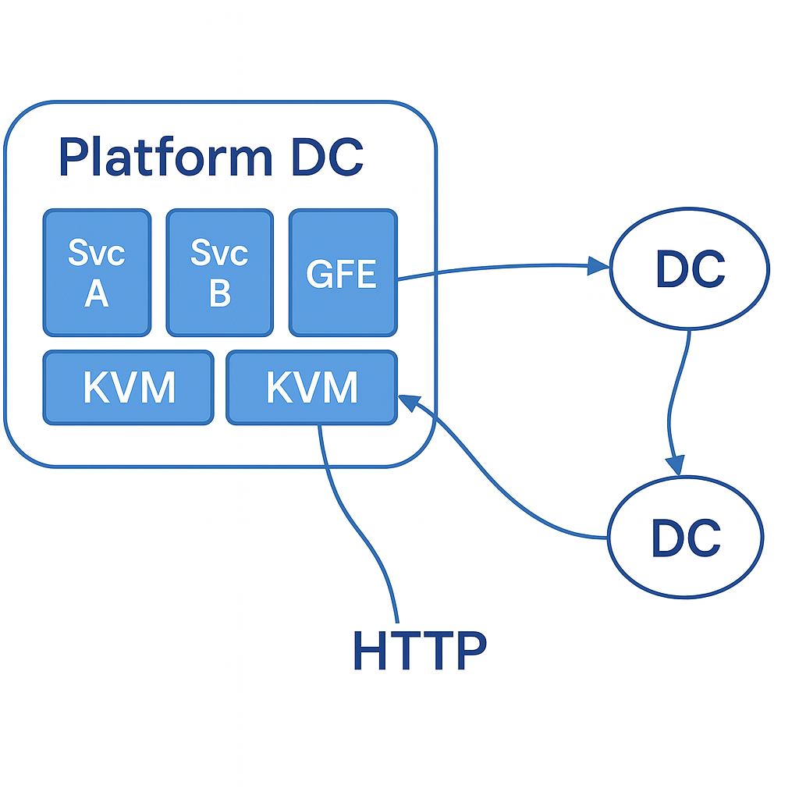

# Arquitectura de Seguridad

---

# ¿Qué es "arquitectura de seguridad"?
  * Estructuración de sistemas completos para:
    * Defender contra grandes clases de ataques (conocidos)
    * Prevenir ataques aún desconocidos
    * Contener daños de ataques exitosos
  * Queremos adelantarnos a los atacantes
    * Y no solo reaccionar aplicando parches

---

# La arquitectura de seguridad consiste en:
  * Formas de analizar la situación de seguridad
    * ¿Qué estamos defendiendo? ¿Tarjetas de crédito? ¿Claves criptográficas? ¿Secretos comerciales? ¿Todo?
    * ¿Quién es el atacante? ¿Spammers? ¿Empleados? ¿Vendedores? ¿Clientes? ¿Competidores?
    * ¿Qué poderes asumimos que el ataque tiene/no tiene?
    * (todo esto se llama generalmente el Modelo de Amenaza)
  * Principios
    * Minimizar confianza
  * Técnicas
    * Aislamiento, autenticación, separación de privilegios, canales seguros, etc.

---

# Caso de estudio: Paper de Arquitectura de Seguridad de Google
  * El paper se enfoca en la oferta de plataforma en la nube de Google.
  * No describe todos los aspectos de seguridad de todos los servicios de Google.
  * El paper toca muchos temas interesantes y complejos.
  * Buena visión general de cómo puede verse una arquitectura de seguridad.
  * Ver la charla de Butler Lampson para discusión de principios.
    * [[ Ref: http://css.csail.mit.edu/6.858/2015/lec/lampson.pdf ]]

---

# ¿Cuáles son los objetivos de seguridad en el paper de Google?
  * Evitar la divulgación de datos del cliente (ej., email).
  * Asegurar la disponibilidad de las aplicaciones de Google.
  * Rastrear qué salió mal si ocurre un compromiso.
  * Ayudar a los ingenieros de Google a construir aplicaciones seguras.
  * En general, asegurar que los clientes confíen en Google.

---

# Preocupados por muchas amenazas; ejemplos:
  * Errores en el software de Google
  * Redes comprometidas (cliente, Internet, interna de Google)
  * Contraseñas de empleados robadas
  * Malware en estaciones de trabajo/smartphones de empleados
  * Ataques internos (sobornar a un ingeniero u operador del centro de datos)
  * Hardware de servidor malicioso
  * Datos en discos descartados

---

# ¿Cuál es el entorno de servidor de Google?
  * Centros de datos.
  * Máquinas físicas.
  * Máquinas virtuales.
  * Servicios en VMs.
  * Aplicaciones (tanto de Google como del cliente) en VMs.
  * RPC entre aplicaciones y servicios.
  * Los servidores front-end convierten HTTP/HTTPS en RPC.

---

# ¿Cuál es el entorno de servidor de Google?
   

---

# Aislamiento: el punto de partida para la seguridad
  * El objetivo: por defecto, la actividad X no puede afectar la actividad Y
    * incluso si X es maliciosa
    * incluso si Y tiene errores
  * Sin aislamiento, no hay esperanza para la seguridad
  * Con aislamiento, podemos permitir interacción (si se desea) y controlarla

---

# ¿Ejemplos de aislamiento en el diseño de Google?
  
  * Separación de usuarios de Linux.
  * Sandboxes de lenguaje.
  * Sandboxes de kernel.
  * Máquinas virtuales.
  * Máquinas dedicadas, para servicios particularmente sensibles.
  * **Service Identity, Integrity, and Isolation**

---

# ¿Qué está haciendo el aislamiento para Google?
  * Veamos las máquinas virtuales.
  * Cada máquina física tiene un VMM host, que supervisa muchas VMs guest.
  * Cada VM guest ejecuta un S.O. etc.
  * Permite compartir máquinas entre actividades no relacionadas.
    * Muchas actividades solo necesitan una fracción de una máquina.
  * Un punto: VMM ayuda a mantener fuera a los atacantes en otras VMs guest.
    * Servidor de almacenamiento de Google en una VM, cliente en otra VM, o
    * Almacenamiento en una VM, servicio de Contactos de Google comprometido en otra VM.

---

# ¿Qué está haciendo el aislamiento para Google? (cont.)
  * Otro punto: VMM ayuda a mantener a los atacantes *dentro* -- confinamiento.
    * Es seguro ejecutar casi cualquier código en una VM guest, incluso en el kernel guest.
    * Mientras podamos controlar con quién habla por la red.
  * ¿Las VMs proporcionan aislamiento perfecto entre guests?

---

# Compartir: Monitor de Referencia.
  * 100% de aislamiento generalmente no es lo que queremos
  * Necesitamos compartir/interacción controlada también
  * Aquí hay un modelo para eso:

   

---

# Este modelo ha sido muy influyente

* ¿Principales?
  * Persona, dispositivo, programa, servicio, etc.

* ¿Recursos?
  * Servicios, como el servicio interno de Contactos de Google.
  * Elementos dentro de servicios, como archivos en un servicio de almacenamiento.

* ¿Qué hace el guardia?
  * ¡Autenticar!
  * ¡Autorizar!
  * ¡Auditar!


---
# Autenticar: ¿quién/qué está emitiendo la solicitud?

* ¿Cómo autenticar a una persona?
  * Contraseñas.
    * ¿Qué aprende el Guardia de una contraseña correcta?
    * ¿Podemos hacerlo mejor?
  * Autenticación de dos factores, ej. enviar número al usuario vía SMS.
    * ¿Qué aprende el Guardia de la autenticación de dos factores SMS correcta?
    * ¿Podemos hacerlo mejor?
    * Ej. usuario hizo clic en g00gle.com, propiedad del atacante?
      * ¿Y g00gle.com luego reenvía la contraseña del usuario a google.com?
  * Llaves públicas y privadas.

---

# Autorizar: determinar si la solicitud debe ser permitida.
  * Función de política: permisos = POLÍTICA(principal, recurso).
  * Equivalente: matriz de acceso.

    ```
          Alice Bob ...
    File1   Y    N
    File2   Y    Y
    ...
    ```
  * Dos formas típicas de almacenar política.
    * Access Control Lists (ACLs): almacenar una fila (cortar por recurso).
    * Capacidades: almacenar una columna (cortar por principal).
        * Básicamente qué puede hacer un principal
        * Short term

---

# Autorizar: determinar si la solicitud debe ser permitida. (cont.)
  * ACLs ampliamente usados para política a largo plazo.
    * Permisos de archivo, lista de usuarios con acceso a un documento compartido, ...
    * Típicamente almacenados con el objeto protegido.
    * Buenos para responder "¿quién puede acceder a este recurso?"
  * Capacidades útiles para política a corto plazo.
    * Descriptores de archivo en un S.O.; referencias de objeto en lenguajes;
      tokens criptográficos en protocolos distribuidos.
    * Típicamente almacenados con el principal.
    * Flexibles, ya que típicamente las aplicaciones pueden otorgarse capacidades entre sí.

---

# Autorizar: determinar si la solicitud debe ser permitida. (cont.)
  * Capacidades no son buenas para política a largo plazo:
    * No pueden responder "¿quién tiene acceso?"
    * La revocación es complicada.

---

# Granularidad
  * A nivel de Data Center
    * Confiamos en lo que está adentro -> Firewall
  * A nivel de Servicio
    * Nivel mínimo de privilegios
  * A nivel de Usuario
    * Autorización (lo que ya vimos)

---

# ¿Ejemplos de planes de autorización en el diseño de Google?
  * [[ "Inter-Service Access Management" ]]
  * ACL: administrador white-lista quién puede usar cada servicio.
    * Principales = otros servicios, ingenieros.
    * Guardia = aplicación automática por la infraestructura RPC.
  * Capacidad: "ticket de permiso de usuario final" (ej., para acceder al servicio de Contactos).
    * Capacidad para realizar operaciones en nombre de un usuario final.
    * El ticket es de corta duración para limitar daños si es robado.

---

# ¿Por qué la estructura específica del Monitor de Referencia?
  * Separa la política de la implementación del recurso
    * Para facilitar el razonamiento
    * Para facilitar la evolución de la política
  * Implicación: evitar incrustar verificaciones de seguridad en el código del recurso
    * ¡Aunque incrustar sea a menudo conveniente!
  * Nota: depende del aislamiento, es decir, no hay acceso excepto a través del guardia

---

# ¿El Monitor de Referencia es siempre el mejor modelo?
  * A veces las decisiones dependen de datos.
    * Deben ser tomadas por el recurso, no por política+guardia separados.
    * Ej. puedo ver tu oferta solo después de que haga una oferta más alta.
  * A veces los ataques no son sobre acceso a datos.
    * Ej. ataques DoS.
  * A veces no está claro cómo aplicar el modelo de manera directa.
    * Ej. dentro de centros de datos.

---

# ¿Cómo aplicar la idea del Monitor de Referencia a todo un conjunto de máquinas?
  * Ej. ¿cómo aplicarlo a las computadoras de una empresa?
  * Idea antigua: defensa perimetral.
    * Aislar "dentro de la empresa" de "fuera de la empresa".
    * Solo una conexión (lógica) a Internet.
    * El firewall actúa como guardia, detiene ataques, remueve malware, etc.
    * Acceso completo permitido dentro del firewall.
  * La defensa perimetral con firewalls funcionó bien durante muchos años.

---

# Gran parte del paper de Google es una reacción a las debilidades de la defensa perimetral.
  * No hay historia para nada que salga mal dentro.
  * Es decir, no hay segunda línea de defensa si hay penetración exitosa.

  * El paper esencialmente aplica Monitor de Referencia por servicio.
    * Guardia = aceptar RPCs solo de servicios cliente aprobados.
    * Ej. GMail puede hablar con Contactos, pero otros servicios no pueden.
    
  * Esto es un ejemplo de Privilegio Mínimo.
    * Dividir las actividades, aislarlas.
    * Dar a cada actividad solo los privilegios que necesita.

---

# Los tickets de permiso de usuario final de Google reducen el privilegio aún más.
  * RPC debe ser de servicio aprobado, ¡el usuario debe estar realmente logueado!
  * Motivación: limitar daños de servicios solicitantes con errores pidiendo datos incorrectos.
  * Motivación: limitar la capacidad de los internos de acceder a datos arbitrarios del usuario.
  * ¡Quizás los tickets también están atados al cifrado de datos en la arquitectura de Google!

---

# ¿Cómo un servicio autentica la solicitud de otro?
  * Necesitamos "canales seguros" sobre la red.
  * Criptografía: cifrar/descifrar, firmar/verificar.
  * Las firmas prueban quién envió un mensaje (integridad).
  * El cifrado asegura que solo el destinatario previsto pueda leer (confidencialidad).
  * Así:
    * Los servidores de Google (probablemente) firman RPCs a otros servidores.
      * El sistema RPC automáticamente limita quién puede hablar con quién.
    * Los RPCs están cifrados entre centros de datos, sobre internet.
    * Quizás también cifrados dentro del centro de datos (¿por qué?).

---

# La criptografía cambia los desafíos a la gestión de claves.
  * Ej. cuando el servicio GMail habla con el servicio de Contactos.
  * El remitente RPC necesita saber qué clave usar para cifrar.
  * El receptor RPC necesita saber quién corresponde a la clave de firma.
  * Google claramente ejecuta un servicio de nombres, mapeando nombres de servicio a claves públicas.

---

# ¿Cómo sabe Google que es seguro usar una computadora particular como servidor?
  * Usar un servidor significa que Google tiene que confiar en su hardware/BIOS/etc:
    * Datos sensibles, claves cripto, autorización RPC.
  * ¿Por qué podría haber un problema -- qué ataques?
    * El atacante físicamente intercambia su propio servidor por uno de Google.
    * El atacante irrumpe en un buen servidor, cambia el S.O. en disco.
    * El vendedor envía a Google una máquina con BIOS corrupto.
    * El atacante irrumpe en un buen servidor, "actualiza" BIOS a algo malo.

---

# ¿Cuál es la estrategia de defensa de Google?
  * (Muchas conjeturas aquí, veremos diseños reales más tarde)
  * Diseñan sus propias placas base, y su propio "chip de seguridad".
  * El chip de seguridad interviene durante el proceso de arranque.
  * El chip de seguridad verifica que BIOS y S.O. estén firmados por la clave privada de Google.
  * El chip de seguridad tiene una clave privada única atada a una máquina particular.
  * El chip de seguridad está dispuesto a firmar declaraciones cuando se le pide por el software.
    * La declaración incluye identidad (hash) del BIOS y S.O. arrancados.

---

# ¿Cuál es la estrategia de defensa de Google? (cont.)
  * Los servicios de Google requieren autenticación incluyendo declaración firmada por chip.
  * Los servicios de Google pueden verificar la declaración firmada de un cliente:
    * Google tiene BD de claves públicas del chip de seguridad para todas las máquinas que compró.
    * Google tiene una BD de hashes aceptables de BIOS y S.O.
  * Entonces: ¿qué pasa si un empleado del centro de datos inserta máquina con dirección IP correcta?
  * Entonces: ¿qué pasa si el vendedor envía a Google una máquina con BIOS que espía?

---

# Disponibilidad: Ataques DoS.
  * El problema:
    * El atacante quiere sacar tu sitio web del aire, o chantajearte.
    * Ensamblan un "botnet" de 10,000 máquinas aleatorias de Internet.
    * Envían vastas cantidades de solicitudes a tu sitio web.

  * Muchos tipos de recursos podrían ser el objetivo de un ataque DoS.
    * Ancho de banda de red.
    * CPU/memoria del router.
      * Paquetes pequeños, opciones de paquete inusuales, protocolos de enrutamiento.
    * Memoria del servidor.
      * Estado del protocolo (SYN floods, etc.)
    * CPU del servidor.
      * Acciones de aplicación costosas.

---

# Disponibilidad: Ataques DoS. (cont.)
  * Un problema central DoS: difícil distinguir tráfico de ataque del tráfico real.

  * Algunos principios amplios para mitigar ataques DoS.
    * Recursos masivos del lado del servidor, con distribución/balance de carga.
    * Autenticar lo antes posible.
    * Minimizar consumo de recursos antes de la autenticación.
      * Ej. minimizar estado de configuración de conexión TCP del lado del servidor.
    * Factorizar componentes que manejan solicitudes antes de la autenticación.
      * Google: GFE, servicio de login.
    * Limitar/priorizar uso de recursos después de la autenticación.
      * Los usuarios legítimos autenticados deben obtener prioridad.

---

# Disponibilidad: Ataques DoS. (cont.)
  * Google también implementa varias heurísticas para filtrar solicitudes en GFE.

<!--
---

# Implementación.
  * Base de Computación Confiable (TCB): código responsable de la seguridad.
    * Mantenerlo pequeño.
    * Depende de cuál sea el objetivo de seguridad.
    * Compartir máquinas físicas en la nube de Google: KVM.
  * Verificación.
  * Revisiones de diseño.
  * Fuzzing, búsqueda de errores.
    * Red-team/programa de recompensas.
  * Bibliotecas seguras para evitar clases comunes de errores.
  * "Curitas"/"defensa en profundidad" aumenta el costo del ataque.
    * Firewalls, seguridad de memoria, detección de intrusos, ...

---

# Configuración: incluso si la implementación está libre de errores, el sistema puede estar mal configurado.
  * Grupos.
  * Roles.
  * Gestión experta.
  * Querer política de grano fino para flexibilidad vs de grano grueso para manejabilidad.
-->
---

# Resumen de arquitectura de seguridad.
  * Aislamiento.
  * Modelo de Monitor de Referencia.
  * Autorizar/Autenticar/Auditar.
  * Canales seguros.
  * Separación de privilegios, privilegio mínimo.
  * TCB pequeño, verificación/búsqueda de errores.

  * Simplicidad.
  * Perfecto es el enemigo de lo bueno.
  * Aspiraciones más bajas.
  * Seguridad vs inconveniencia.
