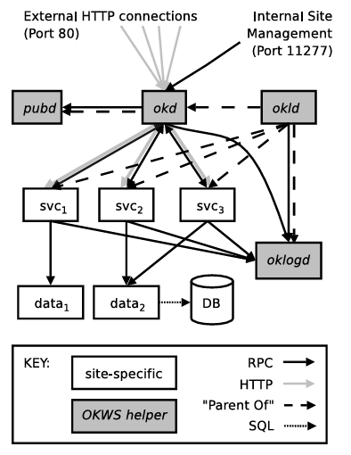

# Separación de Privilegios en OKWS

  * El problema: ¿qué hacer con los bugs?
  * Plan A: encontrarlos, corregirlos, evitar crear nuevos
    * Gran progreso aquí, ej. con buffer overflows
    * ¿Es este plan suficiente?

---

# Ejemplo: configuración tradicional de servidor web (Apache)

  * Apache ejecuta N procesos idénticos, manejando solicitudes HTTP
  * Cada proceso Apache tiene todo el código de aplicación:
    * ejecuta solicitudes para muchos usuarios
    * ejecuta muchos tipos diferentes de solicitudes (iniciar sesión, leer correo, etc.)
  * Almacenamiento: base de datos SQL con contraseñas, cookies, mensajes, etc.
  * Esta disposición es conveniente y eficiente
  * Pero es segura solo si el código web no tiene bugs

---

# Historia sugiere que los desarrolladores seguirán inventando nuevos bugs

  * Buffer overflow + inyección de código expone toda la DB al atacante
  * Bugs de memoria pueden permitir al atacante leer datos de la memoria de la app
  * Verificaciones de control de acceso faltantes antes de consultas DB
  * Bugs en manejo de archivos pueden dar acceso a archivos sensibles
    * ej. open("/profiles/" + user)
    * ¿qué pasa con user=../etc/passwd o ../mail/rtm
  * Inyección SQL puede permitir al atacante leer/escribir todos los datos DB
    * "SELECT email FROM users WHERE id = " + userid
  * Entonces: toda razón para esperar que sigamos viendo bugs
  * Y: esta configuración de "cáscara dura, interior blando" hace que los bugs sean devastadores

---

# Plan B: construir sistemas que sean seguros incluso si hay bugs

  * ¿Podemos hacer algo así?
  * Gran idea: separación de privilegios
    * Dividir el software y datos para limitar el daño de los bugs
    * Dos beneficios relacionados:
      * Limitar daño de exploit exitoso -- "menor privilegio"
      * Limitar acceso del atacante al código con bugs -- "superficie de ataque"

---

# El diseñador debe elegir el esquema de separación

  * Por servicio / tipo de datos (listas de amigos vs contraseñas)
  * Por usuario (mi correo vs tu correo)
  * Por cantidad de bugs (redimensionamiento de imágenes vs todo lo demás)
  * Por exposición a ataque directo (parsing HTTP vs todo lo demás)
  * Por privilegio inherente (ocultar procesos superusuario; ocultar la DB)

---

# La separación de privilegios es difícil

  * Necesita aislar (cliente/servidor, VMs, contenedores, procesos, etc.)
  * Necesita permitir interacción controlada
  * Necesita retener buen rendimiento
  * Hemos visto estas ideas ya en papers anteriores
    * La Arquitectura de Seguridad de Google hace gran cosa de separar servicios
    * U2F separa autenticación en un dispositivo físicamente separado
    * Ahora profundizaremos en un caso de estudio detallado, el servidor web OKWS de OkCupid

---

# Principios de OKWS

* Los procesos deben correr *chrooted*.
* Los procesos deben correr como usuarios no privilegiados.
* Los procesos deben tener privilegios mínimos de BD.
* Funcionalidad independiente debe estar en procesos independientes.

---

# ¿Cómo particiona OKWS el servidor web?

* OK Launcher Daemon (okld): servicio a cargo de lanzar otros servicios en base a un archivo de configuración.
* OK Dispatcher (okd): rutea los requests al servicio correspondiente.
* pubd: acceso a archivos
* OK Logger Daemon (oklogd): escribe logs.
* dbproxy: encargado actuar como intermediario a la BD
* Y servicios/datos...

---

# ¿Cómo particiona OKWS el servidor web?

* Todos los servicios con *chroot*
* Cada servicio corre bajo un usuario sin privilegios
* Todos los requests a la BD a través de RPC

---

# ¿Cómo particiona OKWS el servidor web?

---

# ¿Cómo particiona OKWS el servidor web?

  * ¿Cómo fluye una solicitud en este servidor web?
    * okld inicia todos los otros procesos, desde un archivo de configuración
  * ¿Cómo se mapea este diseño en máquinas físicas?
    * Muchas máquinas front-end, cada una con okld, okd, pubd, oklogd, servicio*
    * Pocas máquinas DB, cada una con dbproxy, DB

---

# ¿Cuáles son los diferentes servicios?

  * Específicos de la aplicación
  * El paper (5.3) menciona matching, messaging, editor de perfil, fotos
  * Login probablemente también es un servicio separado

---

# ¿Por qué esta disposición de separación de privilegios?

  * La mayoría de bugs estarán en el código del servicio
    * Muchos de ellos, relativamente complejos
    * Escritos por expertos en citas en línea, no expertos en seguridad
    * Ojalá el experto en seguridad escriba okld, okd, db proxies, etc.
  * Cada servicio solo puede acceder a datos relevantes de la DB
    * dbproxy restringe qué consultas puede usar cada servicio
    * No puede leer/escribir archivos, o afectar otros componentes
  * Así un buffer overflow en el editor de perfil no expondrá contraseñas
    * Aunque puede permitir al atacante leer/escribir el perfil de cualquier usuario

---

# ¿Qué daño si cada componente es comprometido? ¿Qué tan vulnerable es cada uno?

  * Daño == privilegios
  * Superficie de ataque == avenidas por las cuales el atacante podría activar bugs
  * okld:
    * Privilegios: acceso superusuario a la máquina del servidor web
    * Superficie de ataque: pequeña (sin entrada de usuario excepto salida del servicio)
  * okd:
    * Privilegios: interceptar todas las solicitudes/respuestas HTTP del usuario, robar contraseñas
    * Superficie de ataque: parsear la primera línea de la solicitud HTTP

---

# ¿Qué daño si cada componente es comprometido? (cont.)

  * pubd:
    * Privilegios: algo de acceso al sistema de archivos, podría corromper plantillas
    * Superficie de ataque: solicitudes para obtener plantillas de okd
  * oklogd:
    * Privilegios: cambiar/eliminar entradas de log -- cubrir las huellas del atacante
    * Superficie de ataque: mensajes de log de okd, okld, servicios
  * service:
    * Privilegios: datos del servicio para cualquier usuario, solicitudes a dbproxy
    * Superficie de ataque: solicitudes HTTP, contenido DB (!)

---

# ¿Qué daño si cada componente es comprometido? (cont.)

  * dbproxy:
    * Privilegios: acceder/cambiar todos los datos en la base de datos con la que habla
    * Superficie de ataque: solicitudes de servicios autorizados
                    solicitudes de servicios no autorizados (fácil de descartar)

---

# ¿Dónde debería buscar un atacante debilidades?

  * Probablemente muchos bugs en implementaciones de un servicio
    * Tal vez no tan malo para el servicio de "tipo de relación"
    * Malo qunue bug en un servicio de correo significa que puedo leer/escribir tu correo
    * Muy malo si es un bug en el servicio de autenticación de contraseñas
    * Ojalá servicios sensibles tengan pocas líneas de código (== pocos bugs)
  * Bugs en kernel del OS
    * Código inyectado en un servicio podría ser capaz de explotar un bug del kernel
    * Para convertirse en superusuario, salir del chroot
  * Bugs en parsing de URL de okd
  * Bugs en proxies DB (inyección SQL, demasiado permisivo)

---

# ¿Por qué los proxies de base de datos son separados? ¿Por qué no dejar que los servicios hablen con la DB?

  * DB acepta consultas SQL generales, puede recuperar/modificar cualquier cosa
  * dbproxy acepta RPCs (no SQL); dbproxy genera SQL y habla con DB
    * Así el código del servicio no está sujeto a inyección SQL
  * dbproxy sabe qué consultas se permite hacer a cada servicio
    * Aquí es donde vive la política de seguridad: matriz servicio / consulta
  * Un desarrollador conocedor debe mantener dbproxy

---

# ¿Cómo sabe un dbproxy qué servicio está hablando con él?

  * dbproxies en máquinas DB separadas, servicios usan sockets TCP para conectar
  * No puedes decir mucho desde TCP sobre quién se conectó a ti
  * Entonces:
    * Cada servicio tiene un token secreto único de 20 bytes
    * El servicio suministra su token en RPC cuando habla con dbproxy
    * dbproxy tiene lista de consultas permitidas para cada token
  * ¿De dónde viene el token de 20 bytes?
    * okld lee desde config, lo pasa al servicio

---

# Falta de aislamiento por usuario en OKWS

  * El paper argumenta que el aislamiento por usuario es demasiado costoso
  * El costo de iniciar un proceso (o mantener proceso ejecutándose) es alto,
    * comparado con el costo de procesar una solicitud HTTP
  * Truco/tradeoff potencial del paper de Google:
    * Un servicio ejecutándose pero solo puede actuar en nombre de algunos usuarios
    * "Ticket de permiso de usuario final"
  * ¿Tendrían sentido los permisos de usuario estilo Google en OKWS?

---

# Permisos por usuario desde una perspectiva de seguridad

  * El servicio no puede acceder a datos de usuarios que no han accedido a ese servicio
  * Podría significar que un servicio con bugs raramente usado no puede causar tanto daño
    * Especialmente si ese servicio con bugs comparte datos con otros servicios
    * Ej., puede leer datos de perfil, fotos de usuario, etc.
  * Podría también significar que un servicio comprometido tiene que esperar a que los usuarios inicien sesión
    * Incluso para servicio popular, los usuarios podrían no estar usándolo todo el tiempo
    * Toma más tiempo para que el adversario obtenga datos de muchos usuarios
    * Más oportunidad para que los operadores tal vez noten el ataque, se recuperen

---

# Lab 2 usa contenedores Linux (lxc)

  * No existían cuando el autor construyó OKWS
  * Los contenedores proporcionan la ilusión de máquinas virtuales sin usar máquinas virtuales
    * Los contenedores son más eficientes que las máquinas virtuales
  * Un contenedor es un proceso Linux, pero fuertemente aislado:
    * Acceso limitado a los espacios de nombres del kernel
    * Acceso limitado a las llamadas al sistema
    * Sin acceso al sistema de archivos

---

# Los contenedores se comportan como una máquina virtual

  * Iniciados desde una imagen VM
  * Tienen su propia dirección IP
  * Tienen su propio sistema de archivos
  * Lab 2 usa contenedores *no privilegiados*
    * Estos contenedores ejecutan como procesos de usuario no-root
    * Si el proceso dentro del contenedor ejecuta como root, aún privilegios limitados
  * Más difícil salir del contenedor que proceso con chroot
  * Lab2 también usa chroot/uid para separar procesos privilegiados en un contenedor (perfil)
    * Pero esa es la excepción, lab 2 principalmente depende de contenedores

---

# Usando contenedores para separación de privilegios

  * Plan: convertir aplicación de proceso único en aplicación virtual "distribuida"
    * Crear un contenedor para diferentes servicios
      * Copiar los archivos correctos al contenedor
      * Asignar su propia dirección IP
      * Usar RPC sobre TCP para comunicarse con otros contenedores
    * Limitar comunicación entre contenedores
      * Configurar reglas de firewall para limitar comunicación entre contenedores
    * Lab 2 tiene zookld que hace esto; similar a okld
  * El paper de arquitectura de Google usa máquinas físicas para dividir servicios
    * Los contenedores soportan la misma idea usando una sola máquina física

---

# ¿Qué ha pasado desde 2004, cuando OKWS fue publicado?

  * OKWS mismo aún (probablemente) usado en OK Cupid, pero no en otros lugares
    * C++ no es popular para programación web
    * Las herramientas de aislamiento a nivel de proceso UNIX son difíciles de usar
    * La partición fina es difícil, tensión con desarrollo rápido y evolución
    * La partición OKWS no muy útil si solo tienes un servicio importante
    * La liberación open-source de OKWS ha sido deprecada por sus mantenedores

---

# La separación de privilegios comúnmente usada en la práctica

  * Balanceador de carga, servicio de login, servicio de perfil, DB de contraseñas, DB de perfil
  * El paper de arquitectura de Google es un buen ejemplo
    * Incluso más granulado que OKWS: tickets por usuario
  * Algunos sistemas con partición grano fino estilo OKWS:
    * proceso ssh-agent para mantener claves crypto, vs ssh mismo
    * Chrome ejecuta cada frame en un proceso aislado
  * VMs, FreeBSD jail, contenedores Linux (Docker), Linux seccomp, etc.

---

# Resumen

  * La separación de privilegios es una técnica fundamental de seguridad
  * OKWS demuestra cómo dividir un servidor web monolítico en componentes aislados
  * Cada componente tiene privilegios limitados y superficie de ataque reducida
  * Los contenedores modernos proporcionan mejor aislamiento que procesos UNIX tradicionales
  * La separación de privilegios sigue siendo relevante hoy en día

---

---

# ¿Cómo podríamos orquestar permisos por usuario en OKWS?

  * dbproxy necesita saber qué usuarios puede consultar un servicio particular
  * Algo necesita obtener la cookie HTTP y decirle a dbproxy qué usuario está activo
  * Enfoque potencial: nuevo servicio como okd que mira toda la solicitud HTTP
    * Verifica cookie para determinar usuario
    * Determina qué servicio necesita obtener esta solicitud
    * Le dice a dbproxy que permita consultas para ese usuario de ese servicio
    * No envía cookie al servicio
  * Otro beneficio: los servicios ya no ven la cookie HTTP del usuario
    * Previene que servicio comprometido suplante al usuario

---

# ¿Qué pasa si un servicio explotado trata de leer tokens del archivo config de okld?

  * ¿O trata de usar gdb para mirar dentro de otro proceso de servicio?
  * ¿O trata de leer un token de un archivo de core dump de servicio?
  * ¡Necesitamos ayuda del OS para hacer cumplir el aislamiento!

---

# ¿Cuáles son los mecanismos para aislamiento y control sobre compartir?

  * El paper usa procesos Unix, IDs de usuario (UIDs), permisos de archivo, y paso de fd
    * ¿Qué es setuid(uid)?
      * un proceso puede soltar sus privilegios de root a un uid ordinario
    * ¿Qué es chroot(dirname)?
      * hace que / se refiera a dirname para este proceso y descendientes,
      * así no pueden nombrar archivos fuera de dirname
    * ¿Qué es paso de FD?
      * Un proceso abre conexión de red y pasa el descriptor de archivo a otro proceso
      * Por ejemplo, okld pasa descriptor de archivo para puerto 80 a okd

---

# ¿Cómo hace cumplir OKWS el aislamiento entre componentes en la Figura 1?

  * okld ejecuta cada servicio con un UID separado
    * [En lab 2, ejecutarías cada servicio como un contenedor separado]
    * Así los servicios no pueden leer/escribir la memoria de cada uno
  * okld usa chroot para prevenir que los procesos vean la mayoría de archivos
    * Tabla 1
    * pubd y oklog solo pueden acceder a sus propios archivos
  * okld ejecuta como root (para setuid() y para asignar puerto TCP 80)
    * ¡Así que queremos que haga lo menos posible!

---

# ¿Por qué okd es un proceso separado?

  * Necesitamos una forma de enrutar solicitudes HTTP al servicio correcto
  * okd ve todas las solicitudes, así que no queremos hacer nada más en okd
  * nota okd NO ejecuta como superusuario; okld le da puerto 80
  * ¿Por qué oklogd es un proceso separado?
    * No queremos que servicio corrupto elimine/sobrescriba archivos de log
  * ¿Por qué pubd es un proceso separado?
    * Mantiene código de manejo de archivos fuera de servicios

---

# Tabla 1: ¿por qué todos los servicios y okld están en el mismo chroot?

  * Queremos hacer chroot a okld -- puede tener bugs también
  * okld necesita relanzar okd + servicios
    * Así okd y servicios necesitan vivir en algún lugar en la cárcel chroot de okld
  * ¿Qué estamos exponiendo al tener okld, okd, y servicio compartir cárcel chroot?
    * Legible: bibliotecas compartidas conteniendo código de servicio
    * Escribible: cada servicio puede escribir a su propio /cores/<uid>
  * ¿Dónde está el archivo config?
    * /etc/okws_config, tal vez okld lee al inicio antes de chroot

---

# oklogd & pubd tienen chroots separados porque usan archivos

  * así okld debe iniciar oklogd y pubd antes de hacer chroot a sí mismo
  * ¿Por qué un UID separado para cada servicio?
    * kill, ptrace, archivos core
  * ¿Por qué un GID separado para cada servicio?
    * Así el servicio puede ejecutar su binario pero no leer/escribir/chmod
    * Binario propiedad de root, y x-solo para GID del servicio: rwx--x---
    * Así el servicio no puede leer secretos de su ejecutable, y no puede
      * modificarlo para persistir un ataque

---

# ¿Cómo interactúan los componentes OKWS?

  * okld configura socketpairs (pipes bidireccionales) para cada servicio
    * RPCs de control
    * Logging
    * Conexiones HTTP, okd -> servicio
  * Los servicios hablan con proxy DB sobre TCP
    * La mayoría del estado en DB, la mayoría de interacción vía estado en DB

---

# Las herramientas de aislamiento a nivel de proceso UNIX son difíciles de usar

  * Muchos espacios de nombres globales: archivos, UIDs, PIDs, puertos
    * Cada uno puede permitir que los procesos vean lo que otros están haciendo
    * Cada uno es una invitación para bugs o configuración descuidada
  * No hay idea de "por defecto sin acceso"
    * Así es difícil para el diseñador razonar sobre qué puede hacer un proceso
  * No hay concesiones granulares de privilegio
    * No puedes decir "proceso puede leer solo estos tres archivos"
  * Chroot() y setuid() solo pueden ser usados por superusuario
    * Así los no-superusuarios no pueden reducir/limitar su propio privilegio
    * Incómodo ya que la seguridad sugiere NO ejecutar como superusuario

---

# Referencias

  * OKWS: A Scalable and Secure Web Server (2004)
  * Google's Security Architecture
  * U2F Protocol
  * Lab 2: Container-based Privilege Separation
