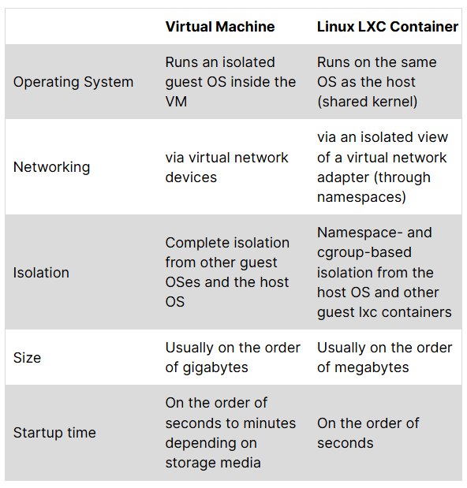

# Linux Containers

  * Vimos separación por procesos (OKWS)
    * Difícil de manejar
  * Separación de Privilegios
    * Mínimo Privilegio
    * Separación de responsabilidades

---

# chroot

  * Cambia el directorio raiz
    * Por ejemplo de / a /home/ignacio
  * No es suficiente
    * Es una aislación que se puede romper

---

# Casos de Uso

  * Segregación de privilegios más fuerte en una arquitectura de microservicios en un solo host 
  * Mejor contención del radio de explosión en caso de compromiso de seguridad
  * Utilización de recursos más efectiva en aislamiento (comparado con virtualización asistida por hardware)
  * Facilidad de despliegue de software (el propósito para el cual los contenedores fueron desarrollados originalmente)

---

# Máquinas Virtuales v/s Containers

  * Una CPU con muchos kernels
  * v/s
  * Un kernel con muchos espacios de usuario

  * Qué es el kernel?


---

# Máquinas Virtuales v/s Containers

  

---

# Linux Containers

  * chroot en esteroides
    * Grupo de procesos
    * Usa namespaces para vistas privadas
    * Usa cgroups para limitar el uso de recursos
    * Usa capabilities para limitar lo que puede hacer root
    * Usa seccomp-bpf para filtrar llamadas de sistema (syscalls) del kernel
  * Ligeros, rápidos y dispensables
    * Corren en milisegundos
    * Usan Mb

---

# Namespaces

  * Un namespace hace que un recurso solo pueda tener acceso a otros recursos en el mismo namespace
    * Por ejemplo podemos separar procesos dentro de namespaces separados para que no se puedan ver entre sí

---

# Namespaces

  * PID: separa procesos
  * UTS: aisla hostnames
    * fqdn
  * cgroup: aisla cgroups
  * IPC: aisla comunicación entre procesos
  * User: aisla usuarios
  * Mount: aisla mountpoints
  * Network: aisla la red

---

# Control Groups - cgroups

  * Limita la cantidad de recursos un grupo de procesos puede utilizar.
    * Por ejemplo útil para multi tasking
  * Límites: se pueden especificar límites máximos en el uso del procesador, uso de memoria, uso de dispositivos, etc.
  * Contabilidad: se monitorea el uso de recursos.
  * Priorización: el uso de recursos puede ser priorizado sobre otros cgroups.
  * Control: el estado de los procesos puede ser controlado (ej. detener, reiniciar, suspender)

---

# Control Groups - cgroups

  * Se puede limitar
    * Memoria
    * CPU
    * Disco
    * Dispositivos
    * Acceso a la red
    * etc.

---

# Capabilities

* Antes teníamos usuario *root* (privilegiado) v/s usuario no privilegiado
* Qué pasa si necesitamos que un usuario no privilegiado corra algo con permisos privilegiados?
* Aquí entran las capabilities
  * CAP_CHOWN
  * CAP_NET_ADMIN
  * CAP_NET_RAW

---

# Capabilities

<style scoped>
    pre {
      width: 70%; /* Adjust this percentage or use a fixed pixel value like 700px */
      margin-left: 0px;
    }
</style>

```
ignacio@ubuntu:~$ ls -al /bin/ping
-rwxr-xr-x 1 root root 72776 Jan 30 15:11 /bin/ping
```

```
USER   PID  %CPU %MEM VSZ   TTY   COMMAND
ignacio 3220 0.0  0.0  18464 pts/0 /bin/ping google.com

```

```
ignacio@ubuntu:~$ getcap /bin/ping
/bin/ping = cap_net_raw+ep
```
---

# Capabilities

* Effective: capability activa
* Inheritable: es heredada por los hijos
* Permitted: permitida sin importar la capability del padre

---

# Capabilities

<style scoped>
    pre {
      width: 70%; /* Adjust this percentage or use a fixed pixel value like 700px */
      margin-left: 0px;
    }
</style>

```
ignacio@ubuntu:~$ cp /bin/ping .
ignacio@ubuntu:~$ getcap ./ping 
ignacio@ubuntu:~$ ./ping google.com
ping: socket: Operation not permitted
ignacio@ubuntu:~$ sudo setcap cap_net_raw=ep ./ping
ignacio@ubuntu:~$ ./ping google.com
PING google.com (172.217.11.14) 56(84) bytes of data.
```

---

# Seccomp-bpf

* Originalmente para networking (Berkley Packet Filter)
* Limita los syscalls que un proceso puede hacer
* Imaginemos que un atacante toma control del container y logra tener privilegios de root
  * Queremos evitar que haga syscalls peligrosas 

---

# ¿Cómo funciona todo junto?

* Namespaces: aislan elementos del kernel
* Capabilities: reducen privilegios no deseados
* cgroups: limitan los recursos de hardware
* seccomp-bpf: filtran llamadas al kernel
* El resultado son contenedor con privilegios limitados

