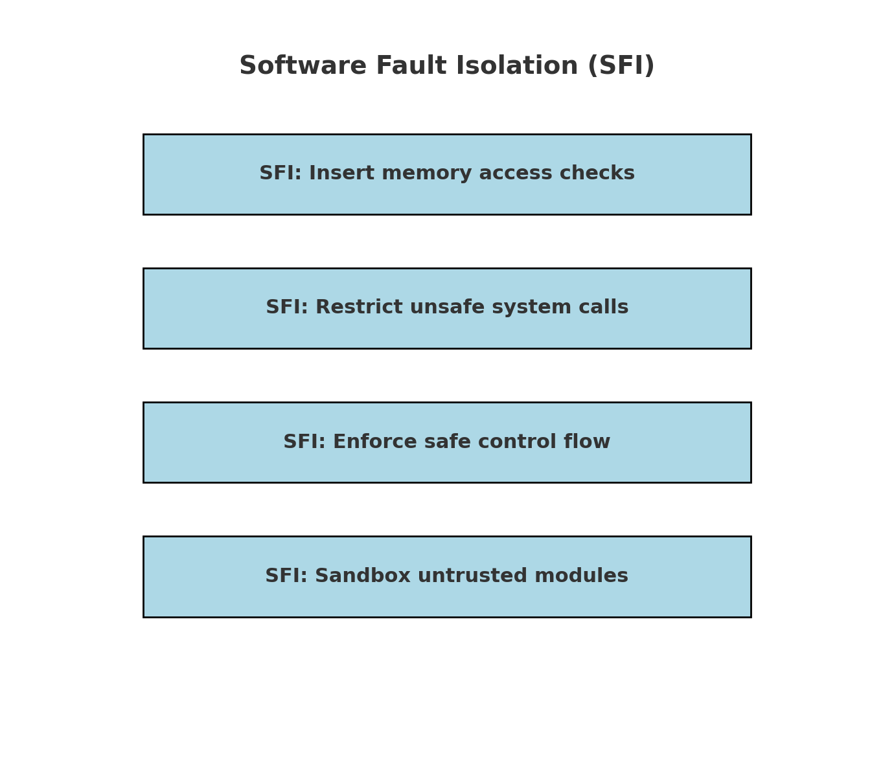
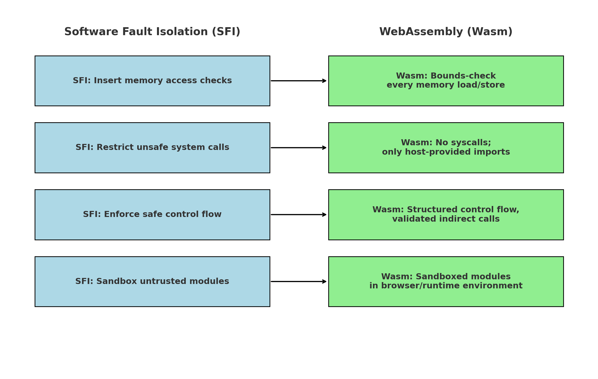

# Aislamiento de fallas de software: WebAssembly

---

# Objetivo: ejecutar código rápido en aplicaciones web
  * Javascript es universalmente soportado pero no es una buena opción en algunos casos
    * Código de alto rendimiento
    * Aplicaciones escritas en un lenguaje que no es JS
  * Desafío: el código debe estar aislado
    * No puede tener código de un sitio web que manipule datos de otro sitio
    * No puede tener código de un sitio web que manipule datos en la computadora del usuario

---

# Hemos visto varios mecanismos de aislamiento ya. ¿Por qué otro más?
  * Algunos requieren privilegios especiales
    * Necesitas ser root para configurar chroot, UIDs, etc
  * Algunos funcionan solo en plataformas específicas
    * Firecracker solo funciona en Linux
      * ¿Pero qué pasa con los navegadores en Windows, MacOS, ...?
    * Las VMs funcionan bien en CPUs que soportan virtualización de hardware
      * ¿Pero qué pasa con dispositivos sin soporte directo de VM de hardware?
  * Algunos requieren que el sistema esté pre-configurado por el administrador
    * Los contenedores requieren Docker / LXC / etc instalado primero
    * El administrador debe crear interfaces de red virtuales
    * El administrador debe configurar namespaces UID

---

# Enfoque: aislamiento de fallas de software
  * Idea poderosa para lograr aislamiento
  * No depende de soporte de hardware o SO
    * No requiere privilegios especiales para desplegar
    * Puede proporcionar aislamiento incluso ante algunos errores de hw/os
  * Pero requiere cooperación entre desarrolladores y dispositivos que ejecutan su código
    * No puede tomar un binario existente y ejecutarlo en aislamiento
    * Contraste con contenedores o VMs: puede ejecutar aplicaciones Linux existentes

<!--
---

# Aparte: sandboxing de Java
  * Java VM
  * Control de acceso basado en stack
  * Algunos códigos son confiables (ej., pueden acceder a archivos), pero algunos no
  * El código de acceso a archivos verifica si el llamador (marcos de stack) es confiable o no
  * Fácil tener un error: problemas de estilo "confused deputy"
  * [[ Ref: http://phrack.org/issues/70/7.html ]]
-->
---

# SFI

---

# Sistema SFI moderno: WebAssembly

  * Se puede ejecutar en línea de comandos
  * También se puede ejecutar en el navegador
  * Corromper memoria es detectado
    * wasmtime main.wasm test, detecta error
    * shift-reload navegador, también detecta error

---

# Módulo WebAssembly
  * Funciones. Define todo el código en el módulo
  * Globales. Variables globales
  * Tablas. Objetivos de punteros de función
  * Memoria. Memoria contigua de 0 a sz
  * Importaciones y exportaciones. Ej., puede marcar una función como exportada, o importar función

---

# Flujo de trabajo de WebAssembly
  * [[ Código de aplicación (ej., C) ]]
    * -> Compilador C que puede generar WebAssembly ->
  * [[ Módulo / archivo WebAssembly ]]
    * -> Validador en navegador web (verificaciones de tipos)
    * -> Intérprete o compilador (ejecución) ->
  * [[ Código nativo que puede ejecutar el módulo WebAssembly ]]

---

# Desafío: rendimiento + aislamiento
  * Podríamos escribir un intérprete para cualquier código que queramos ejecutar
    * Javascript funciona más o menos así
    * Podría ser incluso x86: solo ejecutar qemu en el navegador para emular x86
  * El intérprete no permitirá que el código acceda fuera del límite de aislamiento
  * Pero eso es lento; el objetivo es alto rendimiento

---

# ¿Por qué sería difícil simplemente aislar x86 arbitrario ejecutándose nativamente?
  * En última instancia queremos prevenir:
    * Syscalls
    * Acceder a memoria fuera del módulo aislado
  * Pero es difícil controlar lo que hace el código a través de validación
    * Difícil determinar qué direcciones de memoria serán accedidas
    * Difícil saber si el código saltará a otro lugar, fuera del módulo
    * Tal vez difícil saber si hay instrucciones de syscall incluso
      * Instrucciones de longitud variable en x86
  * En tiempo de ejecución, el código usa saltos calculados y accesos a memoria calculados
    * Sin soporte de hardware, no se puede controlar cuáles serán las direcciones

---

# ¿Por qué WebAssembly es mejor que x86?
  * Diseño inteligente permite intérprete de alto rendimiento simple (y por tanto seguro)

---

# Alto rendimiento: traducir WebAssembly a código nativo (ej., x86, x86-64)
  * Operaciones básicas como aritmética deberían ser más o menos uno a uno
  * Es decir, una operación WebAssembly puede compilarse en una instrucción x86-64
  * Pero necesitamos ser más cuidadosos sobre estado y flujo de control
    * Estado: no debería poder acceder a nada fuera del módulo
    * Flujo de control: no debería saltar a código que no esté "adecuadamente traducido"

---

# ¿Cuál es el plan para asegurar la seguridad del código ejecutado?
  * Las instrucciones WebAssembly que acceden al estado no deben escapar del sandbox
    * Necesitamos asegurar que estamos accediendo a var local / var global / memoria heap legal
    * Agregar verificaciones al código nativo generado según sea necesario para hacer esto seguro
  * Asegurar que el código generado solo puede saltar a otro código generado
    * No puede saltar a código fuera del sandbox
    * No puede saltar a código mal alineado
    * No puede saltar a código en sandbox evitando la verificación
    * Típicamente esto se llama "integridad de flujo de control" o CFI

---

# ¿Qué estado puede acceder el código WebAssembly?
  * Valores de stack
  * Variables locales
  * Variables globales
  * Memoria heap, crece de 0 hacia arriba

---

# ¿Cómo verificar límites de accesos a variables globales?
  * Se conoce de antemano cuántas variables globales hay en un módulo
  * Se puede verificar el acceso a variables globales en tiempo de compilación
  * Emitir código que siempre es seguro ejecutar
    * Solo acceder a globals[off] donde off ya es una constante verificada
    * El runtime mantiene alguna forma de acceder a la base de los globales
  * Acceder a globales dentro de límites es seguro
    * El código WebAssembly podría escribir valores arbitrarios a variable global
    * Pero eso está bien: el aislamiento no depende de valores específicos

---

# ¿Cómo verificar límites de accesos a variables locales?
  * Cada función tiene un número bien conocido (constante) de variables locales
    * Las variables locales incluyen argumentos a una llamada de función
    * Como con globales, se puede verificar que el offset esté en rango en tiempo de compilación
  * Complicación menor: ¿cómo accedemos a las variables locales?
    * La misma función podría ser invocada muchas veces recursivamente
    * Queremos acceder a las variables locales para la invocación actual
  * En tiempo de ejecución, estas variables locales se almacenan en el stack (nativo)
    * Entremezcladas con valores de stack (WebAssembly)
    * Ver siguiente

---

# ¿Cómo verificar límites de ubicaciones de stack?
  * Gran pregunta:
    * ¿Es válido acceder a este offset de stack?
  * ¿Cómo se implementan las variables locales + stack de WebAssembly en términos de un stack nativo?
    * Algunos valores de stack WebAssembly nunca se materializan: almacenados en registros
    * El stack real almacena vars locales WebAssembly, valores de stack (que no se omiten),
      * más direcciones de retorno, registros guardados al llamar
    * Necesitamos asegurar que la dirección de retorno no se corrompa almacenando en var local

---

# El flujo de control estructurado de WebAssembly ayuda a verificar accesos a stack
  * En cada punto de una función, se conoce cuántos valores hay en el stack de runtime
  * El flujo de control dentro de una función siempre debe estar de acuerdo en el contenido del stack
    * Ej., el flujo de control convergente debe estar de acuerdo en cuántos elementos de stack hay
  * Un beneficio: verificación en tiempo de compilación de qué tan arriba en el stack puede acceder el código
    * El compilador conoce la profundidad del stack en cada instrucción en el código WebAssembly
  * Segundo beneficio: el compilador conoce dónde están ubicadas las variables locales
    * Acceder a variable local requiere saltar valores de stack WebAssembly en el stack
    * Pero como conocemos la profundidad del stack, el compilador puede agregar fácilmente ese offset

---

# Verificación de límites de operaciones de memoria
  * Ej., i64.store almacena valor de 64 bits (8 bytes) en alguna dirección A
  * Necesitamos asegurar que el código resultante no pueda corromper estado fuera del sandbox
    * En particular, las direcciones A a través de A+7 deben estar dentro de la región de memoria
  * ¿Cómo debería verse el código compilado?
    * if a+8 >= memsz { panic }
    * hacer el store

---
# Verificación de límites de operaciones de memoria
  * El compilador puede potencialmente eliminar verificaciones de límites repetidas
    * uint64 a[4];
    * a[0] = ..;
    * a[1] = ..;
    * a[2] = ..;
    * a[3] = ..;
  * Basta verificar una vez:
    * if a+4*8 >= memsz { panic }
    * hacer los 4 stores

---

# Uso inteligente de memoria virtual para verificaciones de límites
  * La especificación WebAssembly dice que la memoria es de máximo 4GB de tamaño
  * La dirección usada para i64.store es una dirección de 32 bits sin signo
  * La instrucción también puede especificar un offset estático
    * Común acceder a arrays, lo que significa dos offsets
      * a[5] = 6;
  * Entonces, la operación completa de almacenamiento de memoria es:
    * *(membase + address + offset) = value
  * La especificación WebAssembly requiere que tanto address como offset sean valores de 32 bits
    * Por tanto, la dirección resultante será de máximo 8GB desde membase
  * Truco: la memoria virtual reserva región de 8GB de memoria para todas las direcciones posibles
    * En el peor caso, golpeará page fault si el acceso es a memoria más allá del tamaño asignado

---

# Pequeño trade-off con verificación de límites basada en VM
  * Ya no es completamente determinista
  * Dependiendo del runtime, el programa podría o no parar en store fuera de límites,
    * si el store está ligeramente fuera de límites

---

# No hay seguridad de memoria dentro de un módulo
  * Es completamente posible que un programa C compilado a WebAssembly tenga buffer overflow
  * Ej., corromper región de memoria asignada en heap
  * WebAssembly no previene overflow, así que el programa C podría comportarse mal arbitrariamente
  * Pero asegura que el código WebAssembly no pueda afectar el resto del sistema

---

# ¿Por qué es importante la verificación de tipos de valor? (i32 vs i64)
  * El compilador puede querer saber si un valor podría estar limitado a 32 bits
  * Permite algunas optimizaciones como cargar/almacenar ubicaciones de memoria

---

# ¿Por qué es importante la verificación de tipos de función? (¿Cuántos argumentos toma una función?)
  * La función WebAssembly puede acceder (y modificar) argumentos
    * Son como variables locales
  * Por tanto, la función wasm puede modificar algún número de ubicaciones de stack de runtime,
    * dependiendo de cuántos argumentos se declara a sí misma como tomando
  * Necesitamos asegurar que el llamador nos dio suficientes argumentos en el stack
    * ¡De otra manera la función puede leer/escribir otros elementos en el stack de runtime!
    * Podría ser alguna dirección de retorno nativa, lo cual sería malo

---

# ¿Cómo lograr integridad de flujo de control?
  * Saltos directos: el compilador asegura que el salto nativo vaya al código compilado apropiado
  * Llamadas de función: configurar el stack de la manera que la función objetivo espera
    * Es decir, args + dirección de retorno deberían estar en la parte inferior del stack después de la llamada
    * La seguridad de tipos para tipos de función asegura que pongamos el número correcto de argumentos
  * Llamadas de función indirectas: tabla de objetivos de salto
    * El compilador asegura que todos los objetivos de salto son funciones válidas
    * WebAssembly call_indirect emite código nativo para saltar a alguna función de la tabla

---

# SFI aplicado a Wasm

---

# Ampliamente soportado en navegadores ahora
  * Firefox, Chrome, Safari, variantes móviles, IE Edge, ...
  * Usado en aplicaciones serias, como Adobe Photoshop
  * [[ Ref: https://web.dev/ps-on-the-web/ ]]

---

# Bastante actividad, nuevas características
  * [[ Ref: https://github.com/WebAssembly/proposals ]]
  * Ej., trabajo en agregar soporte para hilos, instrucciones vectoriales, etc

---

# También usado fuera de navegadores web
  * Ej., Fastly y Cloudflare CDNs usan WebAssembly
    * Objetivo: ejecutar código en un servidor cerca del usuario que solicita
    * Objetivos similares a AWS Lambda, tal vez incluso más enfoque en inicios de bajo overhead
    * Ejecutar el paso de compilación una vez, luego el binario es rápido para comenzar a ejecutar
    * [[ Ref: https://docs.fastly.com/products/compute-at-edge ]]
    * [[ Ref: https://blog.cloudflare.com/webassembly-on-cloudflare-workers/ ]]

---

# También usado fuera de navegadores web (cont.)
  * Cloudflare también usa sandboxing a nivel Javascript
    * [[ Ref: https://blog.cloudflare.com/cloud-computing-without-containers/ ]]
  * Trabajo en curso para definir interfaz estándar al sistema fuera de un módulo
    * [[ Ref: https://github.com/WebAssembly/WASI ]]

---

# ¿Por qué la formalización?
  * Definición clara de cómo ejecutar programas WebAssembly
  * Importante para consistencia entre implementaciones (navegadores, runtimes)
  * También buen punto de partida para argumentar sobre corrección, seguridad

---

# ¿Cómo se ven las vulnerabilidades de seguridad en sandboxes WebAssembly?
  * [[ Ref: https://www.fastly.com/blog/defense-in-depth-stopping-a-wasm-compiler-bug-before-it-became-a-problem ]]
  * El compilador dependía de optimización de tipo de 32 bits para accesos a memoria
    * Sabe que ciertos valores son solo de 32 bits
    * Si acceder a memoria con offset conocido de 32 bits, omitir truncamiento
    * De otra manera, emitir instrucción que forzará-cero los 32 bits superiores del valor de 64 bits
  * El compilador almacenó valores en registros de CPU (en lugar de ubicaciones de stack) para rendimiento
  * Cuando se quedó sin registros, almacenó estos registros en stack de runtime
  * Error: al recargar valor de 32 bits del stack, accidentalmente lo extendió con signo
    * Es decir, 0x80000000 se cargó como 0xffffffff80000000 en lugar de 0x0000000080000000
    * Solo una instrucción incorrecta usada para restaurar valor de 32 bits del stack al registro

---

# ¿Cómo se ven las vulnerabilidades de seguridad en sandboxes WebAssembly? (cont.)
  * Ahora no es seguro agregar este valor (supuestamente conocido de 32 bits) para acceso a memoria
    * Termina restando de la base de memoria en lugar de sumar a ella

---

# Posible reducir TCB para depender de un verificador en lugar de todo el compilador
  * Agregar un verificador que acepta resultado binario del compilador y emite sí/no
  * El verificador puede ser mucho más pequeño que el compilador
  * Ej., VeriWasm para Lucet (ahora Wasmtime)
    * [[ Ref: https://cseweb.ucsd.edu/~dstefan/pubs/johnson:2021:veriwasm.pdf ]]
    * [[ Ref: https://github.com/bytecodealliance/wasmtime ]]

---

# Posible reducir el costo de transiciones entre dominios de aislamiento aún más
  * [[ Ref: https://cseweb.ucsd.edu/~dstefan/pubs/kolosick:2022:isolation.pdf ]]

---

# Resumen
  * Aislamiento a nivel de lenguaje / aislamiento de fallas de software
  * Idea poderosa para construir sandboxes fuertes, independientes de SO/HW
  * Puede ser incluso menor overhead que aislamiento SO/HW: menores costos de cambio de contexto
  * Compilador / runtime correcto es crítico para lograr seguridad
  * WebAssembly diseñado para hacer el trabajo del compilador/runtime más fácil en términos de seguridad
