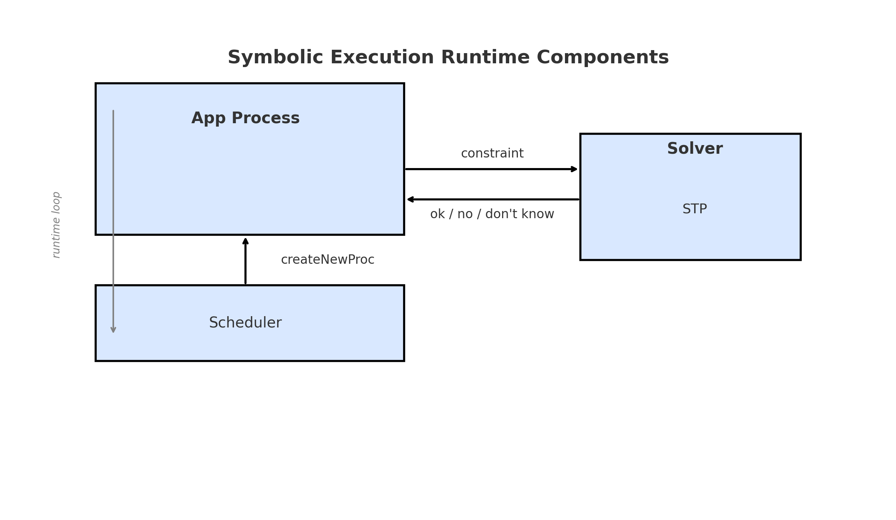

# Bugs y Ejecución Simbólica

---

# Temas de hoy: encontrar bugs, ejecución simbólica, EXE
  * ¿Podemos automatizar la búsqueda de vulnerabilidades de seguridad?
  * Básicamente lo mismo que encontrar bugs; tomemos prestadas ideas de búsqueda de bugs
  * Ejecución simbólica
    * Método poderoso de encontrar bugs "profundos"
    * Lo usarán en el laboratorio 3

---

# Bugs: fuente principal de exploits de seguridad
  * bugs ~ exploit
    * Tal vez difícil, pero debemos asumir que es posible
    * Ej., no todo buffer overrun es un exploit, pero podría ser posible explotar

---

# Potencial Solución
  * Alentar a investigadores/practicantes de seguridad/entusiastas a encontrar exploits
  * Protocolo para divulgar exploits
    * Contactar al vendedor
    * Después de algún tiempo divulgar bug al público (ej., 90 días)
    * Política de ejemplo (https://insights.dice.com/2020/01/15/google-project-zero-bug-disclosure-etiquette/)
    * CVE: esfuerzo comunitario para registrar bugs (https://cve.mitre.org/)
      * CVE = Common Vulnerabilities and Exposures
  * Muchas compañías tienen programas de recompensas

---

# Clase de hoy: un enfoque novedoso para encontrar bugs en aplicaciones
  * La aplicación tiene entradas, que el atacante puede proveer (ej. solicitudes web)
  * Agregamos verificaciones (ej. aserciones) para situaciones malas que podrían surgir
    * Las verificaciones podrían ser muy caras para usar en el sistema real
  * El paper proporciona método para encontrar entradas que el atacante podría proveer
    * que causarían que el código falle las verificaciones
  * ¿Puede el atacante usar esto también?
    * ¡Sí!

---

# ¿Qué tipos de bugs?
  * División por cero, desreferencia de puntero null, acceso a array fuera de límites
  * Bugs específicos de aplicación (a través de asserts)
    * Transacción bancaria cambió suma de todas las cuentas
    * Transacción de X disminuyó balance de Y
    * Programa abrió archivo con nombre determinado por entrada
    * Solicitud establece cookie para suplantar otro usuario
  * Los asserts específicos de aplicación en programas a menudo se apagan durante despliegue
    * A veces son caros
    * Confiamos en pruebas con asserts encendidos

---

# ¿Por qué no probar directamente que el programa es correcto?
  * Esto puede hacerse
  * Pero es mucho trabajo
  * Aún no práctico para programas grandes
  * Algún día

---

# Podrías escribir un conjunto de pruebas (y deberías)
  * Cada prueba ejecuta el programa con alguna entrada
    * La prueba conoce la salida esperada
    * Los asserts en el código tienen oportunidad de detectar errores
  * Pro: bueno para funcionalidad intencionada
  * Pro: bueno para bugs que ya se conocen
  * Con: no tan bueno para funcionalidad no intencionada == vulnerabilidades
  * Con: no tan bueno para bugs aún desconocidos
  * Con: difícil escribir pruebas que obtengan "cobertura" completa
    * == causar que cada línea de código se ejecute
    * Si ninguna prueba causa que alguna línea de código se ejecute,
      * no puedes detectar bugs en ella
  * Con: toma esfuerzo escribir pruebas

---

# ¿Podemos automatizar generación de casos de prueba?
  * ¿Podemos automatizar búsqueda de bugs aún desconocidos?
  * ¿Podemos automatizar generación de pruebas que logren buena cobertura?

---

# Fuzzers
  * Idea: ejecutar programa en muchas entradas generadas aleatoriamente
---

# Fuzzers (cont.) 
  1. Encontrar fuentes de entrada
      * Argumentos de línea de comandos
      * Solicitudes HTTP
  2. Escribir código de generación de entrada
      * Entradas completamente aleatorias poco probable que lleguen muy "profundo"
        * if method == "GET" ...
      * Usualmente necesitan generador de entrada inteligente:
        * Generar entrada sintácticamente correcta
        * Con contenido aleatorio donde se permite libertad
        * GET /xxx
        * GET /transfer?from=xxx&to=yyy&amount=zzz
      * Usar conjunto de pruebas para ayudar a generar entradas

---

# Fuzzers (cont.)
  3. Ejecutar con entradas aleatorias hasta que te aburras
      * Tal vez algunas entradas aleatorias dispararán un assert que
        * no pensaste que un atacante podría violar
      * Ej. tal vez código bancario no verifica que cuenta "from"
        * tenga suficiente balance para cubrir una transferencia;
        * fuzzing puede descubrir argumentos relevantes, disparando
        * un assert que verifica balances negativos o
        * conservación de balances

---

# ¿Los fuzzers funcionan?
  * Son ampliamente usados y han encontrado muchos bugs
    * Particularmente buenos en bugs como buffer overflow que pueden no necesitar un valor de entrada específico para dispararlos
    * Muchos valores fuera de límites probablemente generen crash
    * Ni siquiera tienes que escribir assert
  * Ventaja: mejor que el programador probando comportamiento inesperado
  * Ventaja: no necesita controlar todo el entorno de ejecución
    * Puede hacer fuzz a sistemas de caja negra por la red
    * Mientras haya una forma de detectar errores
  * Ventaja: puede no necesitar código fuente

---

# ¿Los fuzzers funcionan?
  * Desventaja: usa mucho tiempo de CPU
  * Desventaja: difícil cubrir todo
    * Puede perder bugs porque no intentó una entrada particular
      * Ej. if command == "credit"
    * O si entradas deben tener estructura compleja
      * Ej. difícil probar un compilador con entrada puramente aleatoria

---

# Ejecución simbólica: un esquema de prueba más sofisticado ej. EXE
  * Objetivo: encontrar bugs interesantes/profundos
    * Conducir programa a lo largo de todos los caminos en el programa
  * Ideas:
    * Calcular con valores simbólicos (en lugar de valores concretos)
    * Ramificar en cada sentencia if
      * Crear una condición de camino para la rama if y una para la rama else
    * Usar solver de restricciones para ver si la rama es posible

---

# Valores simbólicos

```
int x = 5;
int y = α;
int z = 2 * y;

if (10 * x == z)
  panic();

```

* El solver se asegura de manejar los valores simbólicos y luego puede reemplazarlos por valores concretos
* Sabe que α es un valor simbólico

---


# EXE ejecuta con valores simbólicos
  * Es decir, variable/memoria contiene una *expresión* en términos de entradas
  * x e y contienen las entradas del ejemplo
    * Contienen valores simbólicos -- no valores concretos
    * Digamos x=alpha e y=beta
  * EXE recuerda qué ubicaciones de memoria contienen valores simbólicos
    * Y cuál es el valor simbólico actual de cada ubicación
  * EXE recuerda "restricciones" impuestas por sentencias if ejecutadas
    * Las "restricciones de camino" (pc, path constraints)
  * EXE ve la ejecución como un árbol, que se divide en cada if
  * EXE ejecuta por un lado de cada if, luego por el otro
    * El "if" agrega la condición al pc de una ejecución, y "not" a la otra

---


# EXE ejecuta con valores simbólicos
  * Cuando EXE llega a la llamada error(),
    * Verifica si las restricciones de camino actuales pueden ser satisfechas
    * EXE usa el solver de restricciones STP
    * Si sí, STP indica los valores que satisfacen de las variables de entrada
    * Si el atacante ingresa esos valores, el programa llamará error()

---

# Visión general de EXE

  * En tiempo de compilación:
  
  * Entrada C -->  [Traductor C-a-C] --> if, asignaciones, expresiones instrumentadas + tabla: rango de memoria --> valor simbólico

---

# EXE es un traductor C-a-C -- transforma código C, luego compila con gcc
  * Puede manejar todo de C excepto punto flotante
  * Estado:
    * Tabla indicando qué rangos de memoria son simbólicos
    * El valor para rango simbólico es
      * Un array simbólico de bytes
      * Cada byte es 8 bits simbólicos
      * Una representación independiente del tipo C
    * Path constraint (PC)

---
# EXE es un traductor C-a-C -- transforma código C, luego compila con gcc
  1. EXE agrega código a cada asignación, expresión, y rama
      * Si hay un argumento simbólico, marcar resultado como simbólico, registrar valor simbolico
      * Si todos los argumentos son concretos, ejecutar operación ordinaria más rápida
  2. fork() en cada rama
      * Agregar restricción de condición if (o "not") al pc en cada proceso


---

# Visión general de EXE 						    
  * En tiempo de ejecución




---

# Ejemplo:

```
1. read x, y
2. if x > y:
3.   x = y
4. if x < y:
5.   x = x + 1
6. if x + y == 7
7.   error()
```

  * La línea 6+7 es la expansión de assert x + y != 7

---

# Este es un ejemplo simple de código difícil de probar para humanos o fuzzers
  * Es decir, decidir si el atacante podría disparar el error
  * Requiere algo de pensamiento cuidadoso por humano
  * Requiere mucha suerte en un fuzzer aleatorio

---


# Un camino:


1. pc = { }, x = α, y = β 
2. pc = { α > β }, x = α, y = β (fork)
3. pc = { α > β }, x = b, y = β
4. no puede entrar (no fork)
5. no corre
6. no puede satisfacer β + β == 7
   salta if, continúa ejecutando


---

# Otro camino:

1. pc = { }, x = α, y = β 
2. pc = { α <= β }, x = α, y = β
3. no corre
4. pc = { α <= β AND α < β }, x = α, y = β
5. pc = { α <= β AND α < β }, x = α + 1, y = β
6. (α + 1 + β) == 7 para α < β?
   muchas soluciones ej. α=0 β=6
   EXE reportaría una falla de assert con entradas ej. α=0 β=6


---

# La ejecución simbólica es muy poderosa
  * ¡Mira el programa para descubrir entradas que provocan bugs!
  * Entiende qué implica "x + y == 7" sobre la entrada


---

# Hablemos de de un ejemplo real
  * BPF Filtro de paquetes
    * Esto es lo que tcpdump y muchas otras apps de monitoreo de red usan
    * El usuario (atacante) suministra un filtro interpretado en un lenguaje simple
    * El kernel interpreta el filtro para decidir si el usuario quiere ver cada paquete
    * Estamos preocupados por usuario malicioso suministrando filtro que engañe al kernel
  * EXE detectó bugs críticos a pesar de que el código ya había sido revisado varias veces


---

# ¿Cómo maneja EXE todos esos procesos fork()eados?
  * Cada uno contacta al "servidor de búsqueda" y espera
  * ¿Qué proceso debería permitir ejecutar el servidor de búsqueda?
  * ¿Búsqueda en profundidad (depth-first)?
    * Pro: ejecuta profundo en el programa
    * Con: puede quedarse atascado en bucles con límites simbólicos
      * Así que puede nunca ejecutar muchas líneas de código
  * ¿Búsqueda en amplitud (breadth-first)?
    * Pro: no se queda atascado, ya que intenta muchos caminos un poco
    * Con: puede nunca llegar muy lejos en el programa
  * El servidor de búsqueda EXE usa heurística "best-first":
    * Línea de código que se ha ejecutado menos veces (muy similar a breadth-first)
    * Usar DFS en ese proceso e hijos "por un rato"

---

# La Pregunta
  * Cada vez que EXE agrega una restricción de rama consulta a STP para verificar que existe al menos una solución para las restricciones del camino actual.
  * ¿Qué saldría mal si EXE no usara STP, y en su lugar intentara todas las ramas?
  * ¿Qué saldría mal si EXE seleccionara aleatoriamente una rama para verificar? (es decir, siguiera solo una, no ambas)

---

# ¿Cómo funciona un solver de restricciones?
  * Esta es la parte realmente difícil de la ejecución simbólica
  * El solver de restricciones resuelve conjuntos de ecuaciones
    * Fácil: x + y = 10 AND x = y
    * Difícil: 900 = x*x -- requiere un truco -- STP conoce muchos trucos
    * Muy difícil: 10 = sha1(x) -- se agotará el tiempo

---

# ¿Hay situaciones que EXE no puede manejar?
  * Sin punto flotante
  * Sin interacción con S.O. ej. open(symbolic-file-name)

---

# Si EXE no encuentra bugs -- ¿significa que no hay bugs?
  * No: EXE no sabe qué es un bug
    * Encuentra crashes + asserts, pero ningún otro problema
  * No: STP podría quedarse sin tiempo antes de encontrar una solución
    * Es decir, alguna entrada podría causar que el assert falle, pero STP no puede encontrarla
  * No: EXE puede no explorar todos los caminos
    * Puede haber un número vasto de caminos, el programador puede rendirse antes
      * De que EXE los intente todos

---

# Evaluación
  * ¿EXE encuentra bugs reales?
  * ¿Qué tan rápido?

---

# EXE encuentra bugs reales en código de utilidades UNIX pequeñas
  * Filtro de paquetes vs filtros maliciosos
  * udhcpd vs paquetes maliciosos
  * pcre (expresiones regulares compatibles con perl) vs expresiones regulares maliciosas
  * Sistema de archivos del kernel vs imágenes de disco de sistema de archivos corruptas
  * ¡programas C reales, bugs reales!

---

# Mayormente buffer overflow / referencias de memoria ilegales
  * Estos son errores que EXE puede encontrar sin ayuda del programador
  * Tomaría más ayuda del programador encontrar bugs específicos de aplicación
    * Ej. verificaciones de permiso faltantes


---

# El Laboratorio 3 usa "ejecución concólica", una variante de ejecución simbólica
  * Problema: ¿qué pasa si hay funciones que no puedes mirar dentro?
  * Como al colocar ejecución simbólica encima de un lenguaje complejo
    * Para Laboratorio 3, agregar ejecución simbólica a Python sin modificar Python
  * Ejemplo:
    * read x, u
    * ok = DBlookup(u)
    * if x == "GET":
      * if ok == True:
        * ...
      * else
        * ...
  * Si no tenemos una BD simbólica, no podemos ejecutar esto simbólicamente

---

# Ejecución concólica
  * Ejecutar con entradas concretas -- ej. string vacío
    * Así que podemos ejecutar el DBlookup en el ejemplo
    * Es una ejecución concreta (no simbólica) ordinaria
  * Mientras ejecuta:
    * Registrar valores simbólicos de variables derivadas de entradas
      * Cuando sea posible
    * Mantener restricción de camino del camino ejecutado
      * Solo un camino, ya que entradas concretas solo exploran un lado de cada "if"
  * Después de que la ejecución termina:
    * Negar una condición "if" en el pc
    * Resolver pc modificado (hasta ese "if"), produciendo nuevas entradas concretas
    * Re-ejecutar en nuevas entradas concretas
    * La nueva ejecución seguirá un camino diferente que la primera
  * Seguir re-ejecutando con diferentes condiciones "if" negadas
    * Eventualmente puede conducir ejecución por muchos caminos diferentes
    * Y quizás encontrar entradas que disparen fallas de aserción

---

# Pro/con de concólico
  * Pro: mucho más fácil agregar a un lenguaje como Python
    * Tipos de datos concólicos "proxy" reemplazan int, string
  * Pro: una forma fácil de tolerar funciones opacas
  * Con: perderá algunas restricciones, ej. relación de ok con u
    * Así que puede no poder ejecutar por algunas ramas "if"

---

# Conclusión
  * La ejecución simbólica es poderosa y productiva
  * Pero no tan práctica a medida que los programas crecen
  * Es un área de investigación prometedora así como una herramienta útil
    * Herramientas de investigación: S2E (ejecución simbólica para qemu)
    * Usada en la práctica en compañías de búsqueda de bugs (ej., GrammaTech)
    * Usada en Microsoft internamente (ej., SAGE)

---

# Referencias
  * https://cacm.acm.org/magazines/2013/2/160161-symbolic-execution-for-software-testing/abstract
  * https://unsat.cs.washington.edu/projects/serval/

